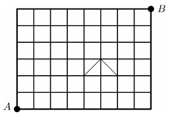
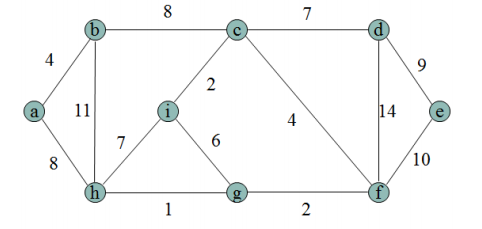
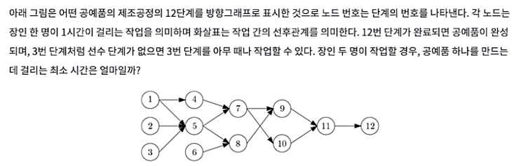
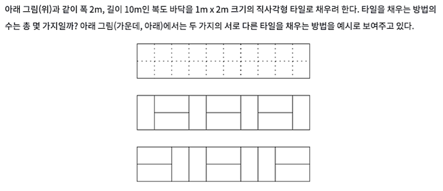

테스트문제
===

1. 1에서 10까지의 자연수를 모두 곱한 수를 X라고 하자. X를 8진수로 표기하면 제일 오른쪽에 연속으로 나타나는 0은 모두 몇 개일까?

    1
    2
    4
    6
    8

    해설.

    1~10 까지 의 곱을 볼때 가장 작은 수인 2가 몇개 곱해지는지 확인해보면 

    1 2 3 4     5 6 7 8   9 10
    2   2^2     2   2^3   2

    총 2^8인 것을 알 수 있다. 그러므로 이를 2진수로 나타내면 xxxxx00000000이다. 그러므로 이를 다시 8진수로 나타내면 xxxx00이 되므로 앞의 내용을 알 필요가 없다.

1. 두 자연수 a와 b에 대하여 a^b는 a를 b번 곱해서 얻은 수이다. 3^2016의 마지막 자리의 숫자(1의 자리의 수)는 얼마인가?

    1
    3
    5
    7
    9

    해설.

    3 제곱의 규칙성을 확인하면 풀 수 있다.

    3 9 27 81 243 이므로 1의 자리 숫자 3 9 7 1이 반복되는 것을 알 수 있다. 2016 / 4 = 0이므로 1이 나온다    

3. 어떤 밭을 일구는데, 세 사람 A, B, C가 혼자 밭을 일구면 각각 2시간, 3시간, 6시간이 걸린다. A, B, C 세 사람이 함께 이 밭을 일구면 몇 시간이 걸리는가?
    
    1
    1.2
    1.3
    1.4
    1.5

    해설.

    각 A, B, C가 한시간 동안 얼마나 일하는지 확인해 본다. 1/2 + 1/3 + 1/6 = 1

4. 아래 그림은 A지점과 B지점을 잇는 도로를 선분으로 표시한 약도이다. 이 약도에서 가장 작은 정사각형의 가로, 세로 길이는 1이다. A지점에서 B지점으로 이동할 때에 가장 짧은 길은 모두 몇 가지인가? (대각선으로 표시된 길은 1보다 길다는 것에 유의하라. )

    

    300
    420
    525
    735
    1176

    해설.

    옛날 수학 풀이 방식을 잘 생각해보세요.

5. 아래의 그림은 여러 개의 도시(a,b,c,d,e,f,g,h,i)사이에 도로를 건설하는 비용을 보여주고 있다. 모든 도시를 연결할 때 필요한 최소 비용은 얼마인가?

    

    28
    35
    37
    39
    44

    해설.
    
    도시들을 잊는 도로 중에서 최소 비용부터 선택하세요. 만약 필요없는 도로라면 제거합니다. 이를 최소비용신장트리 라고합니다.

6. 0에서 6까지의 자연수를 한 번씩만 사용하여 만들 수 있는 세 자리의 자연수는 모두 몇 가지 인가?

    180
    190
    200
    210
    220

7. 
캡션 없는 이미지
    

    6
    7
    8
    9
    10

    그냥 하나씩 해보면서 풀어요.

8. 오른쪽부터 거꾸로 읽어도 원래의 것과 같이 읽히는 문자열을 회문이라 부른다. 예를 들어 "a", "noon", "level" 은 회문이다. 영문 알파벳 세개 {a,b,c} 로 만들 수 있는 9글자 길이의 모든 회문을 사전순으로 나열했을 때, 200번째 오는 것은 무엇일까?
   
    ccbababcc
    cbbababbc
    cbcacacbc
    cccabaccc
    ccbacabcc

    해설.

    회문이기 때문에 절반만 잘라서 봐도 괜찮습니다. 즉 aaaaaaaaa대신에 aaaaa로 봐도 괜찮습니다. 

    aaaaa 1
    aaaab 2
    aaaac 3
    aaaba 4

    이것을 3진수로 봐도 되지 않을까요? a = 0, b = 1, c = 2라고 생각해보면 199를 3진수로 표현하면 되는 간단한 문제입니다.

    199 => 21101이므로 cbbab입니다.

9. 
    

    피보나치로 풀어볼세요.

    1 2 3 5 8 13 21 

10. 다음은 합병정렬(MergeSort) 과정을 표현한 그림이다. 빈 칸을 채우고, 이 정렬의 시간복잡도를 적으시오.

    캡션 없는 이미지

1.  다음 코드의 출력 결과는 무엇인가?
캡션 없는 이미지
12. 다음 코드를 보고 name 오름차순(사전순) 정렬이 되도록 빈칸을 채우시오.
캡션 없는 이미지
13. 위 코드에서 number 오름차순 정렬이 되도록 빈칸을 채우시오.
14. 다음 수식을 후위표기식으로 변환하시오.
캡션 없는 이미지
15. 다음 그래프에서 BFS와 DFS로 순회하였을때 방문순서를 적으시오. (방문 할 수 있는 정점이 여러개인 경우 작은 숫자부터 방문합니다.)
캡션 없는 이미지
16. BFS 알고리즘을 구현하기 위해 필요한 자료구조를 고르시오.
stack
queue
hash
heap
17. 다음 프로그램에서 f(6)을 한번 호출하면 f(1)은 몇 번 호출되는가?
캡션 없는 이미지
18. 다음과 같은 그래프가 있을때 1에서 출발하여 모든 정점의 최소비용을 계산하시오. (정점 1에서 2의 최소비용은 2, 정점 1에서 6의 최소비용은 3, 나머지를 모두 구하시오.)
캡션 없는 이미지
19. 다음과 같이 음의 가중치가 있는 그래프가 있을때 1에서 출발하여 모든 정점의 최소비용을 계산하시오.
캡션 없는 이미지
20. Brute-Force에 대한 설명으로 틀린 것은?
상대적으로 빠른 시간에 문제 해결(알고리즘 설계)을 할 수 있다.
문제에 포함된 자료(요소, 인스턴스)의 크기가 작다면 유용하다.
런타임 시간이 짧으며 다이나믹 프로그래밍과 그리디를 이용한다.
학술, 교육 목적을 위해 알고리즘의 효율성을 판단하기위한 척도로 사용한다.
수행속도는 느리지만 해답은 찾아내지 못할 확률이 작다.