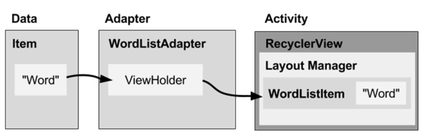
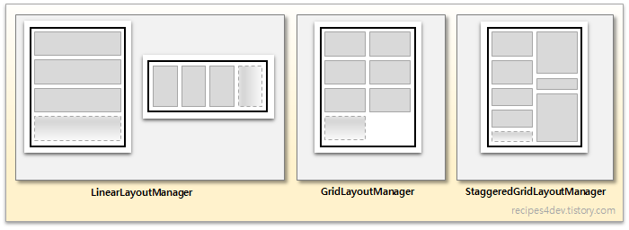

06 RecyclerView
===

# 1. RecyclerView Components

RecyclerView는 기존 리스트 형태의 화면 구성에 사용되던 ListView에 **유연함과 성능**을 더한 ListView의 확장판 또는 개선판이라고 볼 수 있습니다. 구글에서도 ListView 대신 ReclyerView의 사용을 권장하고 있습니다.

RecyclerView라고 부르는 이유는 무엇일까요? recycler 단어의 의미는 "재활용하는 사람"입니다. 즉 "사용했던 것을 다시 사용한다"라는 의미입니다. 그럼 RecyclerView에서는 무엇을 재활용 하는 것 일까요? 기존 ListView는 List의 항목이 갱신될 때 마다 ListView를 새로 구성해야 된다는 문제점이 있었습니다. 이는 성능 저하를 야기하는 문제기도 합니다. 이러한 ListView의 단점을 고려하여 RecyclerView는 생성한 View를 재활용합니다. 이를 위해 ViewHolder 패턴을 사용하도록 만들어 놓았습니다.


## 1.1 사용순서

1. Data 준비
2. RecyclerView 생성
3. RecyclerView의 한 항목을 위한 XML file
4. RecyclerView.LayoutManager
5. RecyclerView.Adapter
6. RecyclerView.ViewHolder
   


## 1.2 LayoutManager

화면에 표시될 아이템 View들을 수직방향, 수평방향 또는 격자 형태의 레이아웃으로 나타내기 위해 LayoutManager를 사용합니다.

LayoutManager는 다양한 형태의 배치를 지원하고 있습니다.

- LinearLayoutManager : 수평 또는 수직 방향으로 아이템 View를 배치
- GridLayoutManager : 바둑판 모양의 격자 형태로 아이템 View를 배치
- StaggerdGridLayoutManager : 엇갈림(Staggerd) 격자 형태로 아이템 View를 배치



## 1.3 Adapter

RecyclerView는 데이터 목록을 아이템 단위의 뷰로 구성하여 화면에 표시하기 위해 Adapter를 사용합니다. 사용자 데이터 리스트로부터 아이템 View를 만드는 것이 Adapter의 역할입니다.


## 1.4 ViewHolder

Adapter를 통해 만들어진 각 아이템 View는 ViewHolder 객체에 저장되어 화면에 표시되고, 필요에 따라 생성 또는 재활용 됩니다. 

ViewHolder는 어댑터에 의해 관리되는데, 필요에 따라(좀 더 정확히는, 레이아웃매니저의 아이템 뷰 재활용 정책에 따라) 어댑터에서 생성됩니다. 물론, 미리 생성된 뷰홀더 객체가 있는 경우에는 새로 생성하지 않고 이미 만들어져 있는 뷰홀더를 재활용하는데, 이 때는 단순히 데이터가 뷰홀더의 아이템 뷰에 바인딩(Binding)됩니다.


# 2. Implement a RecyclerView

recyclerView를 사용하기 위한 단계는 다음과 같습니다.

1. RecyclerView dependency를 build.gradle에 추가합니다.
   
2. mainActivity에 RecyclerView를 추가합니다.
   
3. RecyclerView의 항목을 위한 XML파일을 생성합니다.

    ```XML
        <LinearLayout>
            <TextView
                android:id="@+id/word"
                style="@style/word_title"/>
        </LinearLayout>
    ```
4. RecyclerView.Adapter를 구현합니다.

    Adapter는 RecyclerView.Adapter를 상속받아 구현합니다. 이때 Overrid가 필요한 메서드는 다음과 같습니다.

    - onCreateViewHolder(ViewGroup parent, int viewType) : viewType 형태의 아이템 뷰를 위한 뷰홀더 객체 생성.
    - onBindViewHolder(ViewHolder holder, int position) : position에 해당하는 데이터를 뷰홀더의 아이템뷰에 표시.
    - getItemCount() : 전체 아이템 갯수 리턴.

    ```Java
    public class WordListAdapter extends RecyclerView.Adapter<WordListAdapter.WordViewHolder> {

        LayoutInflater mInflater;
        LinkedList<String>mWordList;

        public WordListAdapter(Context context, LinkedList<String> wordList) {
            mInflater = LayoutInflater.from(context);   //XML to View
            this.mWordList = wordList;
        }

        @Override
        public WordViewHolder onCreateViewHolder(ViewGroup parent, int viewType) {
            // Create view from layout
            View mItemView = mInflater.inflate(
                R.layout.wordlist_item, parent, false);
            return new WordViewHolder(mItemView, this);
        }

        @Override
        public void onBindViewHolder(WordViewHolder holder, int position) {
            // Retrieve the data for that position
            String mCurrent = mWordList.get(position);
            // Add the data to the view
            holder.wordItemView.setText(mCurrent);
        }

        @Override
        public int getItemCount() {
            // Return the number of data items to display
            return mWordList.size();
        }
    }
    ```
5. RecyclerView.ViewHolder를 extend 합니다.

    ```Java
    class WordViewHolder extends RecyclerView.ViewHolder implements View.OnClickListener {
        
        TextView wordItemView;
        WordListAdapter mAdapter;
        
        public WordViewHolder(View itemView, WordListAdapter adapter) {
            super(itemView);
            // Get the layout
            wordItemView = itemView.findViewById(R.id.word);
            // Associate with this adapter
            this.mAdapter = adapter;
            // Add click listener, if desired
            itemView.setOnClickListener(this);
        }
        // Implement onClick() if desired
    }

    //...
    ```

6. onCreate()에서 adapter와 layout manager를 가진 RecyclerView를 생성합니다.
    ```Java
        //create the RecyclerView in Activity onCreate()
        @Overrid
        ~~ onCreate(){
            mRecyclerView = findViewById(R.id.recyclerview);
            mAdapter = new WordListAdapter(this, mWordList);
            mRecyclerView.setAdapter(mAdapter);
            mRecyclerView.setLayoutManager(new LinearLayoutManager(this));
        }
    ```