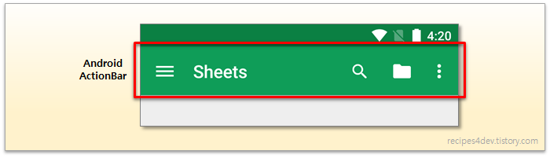
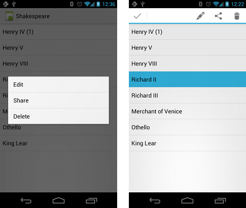

08 Menu
===

# 종류

1. App bar with options menu
2. Context menu
3. Contextual action bar
4. Popup menu

# 1. App bar with options menu

App bar위에 나타나는 메뉴를 의미합니다.



물음표와 폴더 아이콘, ...을 options menu라고 합니다. 가장 중요한 menu를 표시하고, 그 이외의 메뉴는 ...안에 표시합니다.

# 1.1 생성방법

1. XML menu resource(menu_main.xml)

    xml 파일에 메뉴에 표시할 항목들을 추가합니다.

    ```xml
    <item android:id="@+id/option_settings"
          android:icon="@drawable/ic_settings"
          <!-- 항목의 표시 순서를 나타내며, 오름차순이다. -->
          android:orderInCategory="2"
          android:title="Settings"/>
    <item android:id="@+id/option_favorites"
          android:icon="@drawable/ic_favorites"
          android:title="Favorites"
          <!-- 만약 공간이 충분하다면 이 항목도 표시한다. -->
          app:showAsAction="ifRoom"/>
    ```

2. onCreateOptionsMenu() to inflate the menu

    ```Java
    @Override
    public boolean onCreateOptionsMenu(Menu menu){
        getMenuInflater().inflate(R.menu.menu_main, menu);
        return true;
    }
    ```

3. onClick attribute or onOptionsItemSelected()

    ```Java
    @Override
    public boolean onOptionsItemSelected(MenuItem item){
        switch(item.getItemId()){
            case R.id.action_settings:
                showSettings();
                return true;
            case R.id.action_favorites:
                showFavorites();
                return true;

            default:
                return super.onOptionsItemSelected(item);
        }
    }
    ```

4. Method to handle item click


# 2. Contextual Menu

선택된 View에서 사용자의 action을 허용합니다. 대부분 RecyclerView, GridView 또는 다른 collection에서 사용됩니다.



# 2.1 종류

1. floating context menu

2. contextual action mode

## 2.2 Floating Context Menu

### 생성방법

1. create XML menu resource file and assign appearance and position attributes

    ```xml
    <item android:id="@+id/option_settings"
          android:icon="@drawable/ic_settings"
          <!-- 항목의 표시 순서를 나타내며, 오름차순이다. -->
          android:orderInCategory="2"
          android:title="Settings"/>
    <item android:id="@+id/option_favorites"
          android:icon="@drawable/ic_favorites"
          android:title="Favorites"
          <!-- 만약 공간이 충분하다면 이 항목도 표시한다. -->
          app:showAsAction="ifRoom"/>
    ```

2. Register View using registerForContextMenu()

    ```Java
    TextView article_text = findViewById(R.id.article);
    registerForContextMenu(article_Text);    
    ```

3. Implement onCreateContextMenu() in Activity to inflate menu
4. Implement onContextItemSelected() to handle menu item clicks

    ```Java
    @Override
    public boolean onContextItemSelected(MenuItem item){
        switch(item.getItemId()){
            case R.id.context_edit:
                editNote();
                return true;
            case R.id.context_share:
                shareNote();
                return true;

            default:
                return super.onContextItemSelected(item);
        }
    }
    ```

5. Create method to perform action for each context menu item

## 2.3 Contextual action bar

### 생성방법

1. Create XML menu resource file and assign icons for items
2. setOnLongClickListener() on VIew that triggers contextual action bar and call startActionMode() to handle click
3. Implement ActionMode.Callback interface to handle ActionMode lifecycle, include action for menu item click in onActionItemClicked() callback
4. Create method to perfrom action for each context menu item