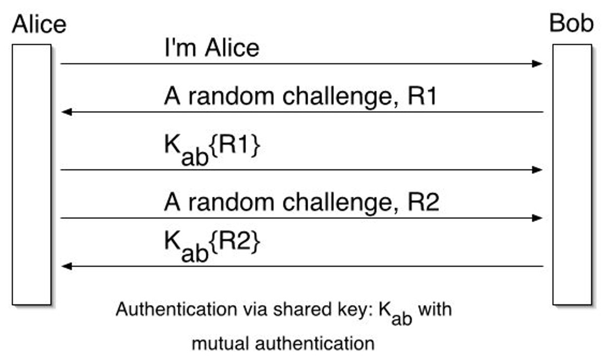

09 인증
===

오늘 배운 인증(Authentication)은 해당 사람이 맞는지 확인 하는 방식입니다. 인증은 사용자가 서비스를 이용하기 위해서 자신을 증명하는 과정을 말합니다. 여기서 해당 사용자에게 권한을 부여 하는 인증(Authorization)과는 다른 개념입니다. 

# 분류

인증 방식은 크게 지식 기반과 소유 기반, 생체 기반으로 구분됩니다. 각 인증 방식은 사용자 편의성, 보완성 등에서 차이를 보입니다.

- 지식 기반 인증
- 소유 기반 인증
- 생체 기반 인증

# 1. 지식 기반 인증

사용자와 서버가 미리 설정하여 공유한 비밀정보를 기반으로 사용자를 인증합니다. 지식 기반 인증은 정적 방식(shared secret)과 동적 방식으로 나뉩니다.

## 특징

- 별도의 하드웨어가 필요없어 비용이 아주 적으며 사용자 편의성이 높습니다.
-  인증 강도가 다른 방식들에 비해 낮아 **보안 취약점**이 가장 많이 발견됩니다.

## 1.1 정적 지식 기반 인증

현재 가장 널리 사용되고 있는 지식 기반 인증 방식입니다. 사용자가 회원 등록 과정에서 서버에 자신의 인증 정보를 미리 입력하고 후에 서비스 사용시 미리 설정한 인증 정보를 사용하는 방식입니다.

## 1.2 동적 지식 기반 인증

사용자와 서버 간 사전 접촉 없이 질문을 통해 사용자의 신원을 확인합니다. 서버는 사용자에 대한 공개된 정보, 수집된 마케팅 데이터 또는 신용보고정보 등을 이용하여 즉석에서 사용자에게 질문을 제시합니다.

### 특징

- 정적 방식에 비해 높은 보안 강도를 제공합니다.

# 2. 소유 기반 인증

인증 토큰을 소유하고, 이를 기반으로 사용자를 인증하는 방식입니다.토큰의 구성 방식에 따라 하드웨어 형태와 소프트웨어 형태로 분류합니다.

## 특징

- 사용자가 토큰을 소유하고 있기 때문에 지식 기반 방식의 인증 방식보다 보안성이 높습니다.
- 인증 시스템 구축이 어렵습니다.
- 사용자가 서비스 신청을 위해 CA 또는 RA와 최소 1번의 대면으로 본인 확인이 필요합니다.
- 항시 소유하여햐 하므로 편의성이 낮습니다.

## 2.1 하드웨어 형태의 토큰

사용자가 물리적인 형태의 토큰을 소유하고 있어야 하기 때문에 휴대성과 편리성이 낮습니다. OTP를 예로 들 수 있습니다.

## 2.2 소프트웨어 형태의 토큰

논리적인 형태로 저장매체 저장이 되어 있으므로 유출의 위험이 높습니다.

# 3. 생체 기반 인증

사용자가 가지고 있는 고유한 신체구조 또는 사용자의 신체를 이용하여 행동했을 때 나타나는 행동결과를 기반으로 사용자를 인증하는 방식입니다. 하지만 사용자의 생체 구조를 쉽게 변경할 수 없다는 점 때문에, 기밀성과 무결성이 훼손 될 경우 큰 문제가 발생할 수 있습니다.

생체 기반 인증은 생체 특징 방식과 행위 특성 방식으로 나뉩니다.

- 생체 특징 방식 : 지문, 홍채, 얼굴, 정맥, 심박도, 뇌파, 심전도 등
- 행위 특성 방식 : 목소리, 타이핑 리듬, 서명 패턴, 서명 압력 등

## 특징

- 별도의 토큰을 소유하지 않아도 됩니다.
- 편리성이 높습니다.
- 신체의 고유 정보를 이용하므로 보안성이 높습니다.
- 시스템 구축 및 관리가 힘듭니다.
    
    생체 구조로 부터 일련의 패턴을 분석해야 하므로 관련 분야 연구가 어려우며, 패턴화한 정보를 활용하기 위한 시스템을 구축하는데 비용이 듭니다.
    
# 4. 패스워드 기반 인증 방식

패스워드 기반 인증 방식은 수세기 동안 사용되었으며, 저렴하고 보안에 가장 일차 적으로 사용됩니다. 패스워드 인증 방식의 예시는 다음과 같습니다.

- ATM과 은행 계좌
- 핵 발전소 및 다른 중요한 인프라 시설물
- 회사 중요 정보 및 시스템
- 이메일 계정

## 4.1 패스워드 기반 저장 방식

패스워드를 다양한 방식으로 저장될 수 있습니다.

| 저장 방식 | 내용 | 보안강도|
|:---:|:---:|:---:|
|Filing System| Clear Text| 최하|
|Dedicated Authentication Server|Clear Text|최하|
|Encrypted|Password + Encryption|하|
|Hashed|Password + Hashfunction|중|
|Salted Hash|UserName + Salt + Password + Hashfunction -짧은 패스워드에 대해서는 사전 공격이 가능하므로 Salt를 추가하여 보안 강도를 높임||

Hash 방식은 보통 hash 값을 저장합니다. 

초기 UNIX 시스템에서는 DES를 이용한 패스워드 인증을 사용하였습니다. 저장된 패스워드는 /etc/passwd/에 저장되었습니다. 새로운 UNIX에서는 해쉬화된 패스워드를 /etc/shadow/에 저장합니다. 기존 방식 보다 정보 노출에 덜 민감하며 패스워드에 만료일이 추가되었습니다.

## 4.2 패스워드 기반 인증의 위협

- Disclosure(공개)

    - 정보의 자발적 공개
    - 시스템 암호의 부적절한 보호

- Inference(추론)
    
    - 암호 생성에 대한 알려진 패턴
    - 생성된 암호의 예측 가능한 사용

- Exposure(노출)

    - 실수로 인한 암호 노출

- Loss(손실)

    - 암호를 잊어버리면 쉬운 암호로 변경할 수 있음
    
- Snooping&Eavesdropping

    - 키로거
    - 네트워크 스니핑을 이용하여 패스워드를 중간에 가로챔

- Guessing(추측)

    - 제거 과정을 통해 파악할 수 있는 선택의 폭을 제한
    - 친척, 펫 등 이름을 통해 알 수 있는 패스워드

- Cracking

    - 자동화된 Guessing
    
## 4.3 Cracking 방식
    
- Dictionary Attack
- Hybrid Attack : 단어 끝에 숫자나 기호를 붙이는 방식
- Brute Force Attack
- Popular programs for Windows password cracking
    - LophtCrack
    - Cain & Abel(UNIX)
    - John the Ripper(UNIX)
    - Sam Inside
    
## 4.4 Cracking 보호

- Salting

    Salt가 없다면 공격자는 패스워드 입력시 사전에 계산한 hash값을 이용할 수 있습니다. 반면 Salt가 있다면 공격자는 패스워드 입력시 매번 hash값을 계산해주어야 합니다.    
        
# 5. Cryptographic 인증 방식

패스워드 기반 인증 방식은 입력을 해야 하므로 해당 정보가 네트워크를 통해 전송됩니다. 하지만 Cryptographic 방식은 패스워드나 비밀 정보를 네트워크를 통해 전송하지 않습니다. 대신에 사용자는 cryptographic을 행하여 자신을 증명합니다. 이때 Crypto 연산은 사용자의 비밀키를 이용합니다.

다음 예를 들면서 알아보도록 하겠습니다. 다음은 간단한 정적 지식 기반 인증 방식입니다.  Alice 와 Bob이 있습니다. Alice는 클라이언트나 유저이며, Bob은 Server로 보겠습니다. Alice는 Bob의 서비스를 사용하고 싶어합니다.

1. Alice는 Bob에게 인사합니다.
2. Bob은 Random Challenge R을 전송합니다.
3. Alice는 R을 비밀키로 암호하하여( $K_ab{R}$) Bob에게 전송합니다.

다음 과정을 이용하여 상호 인증도 가능합니다.

1. Alice는 Bob에게 인사합니다.
2. Bob은 Random Challenge R1을 전송합니다.
3. Alice는 R1을 비밀키로 암호하하여( $K_ab{R}$) Bob에게 전송합니다.
4. Alice는 Random Challenge R2를 전송합니다.
5. Bob은 R2를 비밀키로 암호화하여 ( $K_ab{R}$) Bob에게 전송합니다.

## 문제점

- Poor scaling properties

    N명의 사용자와 M개의 서버가 있다면 사용자와 서버 각각에 대해 다른 비밀키를 가지고 있어야 하므로 N * M개의 비밀키를 공유해야 합니다.

## 해결책

신뢰할 수 있는 다른 기관을 이용하여 각 사용자와 각 서버가 하나의 비밀키만을 가지고 인증하는 방식입니다. 여기서는 N+ M 개의 키만 있으면 됩니다. 이를 Mediated Authentication이라 합니다.

## 5.1 Mediated Authentication(중재 인증)

신뢰할 수 있는 제 3자가 인증 과정을 중재하는 방식입니다. 중재 인증 방식에서는 KDC(Key Distribution Centor)를 가지고 있습니다. 각 사용자와 서버는 하나의 비밀키를 KDC에 둡니다. KDC는 통신을 위한 대상들에게 세션키를 생성하고 제공합니다. 그리고 각 대상들은 해당 세션키를 알고있는지 확인하여 증명합니다. 

다음은 그림은 중재 인증의 과정을 나타냅니다.

- $K_a$ : KDC와 Alice사이에 공유된 마스터 키
- $K_{ab}$ : Alice와 Bob 사이에 공유된 세션키
- $T_b$ : Bob에게 사용할 티켓
- $K\{data\}$ : 키 K를 이용하여 암호화된  data

# 6. KERBEROS

KERBEROS는 사용자와 서버 간 인증을 위해 중앙 인증 서버를 제공합니다. 공개키 암호화 방식을 사용하지 않기 위해 conventional encryption에 의존합니다. 

> Version 4와 5가 있으며, Version 4는 DES를 사용합니다.
