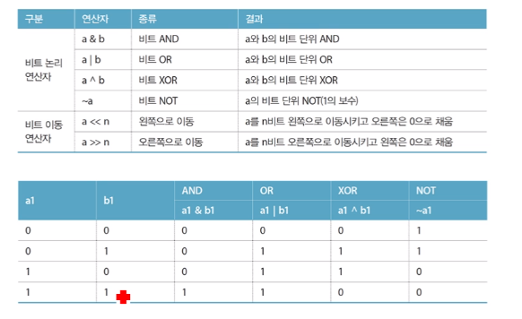

04 비트연산자
===

# or

or은 특정 비트를 1로 설정하는데 사용합니다.

예를들어 

a = 0b00000100 이며 a의 4번째 비트를 1로 설정하고 싶다면

a = a | (0x01 <<3) 또는 a = a | 0x08 로 4번째 비트를 1로 설정할 수 있다.

# and

and는 특정 비트를 0으로 설정하는데 사용합니다. 또는 특정 비트를 검사하는데 사용할 수도 있습니다.

예를들어

a = 0b00101010 이며 a의 6번째와 4번쨰 비트를 0으로 설정하고 싶다면

a = a & (0b11010111) 로 특정 비트를 0으로 설정할 수 있다.

예를들어

a의 4번째 비트가 1인지 검사하고 싶다면 검사를 위한 비트는 0b00001000으로 검사할 수 있다.

# xor

xor는 특정 비트를 반전하는데 사용합니다.

예를들어

a = 0b01010101 이며 a의 짝수번째 비트를 1, 홀수번째 비트를 0으로 설정하고 싶다면
a = a ^ 0b11111111 로 특정 비트를 반전할 수 있다.

# 비트 연산

연산|C스타일|아두이노 스타일
---|---|---
세트|a = a \| (0x01 << n);|bitSet(a,n);
클리어|a = a & ~(0x01 << n);|bitClear(a,n);
반전|a = a ^ (0x01 << n);|-
검사/읽기|bitValue = (a >> n) & 0x01;|bitValue = bitRead(a,n);