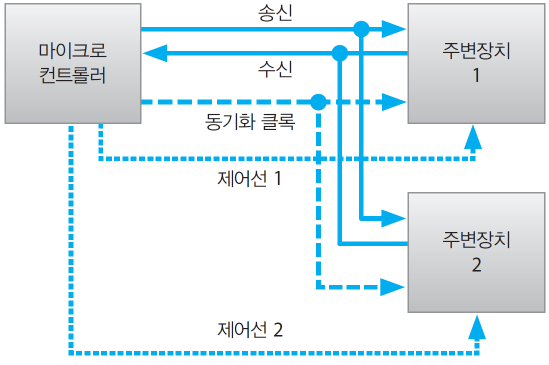
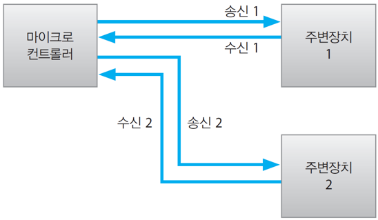

01 마이크로컨트롤러
===

# 목차

- [01 마이크로컨트롤러](#01-%eb%a7%88%ec%9d%b4%ed%81%ac%eb%a1%9c%ec%bb%a8%ed%8a%b8%eb%a1%a4%eb%9f%ac)
- [목차](#%eb%aa%a9%ec%b0%a8)
- [1. 마이크로컨트롤러](#1-%eb%a7%88%ec%9d%b4%ed%81%ac%eb%a1%9c%ec%bb%a8%ed%8a%b8%eb%a1%a4%eb%9f%ac)
  - [1.1 마이크로프로세서와 마이크로컨트롤러?](#11-%eb%a7%88%ec%9d%b4%ed%81%ac%eb%a1%9c%ed%94%84%eb%a1%9c%ec%84%b8%ec%84%9c%ec%99%80-%eb%a7%88%ec%9d%b4%ed%81%ac%eb%a1%9c%ec%bb%a8%ed%8a%b8%eb%a1%a4%eb%9f%ac)
  - [1.2 마이크로컨트롤러의 장단점](#12-%eb%a7%88%ec%9d%b4%ed%81%ac%eb%a1%9c%ec%bb%a8%ed%8a%b8%eb%a1%a4%eb%9f%ac%ec%9d%98-%ec%9e%a5%eb%8b%a8%ec%a0%90)
  - [1.3 마이크로컨트롤러의 사용 분야](#13-%eb%a7%88%ec%9d%b4%ed%81%ac%eb%a1%9c%ec%bb%a8%ed%8a%b8%eb%a1%a4%eb%9f%ac%ec%9d%98-%ec%82%ac%ec%9a%a9-%eb%b6%84%ec%95%bc)
  - [1.4 마이크로컨트롤러는 어떻게 공부해야 할까?](#14-%eb%a7%88%ec%9d%b4%ed%81%ac%eb%a1%9c%ec%bb%a8%ed%8a%b8%eb%a1%a4%eb%9f%ac%eb%8a%94-%ec%96%b4%eb%96%bb%ea%b2%8c-%ea%b3%b5%eb%b6%80%ed%95%b4%ec%95%bc-%ed%95%a0%ea%b9%8c)
  - [1.5 주변장치와 데이터 교환](#15-%ec%a3%bc%eb%b3%80%ec%9e%a5%ec%b9%98%ec%99%80-%eb%8d%b0%ec%9d%b4%ed%84%b0-%ea%b5%90%ed%99%98)
  - [1.6 직렬 데이터의 동기화 방법](#16-%ec%a7%81%eb%a0%ac-%eb%8d%b0%ec%9d%b4%ed%84%b0%ec%9d%98-%eb%8f%99%ea%b8%b0%ed%99%94-%eb%b0%a9%eb%b2%95)
  - [1.7 직렬 통신 방식](#17-%ec%a7%81%eb%a0%ac-%ed%86%b5%ec%8b%a0-%eb%b0%a9%ec%8b%9d)
  - [1.8 마이크로컨트롤러를 위한 프로그램](#18-%eb%a7%88%ec%9d%b4%ed%81%ac%eb%a1%9c%ec%bb%a8%ed%8a%b8%eb%a1%a4%eb%9f%ac%eb%a5%bc-%ec%9c%84%ed%95%9c-%ed%94%84%eb%a1%9c%ea%b7%b8%eb%9e%a8)
- [2. ATmega328](#2-atmega328)
  - [2.1 아두이노 우노와 데스크톱 컴퓨터](#21-%ec%95%84%eb%91%90%ec%9d%b4%eb%85%b8-%ec%9a%b0%eb%85%b8%ec%99%80-%eb%8d%b0%ec%8a%a4%ed%81%ac%ed%86%b1-%ec%bb%b4%ed%93%a8%ed%84%b0)

# 1. 마이크로컨트롤러

마이크로컨트롤러란 하나의 반도체 칩입니다. 대부분의 컴퓨터 본체의 기능을 하나의 칩 위에 구현한 것을 말한다. 입출력 장치를 연결함으로써 연산을 위한 컴퓨터로써 사용할 수 있습니다. 이는 일반적인 PC와는 사용목적이 다릅니다.

## 1.1 마이크로프로세서와 마이크로컨트롤러?

마이크로프로세서란 **CPU를 하나의 칩**으로 구현한 것을 말합니다. 마이크로컨트롤러는 CPU, 메모리, HDD(프로그램을 저장), I/O 인터페이스를 **하나의 보드**에 구현한 것을 말합니다. 마이크로컨트롤러 안에 마이크로프로세서가 있으므로 '**칩 위의 컴퓨터**'라고도 합니다. 즉, 하나의 작은 컴퓨터 입니다.

## 1.2 마이크로컨트롤러의 장단점

1. 장점
    - 제품의 소형화와 경량화
    - 저렴한 가격
    - 신뢰성 향상 : 저렴한 가격으로 인한 유지보수의 용이성
    - 융통성 : 프로그램에 의해 손쉬운 기능 추가 및 변경 가능

2. 단점
    - 한정된 처리 능력
    - 작은 메모리
    - 한정된 범용성 : 단일 목적으로만 사용 가능

## 1.3 마이크로컨트롤러의 사용 분야

마이크로컨트롤러는 다음과 같이 다양한 분야에서 사용되고 있습니다.

|  분야   | 예                 |
| :---: | :---------------- |
|  의료   | 의료기 제어, 자동 심박계    |
|  교통   | 신호등 제어, 주차장관리     |
|  감시   | 출입자/침입자 감시, 산불 감시 |
|  가전   | 에어컨, 세탁기, 전자레인지   |
|  음향   | CD플레이어, 전자타이머     |
|  사무   | 복사기, 무선전화기        |
|  자동차  | 엔진제어, 충돌 방지       |
|  기타   | 게임기, 차고 개폐 장치     |

## 1.4 마이크로컨트롤러는 어떻게 공부해야 할까?

마이크로컨트롤러는 하나의 칩일 뿐입니다. 최소한의 회로에서 시작하고, 필요한 기능을 추가해 나가면 됩니다. 프로그램을 업로드 하기 위해서는 다음과 같은 장치가 필요합니다.

- ISP(In System Programming) : AVR 시리즈에서 주로 사용하는 업로드 방식
- USB : 아두이노에서 주로 사용하는 업로드 방식으로 아두이노 보드에 포함되어 있음

## 1.5 주변장치와 데이터 교환

마이크로컨트롤러 내부에서는 바이트 단위로 데이터를 처리합니다. 마이크로컨트롤러와 외부장치 간에는 비트단위로 데이터를 송수신합니다. 마이크로컨트롤러의 데이터 핀은 1비트 데이터의 송수신 통로입니다. 데이터를 교환하는 방식은 다음과 같습니다.

- 병력방식 : 8개의 데이터 핀을 사용
- 직렬방식 : 1개의 데이터 핀을 사용

직렬방식은 8개의 데이터를 교환하기 위해 8번으로 나누어 데이터를 전송하므로 송신측과 수신측간 **동기화**가 중요합니다.

## 1.6 직렬 데이터의 동기화 방법

- 동기 방식

  별도의 클럭을 사용하여 클럭을 기준으로 데이터를 확인합니다. SPI, I2C 방식을 사용합니다.

  SPI

  

  SPI 방식은 주변장치 마다 제어선을 통해 동기화를 하므로 주변장치가 늘어날 때 마다 추가적인 송수신선을 필요로 하지 않습니다.

  I2C

  

  I2C는 반이중 방식으로 주변장치가 늘어날 때 마다 추가적인 송수신선을 필요로 하지 않습니다. 하지만 소프트웨어적으로 동기화를 해주어야합니다.

- 비동기 방식
  
  별도의 클럭을 사용하지 않고, 약속된 속도로 데이터를 확인합니다. UART방식을 사용합니다.

  UART

  

  UART 방식은 주변 장치와 마이크로컨트롤러 간에 동기 신호가 없으므로, 주변 장치 마다 송수신선으로 구성되어 있습니다. 이는 하드웨어와 소프트웨어적으로 안전한 방식입니다. 하지만 주변 장치가 늘어날 수록 송수신 선이 게속 늘어나게 됩니다.

  > UART : **U**niversal **A**synchronous **R**eceive **T**rasmitte 

|          | UART  |  SPI   |  I2C  |
| :------- | :---: | :----: | :---: |
| 연결방법     |  1:1  |  1:n   |  1:n  |
| 전송방법     |  전이중  |  전이중   |  반이중  |
| 연결선      |  데이터  |   2개   |  2개   | 1개 |
|          | 동기신호  |   -    |  1개   | 1개 |
|          |  제어   |   -    |  1개   | -  |
|          |   총   |   2개   |  4개   | 2개 |
| n개의 슬레이브 |  2n개  | (3+n)개 |  2개   |

## 1.7 직렬 통신 방식

직렬 통신 방식은 데이터 선의 수와 동기신호, 연결 방법/구조에 따라 나눠집니다.

- 데이터 선의 수
  - 전이중 방식 : 송신과 수신을 위한 별도의 연결선을 사용
  - 반이중 방식 : 송신과 수신을 위한 공통의 연결선을 사용

- 동기 신호
  - 동기 방식 : 전용의 동기화 클럭을 사용
  - 비동기 방식 : 동기화 클럭을 사용하지 않음

- 연결 방법/구조
  - 1:n : 하나의 마스터와 여러 개의 슬레이브를 연결
  - 1:1 : 2개의 장치가 동등한 기능으로 연결 
  > 1:1 방식은 마스터와 슬레이브 구조는 아니다.
  
## 1.8 마이크로컨트롤러를 위한 프로그램

특정한 목적을 가진 프로그램을 사용하기 위해서는 교차 컴파일러를 통해 마이크로컨트롤러에서 실행되는 기계어 파일을 생성할 수 있습니다. 이를 마이크로컨트롤러에 업로드할 수 있습니다.앞서 배웠듯이 업로드 방식은 SPI, I2C, UART가 있습니다. 

# 2. ATmega328

ATmega328은 마이크로컨트롤러입니다. 위 사진의 빨간 부분이 ATmega328P-PU 칩이고, 보드를 아두이노 우노라고 부릅니다. 아두이노는 기업명을 말하며 아두이노 우노는 보드를 의미합니다.

## 2.1 아두이노 우노와 데스크톱 컴퓨터

마이크로컨트롤러는 특수 목적용으로 만들어진 컴퓨터입니다. 데스크톱과 비교해서 낮은 성능과 작은 메모리를 가지고 있습니다. 이는 높은 성능을 요구하지 않는 작고 간단한 제어 장치 제작을 위해 사용하기 때문입니다. 또는 다른 시스템의 일부에 포함(**embedded**)되어 사용됩니다. 마이크로컨트롤러는 그 목적에 맞게 다양한 종류의 제품이 존재합니다.

