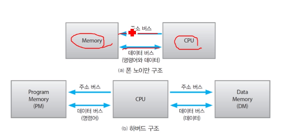
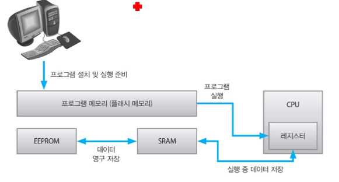

02 메모리
===

# 1. 컴퓨터의 메모리

컴퓨터 메모리의 종류를 다양합니다.

- 하드디스크
- 메인 메모리
- 레지스터

# 2. 폰노이만과 하버드 구조

- 폰노이만 구조

    프로그램과 데이터 저장을 위한 1종류의 메모리를 가지고 있습니다. 프로그램과 데이터를 읽고 쓰기 위해 메모리를 자주 접근하므로 병목 현상이 발생합니다. 하지만 하나의 데이터 및 주소 버스로 간단한 구조를 가집니다.

- 하버드 구조

    프로그램 데이터 저장을 위한 서로 다른 2종류의 메모리를 가지고 있습니다. 병목 현상을 안화하기 위해 고속 메모리 액세스를 이용합니다. 2개의 데이터 및 주소 버스로 복잡한 구조를 가집니다.

# 3. 메모리

메모리는 프로그램 메모리와 데이터 메모리가 있습니다. 데스크탑은 DRAM과 HDD를 이용합니다. 반면에 ATmega328은 프로그램 메모리에 플래시 메모리, 데이터 메모리에 SRAM과 EEPROM을 사용하고 있습니다.

|  메모리종류  |                        | 컴퓨터  | ATmega328 |
| :-----: | :--------------------- | :--- | :-------- |
| 프로그램메모리 | 프로그램이 설치되는 메모리         | HDD  | 플래시 메모리   |
| 프로그램메모리 | 프로그램이 실행되는 메모리         | DRAM | 플래시 메모리   |
| 데이터메모리  | 연산 결과 데이터가 임시 저장되는 메모리 | DARM | SRAM      |
| 데이터메모리  | 연산 결과 데이터가 영구 저장되는 메모리 | HDD  | EEPROM    |

## 3.1 ATmega328 메모리

컴퓨터에서 프로그램을 작성하면 ATmega328에서 실행 가능한 구조로 변경해줍니다. 이 프로그램을 플래시 메모리에 업로드하여 실행하면 CPU의 레지스터로 프로그램이 이동합니다.프로그램이 실행하면서 임시로 필요한 데이터는 SRAM, 영구저장하는 데이터는 EEPROM에 저장됩니다.

## 3.2 ROM과 RAM

- ROM(Read Only Memory)

    ROM은 읽기 전용 메모리라고 합니다. 비휘발성으로 전원이 꺼져도 내용이 보존됩니다. 읽기 속도는 빠르나 쓰기 속도는 느립니다.

    ROM은 다양한 종류가 있습니다.

    - Mask ROM : 생산 시점에서 내용을 기록하고 읽기만 가능합니다. 현재는 생산/사용하지 않습니다.

    - PROM(Programmable ROM) : 1회 쓰기가 가능하며 전용 장비인 롬 라이터가 필요합니다.

    - EPROM(Erasable PROM) : 1회만 쓸 수 있는 PROM의 단점을 보완하며 일정 횟수의 지우기와 쓰기가 가능합니다. 데이터를 지우기 위해서는 자외선을 이용한 전용 장비가 필요합니다.

    - EEPROM(Electrically EPROM) : EPROM의 단점을 보완하여 전기 신호로 지우기와 쓰기가 가능합니다. 

        - Flash 메모리 : 1984년 도시바에서 개발된 EEPROM의 변형입니다. 바이트 단위의 I/O만 가능한 EEPROM을 개선하여 블록 단위의 I/O를 가능하게 함으로 써 쓰기 속도가 개선됩니다.

            EEPROM에 비해 쓰기 횟수가 제한되어 있습니다. ATmega328의 EEPROM은 100,000회, Flash 메모리는 10,000회를 보장합니다.

            종류는 NOR형, NAND형이 있습니다.

            - NOR : 읽기 시간 최적화를 위한 구조로 RAM과 큰 차이가 나지 않을 정도로 빠릅니다.

            - NAND형 : 쓰기 시간 최적화를 위한 구조로 집적도가 높고 저렴한 가격으로 널리 사용됩니다. 흔히 SSD가 여기 속합니다.

- RAM(Random Access Memory)

    RAM은 임의 접근 메모리라고 합니다. 휘발성으로 전원이 꺼지면 내용이 사라집니다. 자유롭게 사용가능한 이점이 있습니다.

    

    - DRAM(Dynamic RAM) : 커패시터 기반의 RAM으로 주기적인 리프레시가 필요합니다. 그렇기에 상대적으로 속도가 느리지만 가격이 저렴합니다.

        DRAM은 발전을 거쳐 다양한 형태가 존재합니다.

        - SDRAM(Synchronous DRAM) : CPU와 메모리의 클록을 동기화 시킨 메모리이다.
        - DDR(Double Data Rate) : 동일한 클록에서도 데이터 전송 속도가 향상된 방식이다. DDR2, DDR3, DDR4로 발전하고 있다.

        DRAM은 두 종류의 규격이 있습니다.

        - DIMM(Dual In-line Memory Module) : 메모리 모듈 형식
        - SO-DIMM(Small Outline) : 노트북용 소형 모듈 형식

    - SRAM(Static RAM) : 플립플롭 기반으로 리프레시가 필요하지 않습니다. 상대적으로 빠른 속도를 가지지만 가격이 비쌉니다. 대중적인 용도보단 CPU의 캐시 메모리로 사용됩니다.

    - MRAM(Magnetic RAM) : DRAM와 SRAM의 장점을 결합한 RAM이다. 상용 준비중에 있다.

    