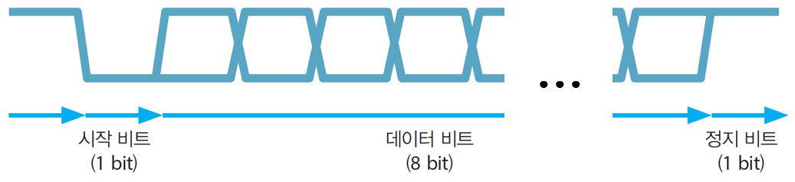

05 시리얼통신
===

# 1. Serial과 Parallel


# 2. UART

송신측과 수신측 사이의 데이터 전달 속도에 대한 약속이 반드시 필요합니다.


> UART(Universal Asynchronous Receiver Transmitter)
> 
> USART(Universal Synchronous/Asynchronous Receiver Transmitter)

## 2.1 보율과 bps

보율(Baud rate)은 데이터 변조 속도로, 즉 신호가 변하는 횟수를 의미합니다. bps(bit per second)는 전달되는 데이터 비트수를 의미합니다.

아래 그림은 보율과 bps를 비교합니다.


## 2.2 UART의 데이터 전송

데이터 전송은 일반적으로 10비트로 이뤄집니다. 비트의 구성은 시작 1비트, 데이터 8비트, 정지 1비트로 되어있습니다.

전송방식은 전이중(Full duplex)방식입니다. 그러므로 전용의 2개 핀 PD0(RX)와 PD1(PX)를 사용합니다.



## 2.3 UART 코드

```c++
// UART.h
#ifndef _UART_H_
#define _UART_H_

#include <avr/io.h>

void UART_INIT(void);
unsigned char UART_receive(void);
void UART_transmit(unsigned char data);
void UART_printString(char *str);
void UART_print8bitNumber(uint8_t no);
void UART_print16bitNumber(uint16_t no);
void UART_print32bitNumber(uint32_t no);

#endif

// UART.c
#include "UART.h"

void UART_INIT(void) {
	UCSR0A |= _BV(U2X0);

	UBRR0H = 0x00;
	UBRR0L = 207;

	UCSR0C |= 0x06;
	
	UCSR0B |= _BV(RXEN0);
	UCSR0B |= _BV(TXEN0);
}

unsigned char UART_receive(void)
{
	while( !(UCSR0A & (1<<RXC0)) );
	return UDR0;
}

void UART_transmit(unsigned char data)
{
	while( !(UCSR0A & (1<<UDRE0)) );
	UDR0 = data;
}

void UART_printString(char *str)
{
	for(int i = 0; str[i]; i++)
	UART_transmit(str[i]);
}

void UART_print8bitNumber(uint8_t no)
{
	char numString[4] = "0";
	int i, index = 0;
	
	if(no > 0){
		for(i = 0; no != 0 ; i++)
		{
			numString[i] = no % 10 + '0';
			no = no / 10;
		}
		numString[i] = '\0';
		index = i - 1;
	}
	
	for(i = index; i >= 0; i--)
	UART_transmit(numString[i]);
}

void UART_print16bitNumber(uint16_t no)
{
	char numString[6] = "0";
	int i, index = 0;
	
	if(no > 0){
		for(i = 0; no != 0 ; i++)
		{
			numString[i] = no % 10 + '0';
			no = no / 10;
		}
		numString[i] = '\0';
		index = i - 1;
	}
	
	for(i = index; i >= 0; i--)
	UART_transmit(numString[i]);
}

void UART_print32bitNumber(uint32_t no)
{
	char numString[11] = "0";
	int i, index = 0;
	
	if(no > 0){
		for(i = 0; no != 0 ; i++)
		{
			numString[i] = no % 10 + '0';
			no = no / 10;
		}
		numString[i] = '\0';
		index = i - 1;
	}
	
	for(i = index; i >= 0; i--)
	UART_transmit(numString[i]);
}


```