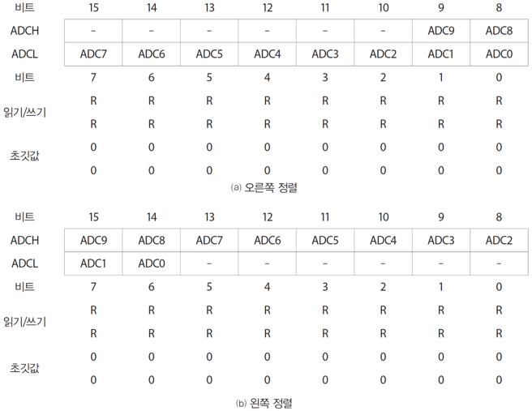
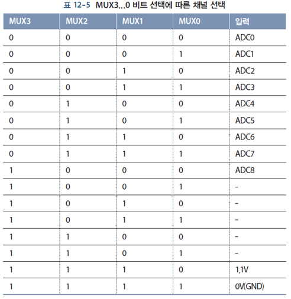
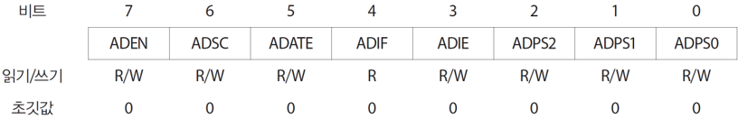
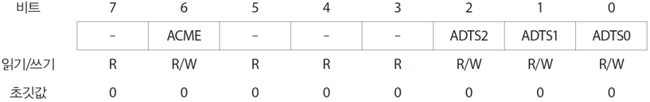

12 아날로그-디지털 변환
===

# 아날로그 데이터

주변 환경에 있는 데이터는 모두 아날로그 데이터이지만, 마이크로컨트롤러에서 처리할 수 있는 데이터는 디지털만 가능합니다. 아날로그 데이터를 디지털 데이터로 변환하기 위해서는 마이크로컨트롤러에 ADC가 있습니다. 반대로 처리 결과를 아날로그 데이터로 확인하기 위해 DAC가 필요합니다. ATmega328에는 DAC가 포함되어 있지 않습니다.

## ADC Block Diagram

ADMUX를 통해 입력으로 받아들일 곳(입력 MUX)을 지정합니다. 

## ADC 레지스터 = ADCH + ADCL

ADC 레지스터는 오른쪽 정렬이 기본입니다. 

## ADMUX 레지스터

기준 전압 선택, 입력 채널 선택, ADC 레지스터 정렬 방식 지정 합니다.

- REFSn : 기준 전압 선택
- MUXn : 입력 채널 선택
- ADLAR : 정렬 방식으로 1은 왼쪽정렬, 0은 오른쪽정렬이다.
  

MUXn을 통해 입력 채널을 선택할 수 있습니다. MUX가 3개 있으면 2^3으로 8가지를 표현할 수 있습니다. ARDUINO UNO는 아날로그 포트가 6개 있으므로 MUX1 부터 MUX3 까지 있습니다.

## ADCSRA 레지스터

ADCSRA(ADC Control and Status Register A)는 AD 변환 상태 및 변환 과정을 제어 합니다. 

- 분주율 

    ADPSn(ADC Prescaler Selection)비트로 설정하며, 16MHz 시스템 클록을 나누는 값으로 시스템 클록보다 낮은 속도로 ADC를 수행한다. 보통 50~200KHz 범위를 추천한다.

    

- ADEN : ADC Enable로 ADC를 활성화시킨다.
- ADSC : ADC Start Conversion으로 AD변환을 시작한다.
- ADATE : ADC Auto Trigger Enable로 선택된 트리거 신호에 의해 변환이 시작되도록 설정한다. 트리거 신호 선택은 ADCSRB 레지스터 설정에 따른다.
- ADIF : ADC Interrupt Flag로 AD 변환이 종료되었음을 알리는 플래그이다.
- ADIE : ADC Interrupt Enable로 AD 변환이 종료되었을 때 인터럽트 발생을 허용한다.
- ADPS2, ADPS1, ADPS0 : ADC Prescaler Select로 ADC를 위한 분주율을 설정한다.

## ADCSRB 레지스터

AD 변환을 위한 트리거 소스를 선택한다. 기본값은 프리러닝 모드이며 일반적으로 프리러닝 모드를 사용합니다. ADCSRA 레지스터의 ADATE 비트에 따라 단일 변환 모드(0) 와 프리러닝 모드(1)로 설정하여 사용합니다.

- 단일 변환 모드 : 한번의 AD 변환 후 멈춤
- 프리러닝 모드 : AD 변환이 안료되면 다음 AD 변환이 자동으로 시작

# 난수

컴퓨터에서 생성되는 난수는 계산에 의해 만들어지는 의사난수(pseudo random number)이다. 시작점이 동일하면 항상 동일한 순서로 숫자가 생성된다. 시작점을 임의로 지정하려면 회로가 연결되지 않은 아날로그 입력 핀에서 읽은 값을 난수의 시작점으로 사용합니다.

# 가변저항

A0에서 A5까지 6개 채널 사용 가능 디지털 14~19번에 해당 PC0~PC5 핀

