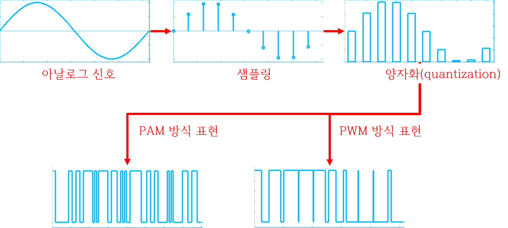

17 PWM
===

# 1. PWM

펄스 폭 변조 (Pulse Width Modulation) 

디지털 신호의 일종으로 아날로그 신호와 유사한 효과를 얻을 수 있다. PWM을 이용하여 LED의 밝기 제어, 모터 속도 등에 사용한다. PWM 신호 출력을 위한 아두이노 함수의 이름은 analogWrite로 아날로그와의 연계성  표현하고 있다.

다른 방식으로 PAM이 있다. PAM (Pulse Amplitude Modulation)은 일반적으로 사용하는 방식 고정된 펄스 폭 사용하며, 2진 표현법에 기초하고 있다.


## 1.1 ADC



## 1.2 PWM vs PAM


## 1.3 PWM 신호의 듀티 사이클


듀티 사이클이 0%라는 뜻은 LED의 전원 공급이 0이라는 뜻입니다. 반대로 100%라면 LED 전원 공급이 100이 된다는 것 입니다.

## 1.4 delay 함수를 이용한 PWM

코드 15-1

```c++
#define F_CPU 16000000L
#include <avr/io.h>
#include <util/delay.h>
#define LED_TIME 20

void turn_on_LED_in_PWM_manner(int dim)
{
	int i;
	PORTB = 0xFF; // LED 켜기
	for(i = 0; i < 256; i++){
		if(i > dim) PORTB = 0x00; // 듀티 사이클을 넘어가면 LED 끄기
		_delay_us(LED_TIME);
	}
}

int main(void)
{
	DDRB = 0xFF; // PB5 핀(아두이노 13번)을 출력으로 설정

	int dim = 0; // 현재 LED 밝기
	int direction = 1; // 밝기 증가(1) 또는 감소(-1)

	while(1){
		if(dim == 0) direction = 1;
		if(dim == 255) direction = -1;
		dim += direction; // 밝기 변화
		turn_on_LED_in_PWM_manner(dim);
	}
}
```

## 1.5 PWM 신호 생성

ON/OFF의 비율 조절을 통해 손쉽게 PWM 신호를 생성할 수 있다.

PWM 신호의 한 주기에 LED가 반응하여야 함

- 50% 듀티 사이클의 PWM 신호에, 한 주기의 50% 시간은 켜지고 50% 시간은 꺼지는 것이 아니라 평균 50% 밝기로 켜져야 함

- LED의 반응 속도에 비해 아주 빠른 주파수의 PWM 신호가 사용

코드 15-1의 경우 대부분의 시간이 PWM 신호 생성에 사용됨

- 타이머/카운터의 파형 생성 기능을 통해 PWM 신호 생성 가능
- 하드웨어적으로 지원되는 PWM 신호 생성 기능

## 1.6 PWM 모드

비교일치 인터럽트가 발생하는 경우 지정된 핀을 통해 신호 출력


### 1. 고속 PWM 모드

BOTTOM에서 TOP으로 카운트 → TOP에서 0으로 리셋

BOTTOM에서 HIGH, 비교일치 시 LOW 출력 (비반전 출력모드)


기준이 되는 OCRnx에 도달하면 LOW로 뚝 떨어집니다. 그러다가 다시 BOTTOM으로 돌아가면 HIGH 상태로 변경된다.

```c++
#define F_CPU 16000000L
#include <avr/io.h>
#include <util/delay.h>
int main(void)
{
	// 파형 출력 핀인 PB3 핀(OC2A 핀, 아두이노 11번)을 출력으로 설정
	DDRB |= (1 << PB3);
	// 타이머/카운터 2번을 고속 PWM 모드로 설정
	TCCR2A |= (1 << WGM21) | (1 << WGM20);
	TCCR2A |= (1 << COM2A1); // 비반전 모드
	TCCR2B |= (1 << CS22); // 분주비 64
	while(1)
	{
		for(int i = 0; i < 256; i++){
			OCR2A = i; // 듀티 사이클 설정
			_delay_ms(10);
		}
	}
}
```

### 2. 위상 교정 PWM 모드


### 둘의 비교

- 고속 PWM 모드 : PWM 신호의 시작점이 일치

- 위상 교정 PWM 모드 : PWM 신호의 중심이 일치


위상 교정 PWM 모드는 고속 PWM 모드의 주기에 2배가 됩니다.