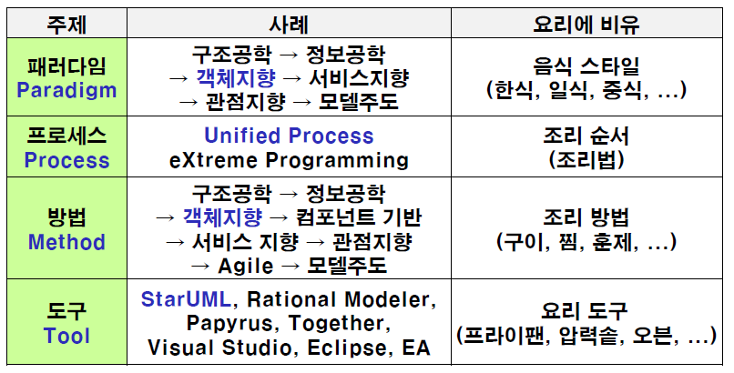
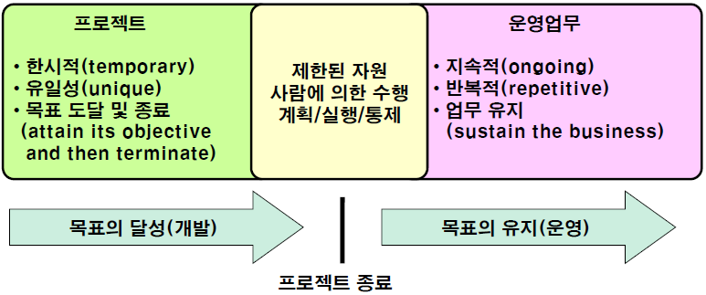

02 개요
=======

# 1. 용어 정의

- 소프트웨어공학 : 소프트웨어의 **개발, 운용, 유지보수 및 파기**에 대한 체계적인 접근방법

- 객체지향 소프트웨어 공학(Object Oriented Software Engineering) : 소프트웨어의 개발, 운용, 유지보수 및 파기에 대한 체계적인 접근방법을 객체중심으로 다루는 것

# 2. 소프트웨어 공학에서 다루는 주제

# 3. SI 프로젝트

일반적인 SI 프로젝트가 어떻게 진행되는지 알아보겠습니다. SI 프로젝트는 '소요 제기'로 부터 시작합니다. 어떤 분야에 일하는 사람이 업무 분야를 소프트웨어화 또는 자동화가 필요하다고 인식
하면 '소요 제기'를 합니다. 이 문제를 어떻게 해야할지를 문서화하는 과정이 '소요 정의'입니다. 그다음 전략 계획을 통해 **제안요청서**를 작성합니다. 제안요청서를 외부에 공개합니다.

특정 개발업체에서 제안요청서를 확인하여 팀을 구성해서 제안서를 작성합니다. 수요 기관은 제안 심사 과정에서 개발 업체들에게 발표를 요구합니다. 개발 업체중 한 곳을 선정하여 원가 협상을 진행합니다. 둘다 협상이 합의 되었다면 계약을 합니다. 하지만 프로젝트의 시작은 착수금이 지급된 시점을 기준으로 합니다.

개발업체는 착수 단계 부터 완료 단계 까지 수요기관을 대상으로 보고서를 작성합니다. 착수 단계에서는 착수보고를 합니다. 그 다음 계획 단계에서 어떻게 수행할지에 대한 수행계획서를 작성합니다. 이제 개발 업체는 수요 기관의 명확한 요구를 분석합니다. 이는 프로젝트가 끝날때 까지 중요한 부분입니다. 분석된 요구를 토대로 개발 업체는 요구사항분석서를 작성하여 검토를 받습니다. 분석이 잘 완료되었다면 설계를 진행합니다.

설계 과정까지 잘 완료되었다면 수요기관은 중도금을 지급합니다. 그럼 개발 업체는 본격적인 개발 과정에 진입합니다. 구현이 완료되었다면 개발된 프로젝트의 테스트를 어떻게 진행할지 시험설계서를 통해 제안합니다. 최종적인 테스트 까지 완료된다면 인수와 설치 과정을 진행합니다. 여기서 수요기관은 수행계획서를 기준으로 잘 인도되었는지 확인하고 나머지 잔금을 지급합니다.

개발업체가 프로젝트를 완료했다고 해서 모든 일이 끝나는 것은 아닙니다. 이제부터는 개발한 서비스에 대해 유지보수를 해야하는 책임이 있습니다.

## 3.1 개발팀 구성

일반적인 SI 프로젝트의 개발팀의 구성은 다음과 같습니다. 

- PM : Project Manager로 프로젝트의 총괄적인 책임및 진행을 담당합니다.

- AC : Advisory Committee는 자문단으로 프로젝트 진행 과정에서 자문을 합니다.

- QA : Quality Assurance는 품질 보증팀으로 프로젝트의 품질을 관리합니다. 여기서 품질은 제안요청서를 토대로 잘 진행되었는지, 프로젝트의 완성도가 적절한지 확인합니다.

- PL : Project Leader는 각 프로젝트의 팀의 리더입니다.

# 4. 프로젝트

프로젝트는 유일한 제품, 서비스, 결과물을 생산하기 위해 수행하는 일시적인 활동입니다.

## 4.1 프로젝트의 제약조건 

프로젝트는 범위와 시간, 비용이 균형을 이루어야 좋은 품질의 결과물이 나오고 이는 곧 성과가 됩니다.  대부분의 프로젝트 진행과정에서는 비용은 고정적으로 하는 반면에  범위와 시간을 줄이려고 합니다. 이는 시간에 따른 수익성 측면을 고려할 수 밖에 없으며, 시간은 곧 개발의 범위에 종속되기 때문입니다.

## 4.2 PMBOK

PMBOK(Project Management Body of Knowledge)란 미국 PMI(Project Management Institute)에서 발행 및 배포한 프로젝트 관리에 대한 지식 체계의 지침서입니다.

PMBOK는 총 10개의 지식영역이 존재하며, 총 5개의 프로젝트 관리를 위한 프로세스 그룹들이 존재합니다.

### 지식영역

- 통합관리
- 범위관리
- 시간관리
- 원가관리
- 품질관리
- 인력자원관리
- 의사소통관리
- 위험관리
- 조달관리
- 이해관계자관리

### 프로세스 그룹

- 착수
- 기획
- 실행
- 감시 및 통제
- 종료

## 4.3 SWEBOK

SWEBOK(Software Engineering Body of Knowledge)는 미국 컴퓨터협회와 IEEE Computer Society에서 관리하는 소프트웨어 공학을 위한 가이드라인과 개발 지침서입니다.
