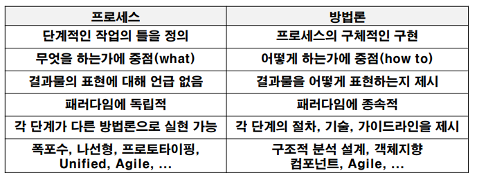
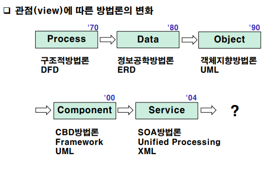
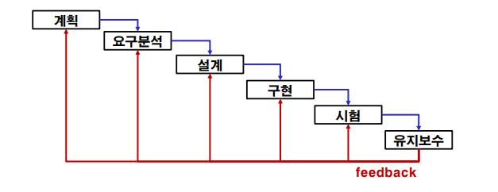
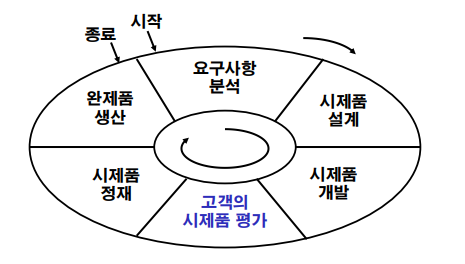
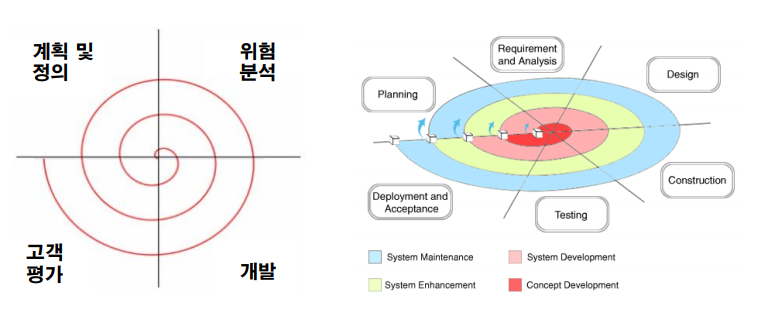
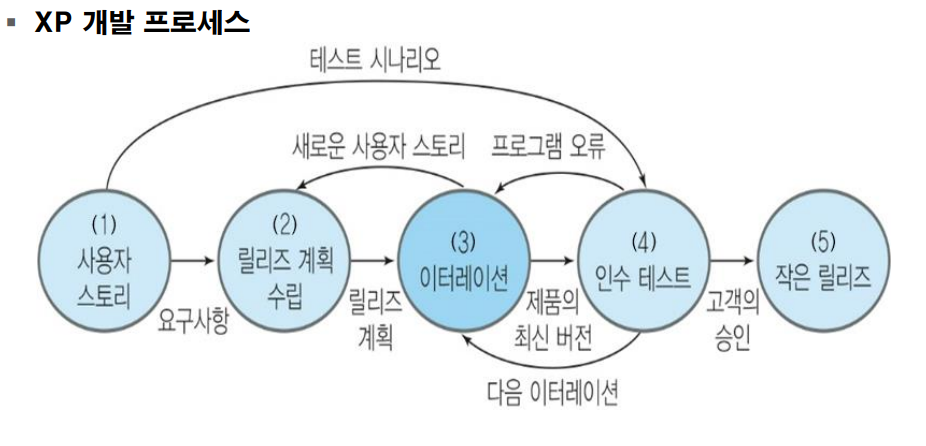
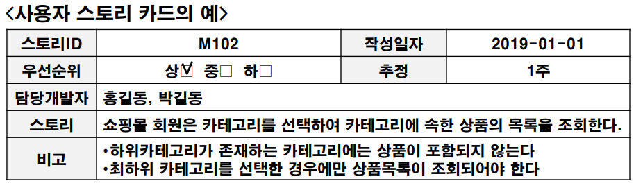
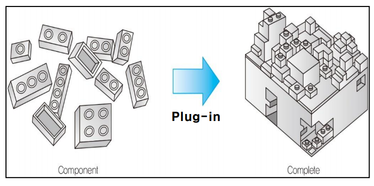
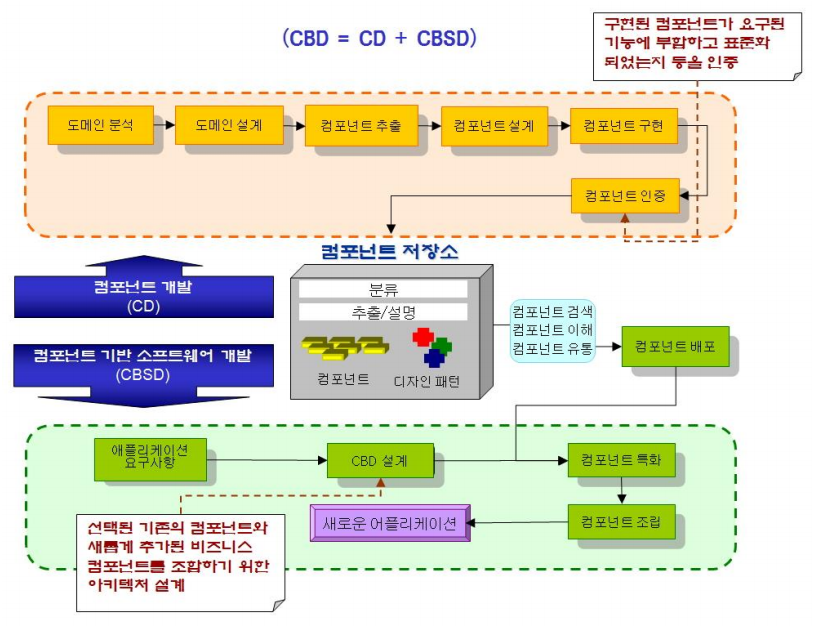

05 개발 방법론과 프로세스
===

# 1. 개발방법 vs 프로세스

---

# 2. 패러다임 전환(Paradigm Shift)

---

# 3. 소프트웨어 개발 방법론

소프트웨어 개발 방법론은 시대를 거쳐 다양하게 변화해 왔습니다.
80년대에 DB가 보편화 되면서 데이터를 단순히 저장하는 것이 아니라 활용하는 방법에 대해서 논의가 필요해졌습니다. 

90년대에는 해결해야 하는 문제를 현실적으로 바라보려 했습니다. 특히 UML을 이용해서 분석하고 설계하였습니다.

2000년대에는 각각의 문제들을 독립적인 구성요소(Component)로 나눠서 설계하였습니다. 이를 CBD(Component Based Development)라고 합니다.

2004년 이후에는 SOA(Service Oriented Architecture)가 나타났습니다. 서비스 제공에 필요한 모든 기능을 구현할 필요 없이 필요한 서비스를 다른 곳으로 부터 이용하는 방법론이다.

모든 개발 방법론은 객체지향 방법론을 근간으로 하고 있다.

---

## 3.1 폭포수 모델(Waterfall Model)

폭포수 모델은 소프트웨어 개발을 단계적으로 정의하여 체계적이고 하향식으로 순차적 접근하는 방법이다. 프로젝트의 진행 과정을 세분화하여 관리하기가 용이합니다. 하지만 실제 개발 과정에서는 순차적으로 이루어 지지 않고 순환이 발생합니다. 또한 고객의 요구사항을 초기에 구체적으로 기술하기란 어렵습니다. 이는 요구사항 구현에 있어서 설계의 헛점이 나타나고 개발의 마지막 단계에서 중요한 문제점들이 나타날 수 있습니다.

폭포수 모델의 단점을 극복하고자 순환의 구조를 허용하는 형태로 변화하고 있습니다.

### 1. 계획
프로젝트의 목표 설정 및 세부 행동 방안을 마련합니다. 이를 통해 프로젝트 관리 계획서(PMP)가 나옵니다.

### 2. 요구사항 분석
사용자 요구사항의 정의를 위한 시스템 요구사항을 수집합니다. 이를 통해 소프트웨어 요구사항 명세서가(SRS)가 나옵니다.

### 3. 설계
요구사항을 설계 도면(논리적/물리적)에 옮기는 과정입니다. 이를 통해 소프트웨어 설계 기술서(SDD)가 나옵니다.

### 4. 구현
설계 도면에 따라 시스템에 맞는 코드로 옮기는 과정입니다. 이를 통해 소스코드가 나옵니다.

### 5. 시험
분석, 설계, 구현 과정을 최종 점검하여 요류를 발견하고 수정하는 과정입니다. 이는 품질 보증 활동이라고도 합니다. 이를 통해 소프트웨어 시험 계획서(STP), 설계서(STD), 결과서(STR)이 나옵니다.

### 6. 유지보수
여러 변경 사항에 대비하는 과정입니다. 수정, 적응, 추가, 관리등을 수행합니다. 유지보수를 완료할 때 소프트웨어 유지보수 계획서(SMP)가 나옵니다.

---

## 3.2 원형 패러다임

사용자는 자신이 원하는 것이 무엇인지 구체적으로 알지 못합니다. 개발자들은 고객의 요구를 온전히 알 수 없게 됩니다. 이를 위해 개발자들은 시제품(prototype)을 만들어 고객의 요구사항을 도출 및 정의하는데 도움을 줍니다.

원형 패러다임은 사용자의 요구사항이 불분명하고 불안정한 상황에서 사용할 수 있습니다. 시제품은 사용자와 시스템 간의 인터페이스에 초점을 맞추어 개발합니다. 하지만 시제품의 결과물을 보고 완제품에 대한 과도한 기대를 할 수 있습니다. 

## 3.3 나선형(Spiral) 패러다임

폭포수 모델과 원형 패더라임의 장점과 **위험 분석을 추가**한 것이다. 시스템 개발에서 식별되는 **위험을 관리하고 최소화**하려는 것이 주된 목적이다.

나선형 패러다임은 나선을 돌면서 점진적으로 완벽한 시스템을 개발합니다.

### 3.3.1 특징

1. 시간과 비용이 큰 시스템 구축에 가장 현실적인 접근 방법입니다. (예. 초고속 정보통신망 개발, 고속철도망 구축 사업 등) 
2. 성과를 보면서 조금씩 투자하여 위험 부담을 줄일 수 있습니다.

### 3.3.2 한계

1. 모델안에 모델이 존재하므로 프로젝트 관리에 어려움이 있습니다. 
2.  많은 고객을 상대로 하는 상업용 제품 개발에 적용하기 어렵습니다. 그 이유는 많은 고객들의 의견들을 적용하다보면 출시한 서비스가 산으로 갈 수 있기 때문입니다. 
3. 또한 나선형 패러다임은 사용 사례가 적어 모델의 검증이 충분하지 않습니다.

---

## 3.4 4세대 기법

자동화 도구들을 활용하여 요구명세서부터 실행 코드 까지 자동으로 생성하는 방법입니다. (예. EER)

사람이 사용하는 자연어(예. 한국어, 영어 등)로 요구사항이 명시되었을 때 실행 가능한 제품으로 전환하는 CASE 도구 활용 기법입니다. 

고급 언어의 모호성 문제를 해결하기 위해 형식 규격 언어(FSL)을 정의하여 개발 과정을 자동화 할 수 있습니다.

### 3.4.1 한계

현재는 4세대 기법의 기술이 정교하지 못하여 지속적으로 개선되고 있습니다.

---

## 3.5 애자일 방법론

기존 방법론은 프로젝트의 본질적인 목표보다 계획 수립, 문서화, 품질 관리등의 주요 작업을 성치하기 위해 부수적으로 수행된느 작업을 과다하게 요구하였다. 그래서 빠르고 실용성을 강조한 경량 개발방법을 제시하게 됩니다. 애자일 소프트웨어 개발 선언문에서는 다음과 같이 언급했습니다.

1. 프로세스와 도구보다는 **개인과 그들의 협업**에 더 가치를 둔다.
2. 포괄적인 문서화보다는 **제대로 작동하는 소프트웨어**에 더 가치를 둔다.
3. 계약 협상보다는 **고객과의 협력**에 더 가지를 둔다.
4. 계획에 따르기 보다는 **변화에 대응하는 것**에 더 가치를 둔다.

### 3.5.1 특징

애자일 방법론은 문서 중심의 전통적 개발방법에서 벗어나서 필요한 요구를 그때 그때 더하여 수정하는 코드 중심의 점진적 개발방법입니다. 협업과 변화에 대한 빠른 대응에 가치를 두고 작은 수행 과정을 통해 **소규모 목표**를 달성해 나갑니다.

애자일 방법론에서는 **리팩토링(Refactoring)** 기법을 사용합니다. 리팩토링이란 겉으로 보이는 UI나 UX등을 바꾸지 않고, 소프트웨어의 내부 구조를 바꾸어, 설계를 향상시키는 기법입니다. 디자인 패턴은 설계 단계에서 적용하는 반면, 리팩토링은 구현 완료 시점에 수행을 합니다. 소프트웨어에서 잘못된 설계 구조를 판단하는 것은 프로그래머의 경험을 통해 터득하는 부분이므로 다양한 해결 방안들이 나올 수 있습니다. 

리팩토링을 통해 잘못된 설계에서 나타나는 기술적 부채를 감소시켜 신뢰성 있는 개발 환경을 조성할 수 있습니다.

> 기술적 부채
>
> 기존 결함들로 인해 새로운 기능을 개발하거나 확장하는데 어려움이 발생하는 현상을 말합니다. 개발자가 임기응변식으로 결점을 가리면서 발생합니다. 즉 급한 불만 끄려고 하는 잘못된 의사결정 관행에 의해 발생합니다.

### 3.5.2 장점

1. 문서화는 기피하고, 프로그래밍을 선호하는 우리나라 소프트웨어 개발 취지에 잘 맞습니다. 

2. 개발 프로젝트의 낮은 성공률 때문에 빠른 프로토타입 요구 증가에 적합합니다.

3. 출시 주기가 짧아지고 있어 애자일 개발방법론의 

4. 규모가 작고 쉽게 도입이 가능하여 투입 비용적어 그에 따른 위험도가 다른 방법론에 비해 상대적으로 낮습니다.

하지만 애자일 방법론을 도입하는데 어려움을 느끼고 있습니다. 그 이유는 

1. 낯선 개발 환경에 따라 성공 사례가 부족하며, 개발자와 고객간의 협력이 필요합니다.

2. 프로젝트 팀원의 역량이 필요합니다.

3. 기존 고객들의 계약중심적 사고방식을 바꿔야합니다. 

### 3.5.3 익스트림 프로그래밍(eXtreme Programming)

애자일 개발방법론 중에서 가장 많이 알려진 방법입니다. 기존 방법론에 비해 매우 **가벼운 기법으로 실용성을 강조**합니다. 추구하는 가치는 의사소통, 단순함, 피드백, 용기, 존중입니다.

익스트림 프로그래밍의 개발 과정은 다음과 같습니다.

익스트림 프로그래밍은 이터레이션이 반복되므로 인수 테스트 과정에서 고객의 변심이 게속 발생한다면 개발 기간이 지체될 수 있습니다.

사용자 스토리를 만들어 고객과 직접 대화를 통해 요구사항을 분석합니다. 수행될 작업을 작게 나누어 짧은 시간에 완료할 수 있는 작업 범위를 배정합니다. 

좋은 사용자 스토리를 만드는 대는 6가지 특성(**INVESET**)이 있습니다.

1. **I**ndependent : 독립적이다. 
2. **N**egotiable : 협상 가능하다. 
3. **V**aluable : 사용자와 고객에게 가치가 있다. 
4. **E**stimable : 추정 가능하다.
5. **S**mall : 작다
6. **T**estable : 시험이 가능하다.

---

## 3.6 컴포넌트 기반 개발방법론(Component Based Development Methods)

Component란 하나의 독립적인 기능을 가지는 모듈을 말합니다. Compoenent는 소프트웨어 컴포넌트를 줄여서 말하며, 그 특징은 다음과 같습니다.

1. 소프트웨어 시스템에서 독립적인 업무나 기능을 수행하는 모듈
2. 목적에 따라 부품처럼 교제하거나 재사용 가능
3. 하나의 컴포넌트는 하나 이상의 클래스로 구성가능
4. 인터페이스를 통해서만 접근 가능

이러한 특징을 가지는 컴포넌트를 재사용하기 위해서는 다음과 같은 조건들이 필요합니다.

1. 실행코드 기반으로 만들어져야 합니다.
2. 관련 정보들이 명세화 되어야 합니다.
3. 표준을 준수해서 개발해야 합니다.
4. 관련 문서와 코드들이 독립단위로 묶여져야합니다.
5. 독립적으로 배포 가능해야 합니다.

하나의 컴포넌트가 완성되려면 다음과 같은 과정을 거쳐 컴포넌트 저장소로 옮겨질 수 있습니다.

### 3.6.1 특징

객체지향 기술이 해결하지 못한 개발 생산성, 소프트웨어 재사용성, 시스템 유지보수성을 향상시킬 수 있는 대안이 됩니다. 소프트웨어 위기를 초래할 고질적인 문제들(생산, 납기지연, 비용초과 등)을 해결할 수 있는 방안으로 인식되고 있습니다.

### 3.6.2 장점

1. 고객의 요구변화에 신속하고 유연하게 대처 가능합니다.

2. 기존 기술에 대한 중복투자 감소 및 유지 보수성이 향상됩니다.