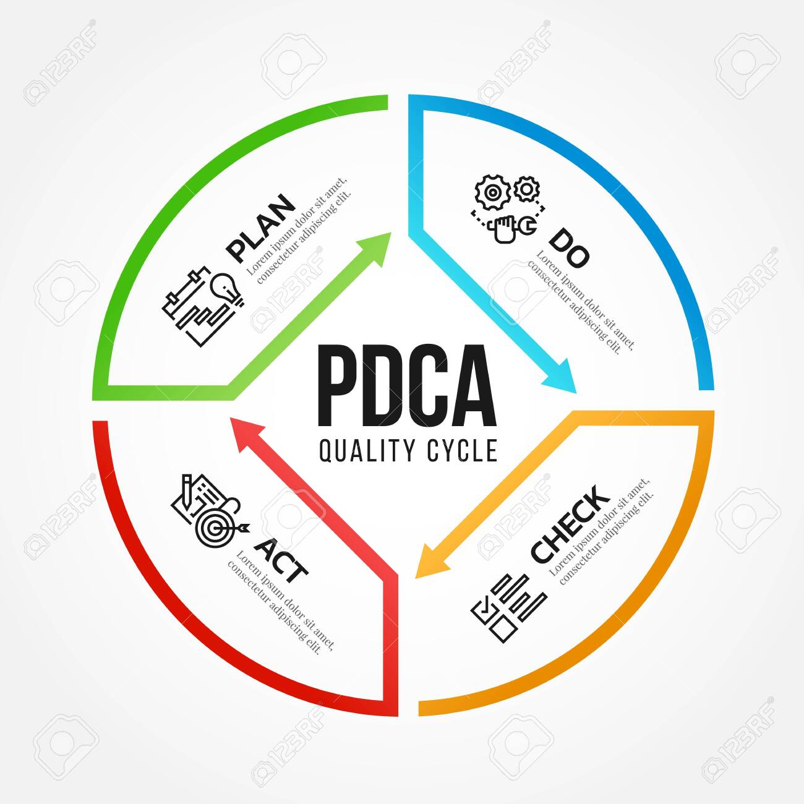
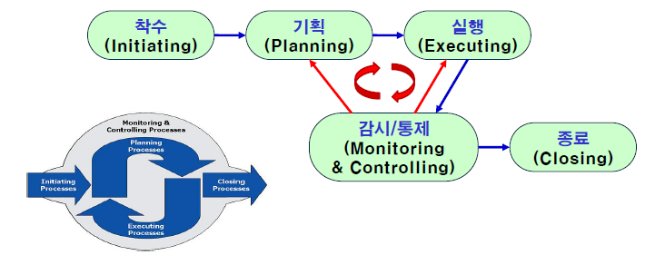
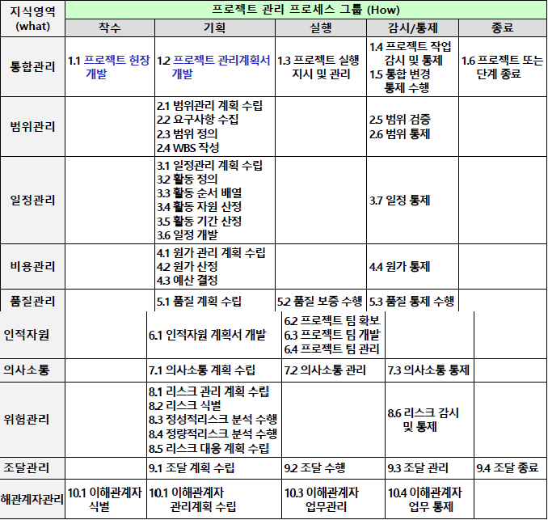
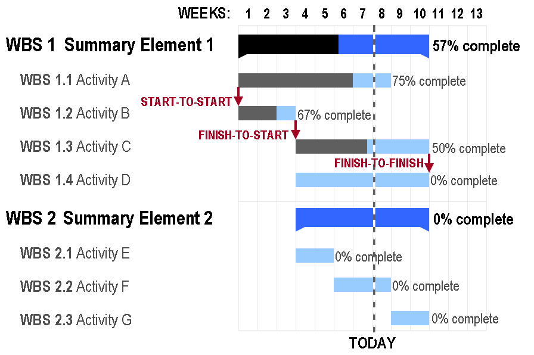

06 프로젝트 관리와 계획
===

# 1. 프로젝트 관리

프로젝트란 특정 제품, 서비스, 결과물을 효과적으로 얻기 위한 사업이다. 사업의 정해진 목표를 얻기 위해 인력, 비용등과 같은 자원을 한시적(일시적)으로 투입한다. 이런 자원의 효율적 사용을 위해 프로젝트에 대한 조직적 관리 및 계획이 필수적으로 요구된다.
 
프로젝트는 다음과 같은 특징을 가진다.

1. 프로젝트의 시작 초기에는 모든 내용을 알 수 없으며, 과거 경험을 통해 추상적으로 접근하므로 불확실하다.

2. 프로젝트의 초기는 추상적이지만, 일이 진척됨에 따라 점진적으로 구체화되고 명확해진다.

많은 프로젝트들이 제대로 진행되지 못하는 이유는 관리가 부족하기 때문이다. 프로젝트를 체계적으로 관리하기 위해서 PDCA(Plan Do Check Action)를 이용한다. 

## 1.1 PDCA 관리 주기

1. Plan : 어떤 업무의 시작을 위해 목표를 확립하고 이를 달성하기 위한 활동 계획을 세우는 과정이다.
   
2. Do : 계획을 확인하고, 수립된 시스템에 따라서 실제로 일을 수행하고, 실행이 계획대로 이루어지는지 현재 상태를 확인 및 계획과 대조하는 작업이다.

3. Check : 실행 상태를 감시하고, 심각한 이상이 감지되었을 경우 근본 원인을 파악하고 해결책을 강구하며 개선할 수 있는 대안 제시한다.

4. Action : 점검을 통해 도출된 대안을 적용하여 계획을 조정한다.

## 1.2 프로젝트 프로세스

프로젝트 수행에 필요한 지식, 기량, 기법, 도구 등을 적절히 적용하는 과정이다. 또는 **입력물**을 받아 **가공처리**하여 새로운 **산출물**을 만들어내는 과정이다. 산업이나 프로젝트 유형에 상관없이 모든 프로젝트에 공통적으로 적용된다.

### 1.2.1 프로젝트 프로세스 분할

1. 제품 개발 프로세스 : 소프트웨어 개발 프로세스, SDLC라고도 한다.

2. 프로젝트 관리 프로세스 : 개발 프로세스에 대한 보호 프로세스를 의미한다.

## 1.3 프로세스 그룹

산업이나 프로젝트 유형에 상관없이 모든 프로젝트에 공통적용된다. PMBOK에서는 5가지 프로세스 그룹을 정의합니다.

착수 과정은 초기 자원을 투입하는 과정을 말합니다. 기획은 프로젝트의 계획들을 수립하는 단계입니다. 실행은 프로젝트 관리 대상에 대한 실제 진행을 합니다. 감시/통제는 실행 과정에 대한 관리를 수행합니다. 통제가 이루어졌다면 기획 단계에 피드백하여 실행 단계로 넘어갑니다. 

범위 관리란 프로젝트의 최종 목표인 요구사항을 관리하는 것을 말합니다. 일정관리란 일정 기간 동안 프로젝트가 완료되도록 관리하는 것을 말합니다. 비용관리란 주어진 물적, 인적 자원을 관리하는 것을 말합니다. 의사소통은 프로젝트 진행에 있어서 정말 중요한 부분입니다. 고객과의 이야기를 통해 고객이 요구하는 기능들을 잘 이해하는 것은 중요합니다. 

## 1.4 프로젝트 통제

프로젝트 통제란 프로젝트 관리 계획서의 모든 변경 요청을 검토합니다. 모든 변경 요청은 문서화되어야 하며, 관리자에 의해 승인 또는 거부 될 수 있습니다. 승인된 변경 요청은 공식적으로 인정받을 수 있고 진행할 수 있습니다.

통제를 담당하는 조직들이 있습니다. 변경통제위원회와 형상통제위원회가 대표적입니다.

## 1.5 프로젝트 종료

프로젝트가 완료되었음을 공식화하는 활동입니다. 고객의 공식적인 승인을 획득하는 활동입니다. 프로젝트 관리 계획서의 제품 수락 계획에 명시되어 있는 산출물 목로그 산출물 및 제품 수락 기준, 수락 프로세스에 근거하여 절차를 진행합니다.

* 주요활동
    - 최종 제품, 서비스 또는 결과물 인계
    - 계약 종결에 대한 계약서 약관 및 조건 이행
    - 고객 또는 스폰서의 인수 수락
    - 습득한 자료 및 경험을 교훈 문서로 정리

> 파레토 법칙(Pareto`s Law) : "상위 20%가 전체 생산의 80%를 해낸다."

## 1.6 프로젝트 리더(PM/PL)의 역할

* 전략적 기획가(Strategic Planner) : 프로젝트 목표와 비전설정, 목표달성을 위한 전략 계획 수립

* 동기 부여자(Exciter) : 팀 응집력 강화, 팀 정신 구축

* 기술적 전문가(Technical Expert) : 기술적 문제점 파악과 대안 제시, 팀원 애로 사항에 대한 피드백

* 기술정보통(GateKeeper) : 의사소통의 구심적 역할, 외부 기술정보원과의 네트워킹, 프로젝트 팀의 대벼인 역할

* 열성적 추진자(Champion) : 프로젝트 목표와 리더 개인 목표를 일치, 관련 부서와 제휴 및 연대 구축 대외적인 홍보와 세일즈맨 역할 수행

# 2. 프로젝트 계획

계획이란 문제를 해결하거나 목적을 이루기 위하여 앞으로 해야 할 일을 미리 생각하여 전략을 수립하고 그 내용을 결정하는 일입니다. 프로젝트 진행 단계에서 가장 중요한 것은 계획입니다.

프로젝트 계획 이전에 발주자가 원하는 제품의 사양, 예산, 일정 등 프로젝트에 관한 요구사항을 정리하여 제안요청서(RFP)를 작성합니다. 입찰 공고를 통해 RFP가 공개되면, 개발업체는 제안요청서를 기초로 소프트웨어 개발 계획을 담은 제안서를 작성하여 제출합니다.

개발업체와 발주자간 계약이 완료되면, 프로젝트 헌장을 작성하여 승인을 받아야합니다. 프로젝트 관리자(PM)가 보통 작성합니다. 프로젝트가 시작되면, 관리자는 프로젝트 관리 계획서(PMP)를 작성합니다. 이는 프로젝트 성공을 위한 모든 계획들을 기술합니다. 이 안에는 성과 측정의 기준 및 프로젝트 통제 기준도 제시하여야 합니다.

## 프로젝트 관리 계획서 목차

프로젝트 관리 계획서의 목차는 다음과 같습니다. 이는 대표적인 예시이므로 모든 업체가 이렇게 사용하는 것은 아닙니다.

## 2.1 범위 관리 계획

프로젝트 성공을 위해 해야 할 일과 하지 말아야 할 일의 경계를 정합니다. 확립된 범위 검증 및 승인된 범위의 변경을 적절히 통제할 수 있도록 계획합니다. 프로젝트 결과물의 특징 및 기능적인 요구사항을 규명합니다.

객체지향 방법론에서 기능 정의는 유스케이스(Use Case)를 활용합니다.

## 2.1.1 WBS, Work Breakdown Structure

프로젝트 팀에서 프로젝트 목표를 달성하기 위해 수행해야 할 작업을 계층적으로 작성한 구조이다. 내용은 일정과 원가를 산정할 수 있는 수준까지 작성할 수 있도록 분할하는것이 중요합니다. 

## 2.2 일정 관리 계획

어떤 일을 언제 할 것인가를 정합니다. WBS를 바탕으로 활동을 정의하여 아래 순서로 진행합니다. 이 순서를 꼭 지키면서 할 필요는 없습니다. 프로젝트를 진행하면서 2번과 3번 과정은 동시에 진행하는 것을 의미합니다.

다음은 인터넷 쇼핑몰 프로젝트의 일정 예시입니다.

## 2.2 원가 관리 계획

원가 관리 계획이란 프로젝트 생명주기 각 단계에서 얼마 만큼 비용이 투입될 것인지 추산하여 프로젝트 전체에 요구되는 비용을 예상하는 활동이다. 원가 관리는 2가지로 나뉠 수 있다.

### 1. 상향식 추정(Bottom-up estimation)

원가 추정을 가장 정확하게 할 수 있는 방법으로 **WBS의 최하위 수준의 작업 패키지 별로 원가 산출하여 상위로 합산**한다. 각 작업 패지키에 대한 상세한 입력 자료가 필요하고 많은 비용과 시간이 소요된다.

### 2. 하향식 추정(Top-down estimation)

프로젝트 착수 단계에서 정확히 원가를 산출할 수 있는 구체적인 근거가 없을 때 **전문가 경험과 판단에 의지**하는 방법이다. 결과물이 눈에 보이지 않아 계획 단계에서 정확히 원가를 산출할 수 없는 경우에 사용합니다. 대표적인 예로 LOC(Line of Code), **FP(Function Point)** 방식이 있습니다.

## 2.3 형상(Configuration) 관리 계획

소프트웨어에서 형상이란 문서를 의미합니다. 이 문서에는 계획서, 보고서 및 소스코드 까지 포함됩니다. 형상 관리 계획은 개발 단계마다 만들어지는 산출물인 문서를 관리하는 일입니다. 

소프트웨어 개발이나 유지보수 과정에서 형상은 수시로 변경됩니다. 이때 형상의 변경은 변경 분에 대해 프로젝트의 책임을 지는 것이기 때문에 매우 중요합니다.

## 2.4 확인 및 검증 계획

식별된 요구사항이 개발 프로세스를 거치면서 어떻게 연관되어 있는지를 규명할 수 있는 방법이 필요합니다. 식별된 요구사항을 추적하기 위해 요구사항 추적표를 이용합니다. 요구사항 추적표는 향후 유지보수에서 기능 식별 및 수정에도 큰 도움이 됩니다.

확인은 사용자 요구사항을 올바르게 이해하는 과정입니다. 고객의 기대와 요구사항을 만족시킬 수 있도록 보장하는 활동입니다.

검증은 이해된 요구사항을 소프트웨어에 올바르게 반영되도록 보장하는 활동입니다. 지정된 기능을 정확히 수행할 수 있도록 단계별 점검을 통해 추적하는 활동입니다. 

