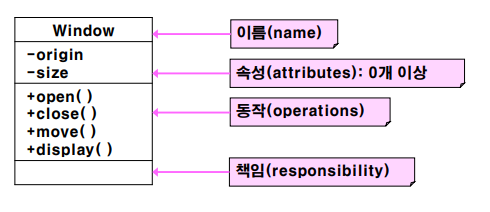

08 UML 기초
===

# 들어가기전

초기의 객체지향 방법론은 다음과 같습니다.

* Booch의 방법론

    Rational Software Corporation의 Grady Booch가 제안하였으며, **설계와 구현**에 적합합니다.

* OOSE(Object-Oriented Software Engineering)

    Objectory 사의 Ivar Jacobson이 제안하였으며, **요구 추출과 분석, 상위 레벨 설계**에 적합합니다. **유스케이스**(use cases)개념을 처음으로 도입하였습니다.

    유스케이스는 요구사항에서 식별한 주요 동작을 서술합니다. 하지만 구현 방식에 대해서는 서술하지 않습니다.

* OMT(Object Modeling Technique)

    General Electric 사의 James Rumbaugh가 제안하였으며, **분석 단계**에 적합합니다. 대량의 자료를 다루는 정보처리 시스템에 강점이 있습니다.

* Others

    다른 방법론으로 Fusion, Shlaer/Mellor, Coad/Yourdon등이 있습니다.

# 1. UML(Unified Modeling Language)

 Unified Modeling Language의 약자로 1997년 OMG(Object Management Group)에서 표준으로 채택한 통합모델링언어 입니다. 즉, 모델을 만드는 표준언어인 것입니다. 모델이란 것은 어떤 것을 실제로 만들 때 이렇게 만들면 잘 작동할지 미리 검증해 보는 것이며 실제 물건을 만드는 비용보다 비용이 훨씬 적을 경우에 모델을 만들어 설계를 검사합니다.

 소프트웨어에서의 모델은 건축, 항공 등의 모델과는 좀 다른 면이 있습니다. 건물을 짓고, 항공기를 만드는 것과 설계를 그리고 만드는 것은 비용의 엄청난 차이가 있습니다. 하지만 UML 다이어그램을 그리며 모델을 만드는 일은 개발보다 비용이 적긴 하지만 훨씬 적게 드는 것이 아니며 때로는 오히려 개발보다 비용이 더 많이 들 수도 있습니다. 그래서 UML은 시험해 볼 구체적인 것이 있고, 그것을 코드로 시험해 보는 것보다 UML로 시험해 보는 쪽이 비용이 덜 들 때 주로 사용합니다. 이러한 목적으로 UML을 사용하는 유형에는 다음 3가지 정도가 있습니다.

- 다른 사람들과의 의사소통 또는 설계 논의
- 전체 시스템의 구조 및 클래스의 의존성 파악
- 유지보수를 위한 설계의 back-end 문서

UML을 그리는데 가장 좋은 도구는 종이와 펜이라는 말이 있듯이 습관적으로 만드는 게 아니라 필요에 의해 만드는 것이 가장 좋은 것 같습니다.

## 1.1 UML 목표

- 시스템을 개발하는 모든 과정에 객체지향적 방법론을 적용하도록 함
- 매우 크고 복잡한 시스템을 모델링 할 수 있도록 함
- 인간과 컴퓨터 모두가 사용할 수 있도록 함

# 2. UML의 문법

UML은 Basic building blocks, Rules, Commone mechanism 3개로 구성되어 있습니다.

## 2.1 Things

UML로 작성한 모델에서 가장 중요한 구조물입니다.

- Structural things or classifiers(구조 사물)

    UML로 작성한 모델에서 명사에 해당됩니다. 이것은 물리적일 수 있고 개념적일 수도 있습니다. Class, Interface, Collaboration, Use case, Active class, Component, Artifact, Node가 구조 사물에 속합니다.

- Behavioral things(동작 사물)

    시간 및 공간의 변화에 따른 구조 사물의 동작을 표현하는 사물입니다. Interaction, State machine, Activity가 동작 사물에 속합니다.

- Grouping things(분류 사물)

    시스템의 구성 요소를 grouping하는데 사용하는 사물입니다. Package가 있습니다.

- Annotational things(주석 사물)

    시스템의 구성 요소에 대한 주석을 붙이는데 사용하는 사물입니다. Note가 있습니다.  

## 2.2 Class

클래스는 보통 3개의 compartment(구획)으로 나누어 클래스의 이름, 속성, 기능을 표기합니다. 속성과 기능은 옵션으로 생략이 가능하지만 이름은 필수로 명시해야 합니다.

속성은 가시성과 중첩도가 있습니다. 가시성은 속성을 표현할 범위를 나타내며 +(public), -(private), #(protected), ~(package)가 있습니다. 중첩도는 생성 가능한 객체의 개수를 나타냅니다.

예를 들어 +toy[20] : Object = (){readonly} 는 toy라는 Object 클래스는 public이며 초기값은 없고 읽기전용이란 뜻입니다.

동작은 가시성과 매개변수, 반환형이 있습니다.

# 3. UML의 개념적 모델

# 4. UML 구성요소