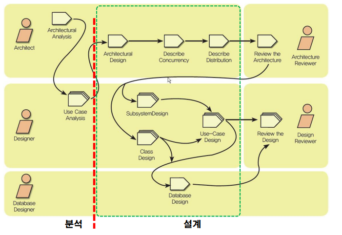
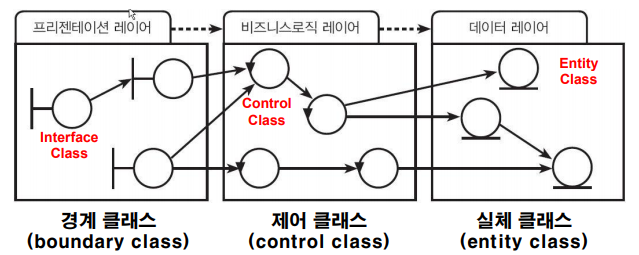

11 UP Workflow
===

# UP Workflow

UP Workflow은 6개의 Core Engineering Workflow, 3개의 Core Sopporting Workflow를 포함 9개의 Core Workflow를 제공합니다.

- Core Engineering Workflow

    1. 비지니스 모델링 Businesss Modeling Workflow
    2. 요구사항 Requirements Workflow
    3. 분석 설계 Analysis and Design Workflow
    4. 구현 Implementation Workflow
    5. 시험 Test Workflow
    6. 배치 Deployment Workflow

- Core Supporting Workflow

    7. 프로젝트 관리 Project Management Workflow
    8. 형상 및 변경 관리 Configuration and Change Managament Workflow
    9. 환경 관리 Enviroment Workflow

# Analysis and Design Workflow

- 구조설계자(Architect)
    - 설계 모델이 올바르고, 모순이 없으며, 읽기 쉽게 작성되도록 하는데 대한 전반적인 책임
    - 설계 모델 및 배치 모델의 구조 작성
    - 설계 모델의 다른 산출물에 대한 책임은 없음

- Use Case Engineer(유즈 케이스 엔지니어)
    - 각각의 유즈 케이스를 요구에 부응하도록 실현
    - 설계 클래스 및 서브시스템과 이들의 인터페이스 및 관계에 대한 책임은 없음

- Component Engineer(컴포넌트 엔지니어)
  - 설계 클래스의 오퍼레이션, methods, 속성, implementation requirements를 작성하고, 지속적으로 유지
  - 서브시스템의 상세 내역을 작성하고, 지속적으로 유지 May also maintain the integrity of one or more subsystems

# 객체지향 설계 기법

