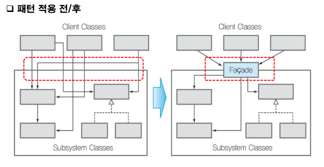
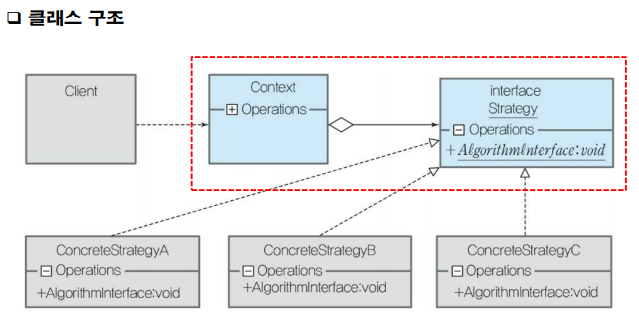
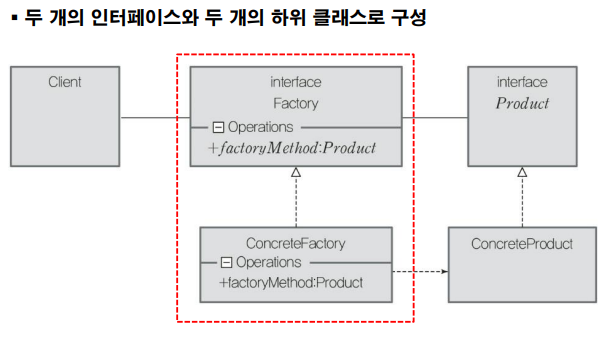

12 디자인패턴
===

# 패턴

패턴이란 일정한 형태나 양식이 반복적으로 나타나는 현상을 의미합니다. 이는 규칙성이 있다는 것을 의미하며 음악, 수학, 미술, 건축 등 다양한 분야에서 문제를 해결하는데 사용합니다.

# 1. 소프트웨어 디자인 패턴

건축물 설계에서 빈번히 발생되는 동일한 설계 내용이 있는데 이것들은 하나의 패턴으로 인식하여 다른 건축물 설계에 재사용하면 문제해결에 대한 고민을 반복하지 않고 무한하게 재사용 가능하다. 


디자인패턴이란 특정한 상황에서 일반적인 설계 문제의 해결을 위해 상호 교류하는 수정 가능한 객체와 클래스에 대한 설명이다. 즉 소프트웨어를 설계할 때 특정 상황에서 자주 사용되는 패턴을 정형화 한 것이다. 이는 최적화된 알고리즘 코드이거나 클래스, 모듈들의 좋은 구조를 가지고 있습니다.

### 특징

- 경험을 통해 습득된다.
- 특정한 형식을 갖고 체계적으로 작성되는 것이 일반적이다.
- 패턴에는 각기 다른 추상화 수준이 존재하며 계속 진화하고 있다.
- 소프트웨어 설계 시, 개발자들에게 추천 지침으로 제공되며, 추천 지침은 개발자가 빠르고 정확하게 설계할 수 있도록 도와주어 소프트웨어 품질 향상을 기대할 수 있음

### 장점

- 의사소통 원할 : 디자인 패턴을 알고 있는 설계자들은 특정 문제에 대해 공통적으로 알고 있는 패턴을 이용해 해결책을 논의 할 수 있어 보다 원활한 의사소통이 가능합니다.

- 경제적 : 검증된 지식인 패턴을 사용해 높은 완성도의 디자인을 빠른 시간에 만들 수 있어 소프트웨어 개발 비용 절감으로 경제적이며 코드 수준을 한 단계 높여주고 적은 수의 클래스로 원하는 목적 달성 가능한 환경을 제공합니다.

- 소프트웨어 구조 파악 용이 : 좋은 설계나 아키텍처가 패턴이라는 이름으로 명명되어 있어 개발자는 그 패턴의 이름만으로도 소프트웨어 구조를 알 수 있습니다. 이전의 소프트웨어 개발에서 사용한 설계나 구조를 쉽게 이해할 수 있으며, 새로운 소프트웨어에 빠르게 적용할 수 있어 소프트웨어 재사용이 용이합니다.

# 2. GoF 패턴

## 2.1 생성

### Singleton

Singleton이란 특정 클래스의 인스턴스가 오직 하나만 있는 것 입니다. Singleton 패턴의 활용 예는 프린터 입니다. 프린터는 다양한 프로그램으로 부터 인쇄 요청이 옵니다. 그렇기에 프린터기에서 인쇄 순서는 중요합니다. 즉 한 번에 한 페이지씩 프린터로 전송해야 하며, 이는 프린터 클래스는 오직 하나만 있어야 한다는 것을 의미합니다.

```Java
public class Printer {
    // 외부에 제공할 자기 자신의 인스턴스
    private static Printer printer = null;

    // 자기 자신의 인스턴스를 외부에 제공
    public static Printer getInstance(){
        if (printer == null) {
            // Printer 인스턴스 생성
            printer = new Printer();
        }
        return printer;
    }
}
```

## 2.2 구조

### Facade 

Facade는 건물의 출입구로 이용되는 정면 외벽 부분을 가리키며 정문의 현관을 포함하고 큰 건물의 경우에는 안내소가 위치합니다. 개발자가 사용해야 하는 서브시스템의 가장 앞쪽에 위치하고 있으면서 하위시스템에 있는 객체들을 사용할 수 있도록 하는 역할을 수행합니다.

시스템간 복잡한 연관관계가 있을 경우, 두 시스템 사이에 위치하여 복잡성을 줄이고 서브시스템을 구조화하여 서브시스템으로의 접근을 하나의 Façade 객체로 제공하는 패턴이다.



### 언제 사용하는가?

- 복잡한 서브시스템에 대한 단순한 인터페이스 제공이 필요할 때
  
- 클라이언트와 구현 클래스 간 너무 많은 의존성이 존재하여 클라이언트와 다른 서브시스템 간 결합도를 줄일 필요가 있을 때
- 빌딩 블록(Building Block) 아키텍처, 컴포넌트 기반 개발 (Component Based Development), Service Oriented Architecture 등의 경우와 같이 서로의 내부구조를 감추고 블랙박스로 이해해야 할 때
- 서브시스템들이 계층 구조를 이루고 있어서 각 서브시스템의 계층별 접근점(Façade 객체)을 제공하려 할 때

### Adapter

소프트웨어 개발할 때는 관련 라이브러리에서 제공하는 API를 대부분 사용합니다. 하지만 사용해야 하는 라이브러리에서 제공하는 API가 사용하는 모듈의 인터페이스와 호환이 되지 않는다면 이를 위한 많은 시간이 필요합니다. 이를 적은 비용으로 기존의 라이브러리를 사용할 수 있는 방법이 Adapter입니다.

Adapter는 호환성이 없는 인터페이스이기 때문에 같이 사용할 수 없는 클래스를 개조하여 함께 작동하도록 합니다.

### 구조

- 상속을 활용한 Adapter 패턴 : Adapter 클래스는 Adaptee를 상속 또는 구현하여 클라이언트가 사용할 도메인에 종속적인 메서드를 제공하는 구조

    

- 객체 합성을 이용한 Adapter 패턴 : Adapter 클래스는 Adaptee 클래스 타입의 멤버 변수를 선언하여 클라이언트가 사용할 도메인에 종속적인 메서드를 제공하는 구조

    

    

- 다양한 라이브러리를 사용할 때

    

### 구성

- Adaptee : Client가 원하는 인터페이스를 지원하지 않는 객체
- Target : Client가 Adaptee로 부터 지원을 바라는 오퍼레이션을 가진 인터페이스
- Adapter : Adaptee가 Target 인터페이스를 지원하는 것처럼 보이게 해주는 클래스로써 상속이나 위임을 사용하여 구현된다.

### 언제 사용하는가?

- 기존의 클래스를 사용해야 하나 인터페이스가 수정되어야 하는 경우
- 아직 예측하지 못한 클래스나 실제 관련되지 않는 클래스들이 기존의 클래스를 재사용 하고자 하지만, 이미 정의된 재사용 가능한 클래스가 지금 요청하는 인터페이스를 꼭 정의 하고 있지 않는 경우, 즉 이미 만들어진 것을 재사용하고자 하나 재사용 가능한 라이브러리를 수정할 수 없는 경우

## 2.3 행위

### Strategy

다양한 알고리즘이 존재할 때 이들 각각을 하나의 클래스로 캡슐화하여 필요할 때 알고리즘을 대체 가능하도록 클래스를 설계하는 것이다. 클라이언트 영향을 주지 않고 다양한 알고리즘으로 변경할 수 있다. 



### 언제 사용하는가?

- 행위들이 조금씩 다를 뿐 개념적으로 관련된 많은 클래스들이 존재하는 경우, 각각의 서로 다른 행위 별로 클래스를 작성해서 알고리즘을 선택해야할 때
- 저장 공간과 처리 속도 간의 절충에 따라 서로 다른 알고리즘 사용할 때
- 많은 행위를 정의하기 위해 클래스 안에 복잡한 다중 조건문을 사용해야 하는 경우
- 어떤 알고리즘이 클라이언트가 알아서는 안될 데이터를 사용하거나, 알고리즘에 종속된 복잡한 자료구조를 사용할 때

### 구현

```Java
package StrategyPattern;
import java.util.ArrayList;

public interface SortStrategy {
    public void sort(ArrayList<Integer> dataList);
}

// #2 BubbleSort.java - Strategy 구상 클래스
class BubbleSort implements SortStrategy {
    @Override
    public void sort(ArrayList<Integer> dataList) {
        System.out.println("Run Bubble Sort");
    }
}

class QuickSort implements SortStrategy {
    @Override
    public void sort(ArrayList<Integer> dataList) {
        System.out.println("Run Quick Sort");
    }
}

class Context {
private SortStrategy srtStrategy;
    public void setContext(SortStrategy srtStrategy) {
        this.srtStrategy = srtStrategy;
    }
    public void sortExcute(ArrayList<Integer> arrayList) {
        this.srtStrategy.sort(arrayList);
    }
}


class StrategyPatternTest {
    public static void makeNum(ArrayList<Integer> arrayList) {
        Random random = new Random();
        for(int i=0; i< 10; i++) {
            arrayList.add(random.nextInt(1000));
        }
    }
    public static void main(String[] args) {
        ArrayList<Integer> arrayList= new ArrayList<Integer>();
        StrategyPatternTest.makeNum(arrayList);
        Context context = new Context();

        context.setContext(new BubbleSort());
        context.sortExcute(arrayList) ;
        context.setContext(new QuickSort());
        context.sortExcute(arrayList);
    }
}
```

### Factory

Factory는 객체를 생성하기 위해 일정한 절차가 필요하거나 객체를 생성하는 시점이 불명확할 경우에 객체를 생성하는 메소드를 이용합니다. 객체를 생성하기 위한 인터페이스를 정의하지만, 어떤 클래스의 인스턴스를 생성할지에 대한 결정은 하위 클래스에서 이루어지도록 인스턴스 생성 책임을 미룹니다. 



### 구성

- Creator : 실제 타입이 알려지지 않은 객체를 생성할 수 있는 메서드로 정의하여 이를 추상 메서드 호출을 통해 수행한다.

- Concrete Creator : Creator의 객체 생성 추상 메서드를 오버라이드하여 Concrete Product를 생성하는 파생 클래스

- Product : Factory 메서드가 생성하는 객체의 인터페이스를 정의, Creator는 이 인터페이스를 통해 Concrete Product에 접근

- Concrete Product :  Creator(기반 클래스) 메서드에 의해 사용되는 객체, Product 인터페이스를 구현


# 3. 패턴의 남용

- 항상 고려해야 하며 패턴을 배웠다고 해서 패턴을 사용하지 말아야 할 곳에 까지 패턴을 사용하게 되면 필요 이상으로 설계가 복잡해짐
- 무분별한 패턴 사용으로 인해 유지보수가 어려운 소프트웨어가 만들어짐
- 패턴을 남용하지 않기 위해서는 패턴에 대해 정확히 이해하고, 소프트웨어의 기능이나 규모에 따라 패턴을 유연하게 사용할 수 있는 설계 능력을 갖추어야 함
