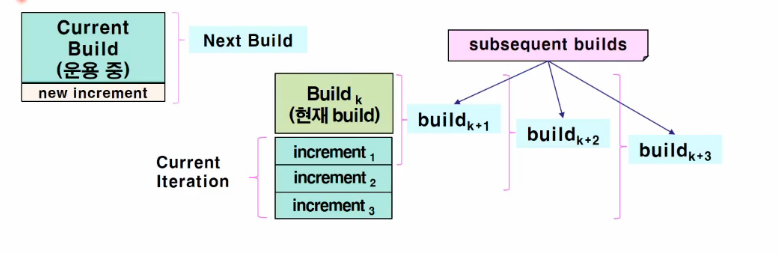

구현
===

# 1. 구현이란?

SIP와 SIR 예제는 등록해두지만 계획서를 작성하지 않습니다.  구현중에 문제를 식별하고 이를 작성하기 바랍니다.

설계 문서를 바탕으로 시스템을 컴포넌트의 집합으로 실현하는 것입니다. 컴포넌트는 소스코드, 스크립트, 이진파일, 실행파일 등을 의미합니다.

## 1.1 구현 작업의 범위

- 각각의 iteration에서 필요한 시스템의 통합 계획 수립
- 설계 클래스 및 서브시스템을 독립코드로 작성
- 컴포넌트를 구성하는 모듈에 대한 단위테스트 실시
- 테스트가 끝난 모듈로부터 실행 파일 생성
- 실행 가능한 컴포넌트를 배치 모델의 노드에 분산 배치

## 1.2

Unified Model에서는 Construction 단계에서 구현을 합니다.  Transition 단계에서의 구현은 늦게 발견된 문제점들을 수정합니다.

구현 단계에서 완성된 산출물은 구현 모델이라 하며 소스 코드의 파일을 포함하고 있으며, 하루 단위로 백업을 진행해야 합니다.

## 1.3 산출물

- 구현 모델

    구현 모델에서는 아래와 같은 사항을 기술합니다.

    - 설계 모델의 구성 요소가 어떤 컴포넌트로 구현되는가?
    - 구현 환경 및 프로그래밍 언어가 제공하는 기능을 사용하여, 컴포넌트들을 체계적으로 그룹화 하는 방법
    - 컴포넌트들 사이의 종속 관계
  
    구현 순서는 다음과 같이 진행합니다.

    1. 서브시스템 구현
    2. 컴포넌트 구현
    3. 인터페이스 구현

- 구조 기술
- 통합 빌드 계획

## 1.4 구현 모델

## 1.4.1 서브시스템 구현

구현 모델의 산출물을 적절한 크기로 분류하는 수단을 제공

구성 요소 : 하위의 서브시스템, 컴포넌트, 인터페이스

오퍼레이션 형태의 인터페이스를 제공할 수 있음

구현 서브시스템과 설계시스템은 1:1 대응 관계를 가집니다.

a, b는 다른 서브시스템에 있는 클래스가 될 수 있습니다.

## 1.4.2 컴포넌트 구현

설계 모델의 구성 요소를 구현한 결과물을 물리적인 단위로 포장하는 것입니다.

- \<<executable\>> : 노드에 탑재하여 실행시킬 수 있는 프로그램
- \<<library\>> : 정적 또는 동적 라이브러리
- \<<table\>> : DB 테이블
- \<<file\>> : 소스 코드 또는 데이터를 갖고 있는 파일
- \<<document\>> : 개발 과정에서 생산된 문서

- 컴포넌트의 특성

컴포넌트 개발자는 컴포넌트 구현과 함께 테스트를 하여야 합니다.

## 1.4.3 인터페이스(Java Interaface) 구현

인터페이스는 컴포넌트 또는 서브시스템이 제공하는 오퍼레이션을 기술하는데 사용합니다. 다른 컴포넌트와 

## 1.5 구조 기술

구조적으로 중요한 산출물을 표현하는 구현 모델에 대하여 구조적 관점을 기술한것 입니다.

구조적으로 중요한 산출물은 다음과 같습니다.

- 서브시스템 구성
  
    - 서브시스템 설정 내역
    - 서브시스템의 인터페이스
    - 서브시스템 사이의 종속 관계

- 중요한 컴포넌트에 대해서

    - 중요한 설계 클래스를 구현한 컴포넌트
    - 범용 설계 매커니즘을 구현한 컴포넌트

## 1.6 통합 빌드 계획

Build란 시스템의 일부로서 실행 가능한 버전으로 만드는 것을 말합니다. Build를 통합 테스트를 거쳐서 완성되며, 버전관리가 필요합니다. Build가 완성 될 떄 마다 버전 관리가 필요합니다. increment가 증가할 때 마다 버전이 변경되야 합니다.

- 점진적 통합 : 반복적 개발 절차에서의 시스템 통합을 지칭합니다.

    관리하기 쉬운 규모의 increment를 대상으로 통합합니다. 하나의 iteration에서 구현할 기능이 너무 복잡하면 일련의 builds를 설정하여 통합 대상의 크기를 작게 조정합니다.

- 점진적 접근방법의 장점

    - 시스템을 부분적으로 완성하여 가동합니다. 시스템이 작동하는 모습을 이해 당사자에게 보여줄 수 있습니다.
    - 기존의 build에 조금씩 추가 합니다. 이는 오류 발견이 용이해집니다.
    - 보다 완전한 통합테스트가 가능합니다.

## 1.6 구현에서의 작업자들

# 2. 코드 검사

코드 검사는 소프트웨어의 오류를 발견하여 제거함으로써 높은 품질의 소프트웨어를 얻기 위한 활동 중의 하나입니다. 문제를 발견할 때 마다 수정하는 것이 아니라, 문서에 기술하여 추후에 수정을 진행합니다. **단위 시험을 진행하기 전에 코드 검사를 반드시 진행해야 합니다.**

## 2.1 코드의 오류 유형

- 데이터 오류(DA. Data Error) : 데이터가 다루어지는데 발생하는 오류로 데이터 유형 정의, 변수 선언, 매개 변수에서 나타나는 오류
- 문서 오류(DC. Document Error) : 프로그램 구성 요소인 선언 부분, 서브루틴, 모듈에 대한 적합하지 않은 주석, 잘못되거나 불필요한 주석을 의미
- 기능 오류(FN. Function Error) : 서브루틴이나 블록이 잘못된 것(what)을 수행하는 오류
- 논리 오류(LO. Logic Error) : 서브루틴이나 블록이 수행하는 방법(how)이 잘못되어 있는 오류
- 성능 오류(PF : Performence Error) : 프로그램을 수행하며 요구되는 효율성을 만족시키지 못하는 오류
- 표준 오류(ST : Standard Error) : 과정이나 표현이 표준에 의해 이루어지지 않은 경우
- 기타(OT : Error) : 문법적인 오류, 사람의 개성이 포함된 경우 등 앞의 유형으로 설명하기 힘든 불투명하고 애매모호한 오류

## 2.2 오류에 대한 구분

- 실종(M : Missing) : 구성 요소 안에 있어야 할 것들이 없음으로써 생기는 오류
- 실수(W : Wrong) : 구성 요소 안에 있으나 잘못이 발견된 오류
- 불필요(E : Extra) : 요구되는 것 이상으로 필요 없는 것이 들어간 오류

## 2.3 예시

209 ~ 238번 줄에 불필요한 코드가 있다는 것을 의미하며, FN에 E(불필요)가 있으며 그 수는 1개를 있다는 것을 의미합니다.

# 3. 단위 시험

단위 시험은 구현자 스스로가 하다보면, 객관적으로 판단하기가 어렵기 때문에, 성능 테스트 도구를 이용하거나 설계자가 단위 시험 테스트 케이스를 제공하는 것이 좋다.

## 3.1 Performing Specification tests

**블랙박스 테스트**라고도 합니다. 메소드가 어떻게 구현되어있는가는 관심의 대상이 아니며, 선정한 테스트 케이스에 대해서 적절한 결과를 보여주는가에 초점을 맞춥니다. 적절한 테스트 케이스의 선정이 매우 중요합니다.

- 허용 범위 안에 들어가는 정상적인 값
- 허용 범위의 경계 값
- 허용 범위 밖에 있는 값
- 적법하지 않는 자료

## 3.2 Performing Structure Tests

**화이트박스 테스트**라고도 합니다. 메소드 내부가 제대로 구현되었는가를 검증합니다. 모든 문장이 적어도 1회 이상 테스트될 수 있도록 테스트 케이스를 선정합니다. 메소드 내부에서 중요한 경로는 반드시 확인합니다. 화이트 박스 테스트는 하지 않아도 되지만, 하는 것을 적극 추천합니다.

- 가장 보편적으로 사용되는 경로
- Critical Path(핵심 경로)
- 알고리즘에서 특이한 경우에 대한 경로
- 위험도가 높은 작업을 수행하는 경로
  
가능한 높은 수준의 Coverage를 달성하도록 노력해야 합니다. 다음은 화이트 박스 테스트의 예시입니다.

# 참고 사항

## 개발 환경

개발 환경에 있어서 프로그래밍 툴의 자유도, DBMS의 사용 계정을 명시해주어야한다.

## 업무 분류

구현 업무 목록과 담당자는 통합되게 표현하도록 합니다. 구현 목록에는 실제 구현할 대상을 적으면 좋을것 같습니다.

## 구현 일정

SIP2를 참고하여, 컴포넌트 구현과 동시에 단위 시험이 진행되므로 컴포넌트의 구현 일정은 순차적으로 진행 하도록 합니다.

## 단위 시험

1. 목적

2. 작업 절차에 대해 명시합니다. 시험 케이스는 구현전에 설계자가 지정하며, 이를 토대로 구현자들은 테스트를 진행합니다.

## 구현 완성도

구현은 순차적으로 진행되므로, 서브시스템내에서 몇 개의 컴포넌트가 구현 되었는지를 표현해서
구현 수 / 설계 수 * 100% 로 계산하는게 더 적합다고 판단된다.

구현 여부는 구현 / 미구현만 하도록 한다.

## 프로그램 목록 및 소스코드

모든 컴포넌트에 대해서 소스코드를 붙이는 것이 아니라 주요 알고리즘에 대해서만 소스코드를 가져오며, 나머지는 구현이 되었다는 표현만 하도록 한다.

## 추적성 매트릭스

