16 기말시험
===

# 1. 학기 마무리 일정

~ 0612 STP 제출
0624 11:00 기말시험
~ 0625 용어집제출
0626 10:00 최종보고회
~ 0626 10:00 구현
~ 0629 PCR 제출

# 2. 기말시험

일자 0624 11:00
2분반 D329
문항 6문제
범위 테스트단계 까지

# 2.1 예상문제

기말시험에서 다음 10개중 5개가 나옵니다. 그림에 빈칸을 채워넣으시면 됩니다. 순서에 상관없는 그림과 순서가 중요한 그림을 작 파악하셔서 학습하시면 됩니다.

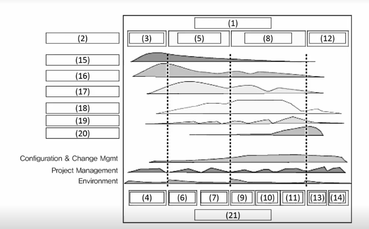

- 소프트웨어 공학에서 다루는 주제

    4가지 주제에 대해 충분히 이해해야 합니다.

    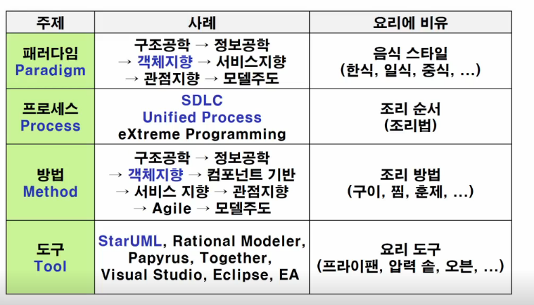

- 소프트웨어 개발 생명 주기 (SDLC)

    SDLC 과 SDC의 비교가 가능해야 합니다.

    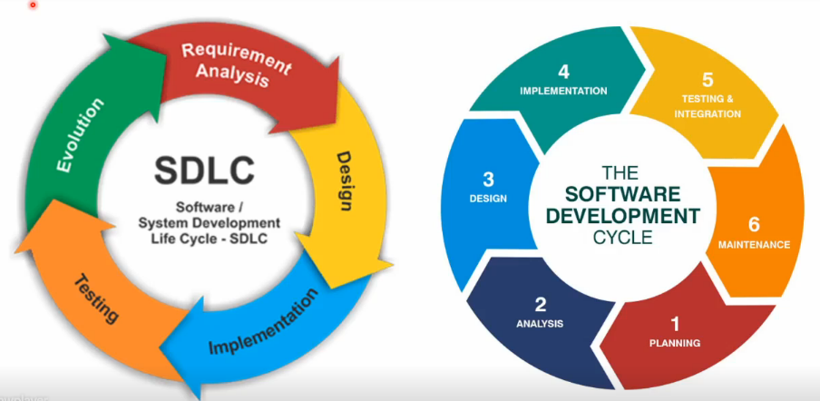

- 프로젝트 프로세스 분할

    개발 프로세스와 관리 프로세스에 대해 어떻게 다른지 알고 있어야합니다. 

    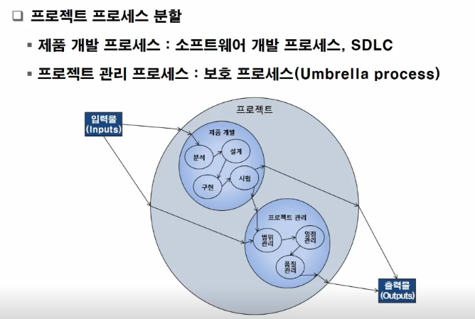

- 프로젝트 관리 프로세스 그룹

    PDCA에 대해 이해하고, PMBOK에서 제시한 프로세스 그룹에 대해서도 알아두세요.

    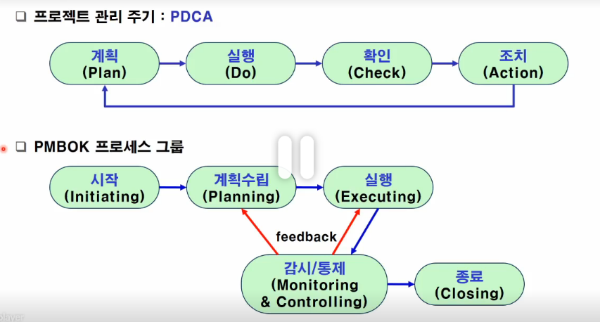

-  Unified Process

    UP에 대표하는 이 그림에서 나오는 용어들이 무엇인지 이해가 되어야합니다.

    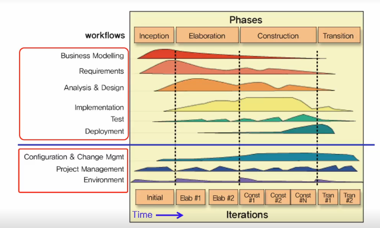
    
    UML(Unified Modeling Language)

    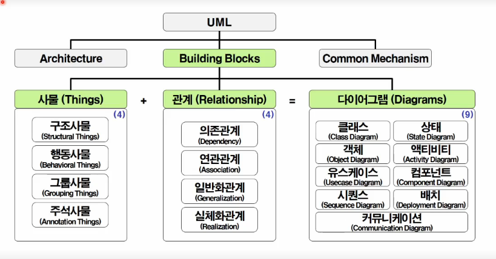

    4+1 View의 의미와 각 View에 표시된 용어들에 대해서 이해가 되어 있어야 합니다.

    

- UP Analysis & Design Workflow

    각 항목과 흐름이 이해가 되어야 되겠습니다. 

    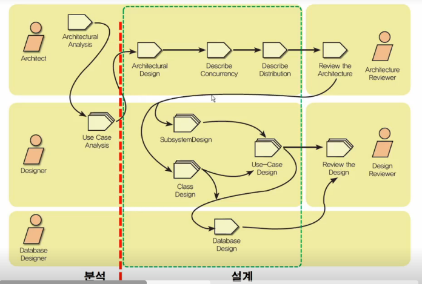

-  객체지향 분석 프로세스

    객체지향 분석 프로세스에서 제시되었던 UML V프로세스에 대해서 각 항목과 흐름에 대한 이해가 되어 잇어야 합니다.

    객체지향 설계 지향 프로세스로 제시되었던 UP Workflow의 각 항목과 흐름에 대해 이해가 되어 있어야 합니다.

    소프트웨어 개발 프로세스와 시험(V모델)에 제시되었던 각 항목과 흐름에 대해 이해가 되어 있어야 합니다.

    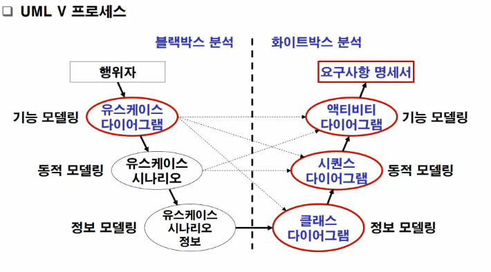

- 소프트웨어 개발 프로세스와 시험(V모델)

    각 항목과 그 흐름에 대해서 이해를 하고 있어야 됩니다.

    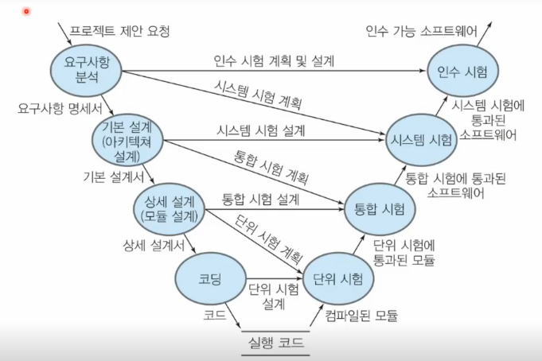

기말 시험의 마지막 문제는 프로젝트가 어떻게 진행되는 지에 대해서 기술하면 됩니다. 여러분이 경험한 프로젝트 과정을 이론과 접목해서 서술하면 됩니다. 정확하게 서술해야 점수를 잘 받을 수 있습니다.

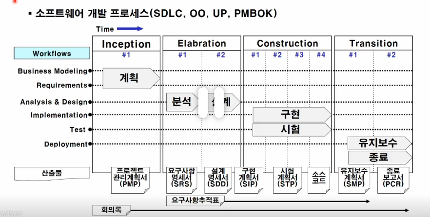

# 3. 최종보고회

0626 1000 ~ 1545

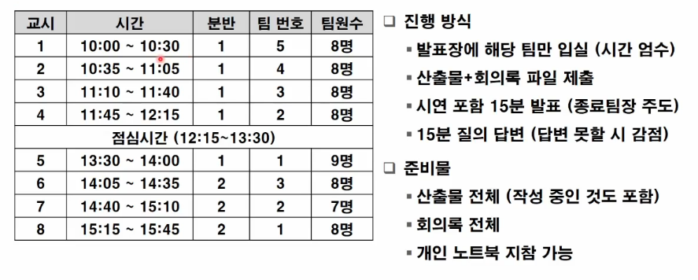

최종 산출물 목록은 다음과 같습니다.

1. 프로젝트 관리계획서
2. 요구사항명세서
3. 설계기술서
4. 소스코드
5. 시험계획서
6. 종료보고서
7. 회의록
8. 요구사항추적표

# 4. 종료보고서

~0629 1800

종료보고서 제출은 다음과 같이 하시면 됩니다.

- 구분
    1. 게시용 : LMS 과제란에 개시하시고, 목차만 표시하면됩니다. 
    2. 제출용 : 최종발표당일 USB에  PMP, SRS, SDD, STP이 포함하여 제출합니다. 작성이 덜 된 경우 CD에 PMP, SRS, SDD, STP 파일을 담아 학과사무실에 제출하도록 합니다.

- 포함내용

    1. 프로젝트 개요 : 목적/범위/산출물 목록등
    2. 프로젝트 추진 경위 : 주요활동/인력배정/예산내역 등
    3. 프로젝트 교훈 : 개인별 A4 용지 3페이지 이상을 수기로 작성하신뒤 스캔하여 문서에 첨삭해주세요.
    4. 개발 산출물 : PMP, SRS, SDD, STP