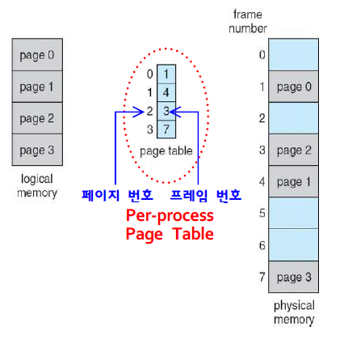
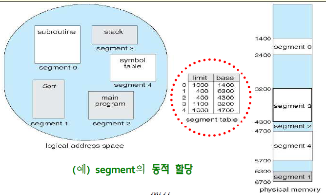

메모리 관리
===========

# 1. 개요

## 기억장치관리 요구사항
1. 재배치를 지원
    
    프로그램은 최초 적재시 임의 위치에 적재가 가능하며 논리 주소를 통해 물리주소를 접근 할 수 있어야 한다. 이는 MMU가 관리를 한다.

2. 보호를 지원

    프로세스가 다른 프로세스의 주소를 접근하지 못하도록 한다. 즉 프로세스들은 기본적으로 상호 독립적이다. 주소 검사는 실행 중인 하드웨어에 의해 수행되므로 컴파일 단계에서는 확인 할 수 없다.

3. 공유를 지원

    공유 자원에 접근이 가능해야 한다.
    
4. 프로그램의 논리적 구조를 지원

    프로그램은 여러줄의 코드와 여러 라이브러리를 통해 구성된다. 이는 사용자가 보는 프로그램의 논리적인 구조로 하드웨어가 생각하는 물리적 구조와는 다르나, 이를 하드웨어가 판단하여 지원해야 한다.

5. 기억장치의 물리적 구조를 지원

    메모리의 계층은 register - cache - main memory - sub memory 로 나뉜다. 프로세스가 실행 중일 때는 register 부터 sub memory 까지 정보의 이동이 원할하게 이루어져야 한다.

# 2. 연속 메모리 할당

하나의 프로세스를 연속적인 주소 공간에 적재하는 메모리 관리 기법이다.

## 연속 메모리 할당 기법
1. 고정 분할 기법

    메모리를 여러 영역(Partition)으로 나누어 각 영역에 프로세스를 할당한다.

    고정 분할 기법에는 Equal-size partitioning과 Unequal-size partitioning, 두가지 방식이 있다.
    
    Equal-size : 먼저 사용할 수 있는 영역을 선택한다.
    
    Unequal-size : 프로세스의 크기에 가장 알맞은 영역을 선택한다.

    고정 분할 기법은 미리 영역을 두어 효율적으로 프로세스를 적재할 것으로 보이나 상황에 따라 가변적으로 영역의 크기를 늘리거나 줄일수 없으므로 내부 단편화(internal fragmentation)이 발생한다.

2. 가변 분할 기법

    필요한 메모리가 발생할 시 메모리를 분할하여 할당하는 방법이다.

    프로세스를 적절한 위치에 할당한다고 하여도 상황에 따라서는 사용하지 못하는 작은 주소 공간이 발생할 수 있다. 이를 외부 단편화라고 하며 이를 해결하기위해서는 주소 공간을 재 할당하여 쪼개진 작은 주소 공간을 합칠 필요가 있다.

3. 페이징(Paging)

    하나의 프로세스를 물리적 단위(page)로 분할하여, 각 page를 메모리의 임의 위치에 적재한다.

    물리 메모리와 page를 동일한 크기로 분할한다. 물리 메모리에서 분할 단위는 frame이라 부른다. page table에 각각의 page가 물리 메모리의 어느 frame에 있는지 보여준다.

    그럼 실제, 메모리로 접근하기 위해서는 page table에 접근하여 frame의 위치를 확인한뒤 물리 메모리에 접근하여 데이터를 가져 오므로 속도가 느려지게 된다. 이를 TLB를 통해 해결한다.

    1. TLB(Traslation Look-aside Buffer)
    
    TLB란 논리 주소를 물리 주소로 변환하는 속도를 높이기 위해 사용되는 캐시이다. 

    2. 보호

    3. 공유 페이지 
    프로세스는 공통적으로 재진입 코드를 두고 있다. 이는 실행 동안 절대 변하지는 않는 코드이다. 공통적으로 사용하므로 이는 여러 프로세스에서 공유하고 있다.

4. 세그멘테이션(Segmentation)

하나의 프로세스를 논리적 단위(Segment)로 분할하여, 각 segment를 메모리의 임의 위치에 적재한다.

앞서 설명했듯이 프로그램은 여러줄의 코드와 라이브러리, 함수등 여러 모듈로 구성되어 있다. 이를 사용자 환경에서 바라 볼시 논리적 구조로 볼 수 있으며 이를 Segment로 분할하여 관리하는 방법이 Segmentation이다.

5. Page Table의 구조

    1. 계층적 페이징(Hierarchical Paging)
    Page table을 다시 paging하는 것 이다.

    2. 해시 페이지 테이블(Hashed Page Table)
    해시테이블이 가리키는 list에서 매치되는 page를 검색하여 frame을 찾는 방법이다.

    3. Inverted Page Table