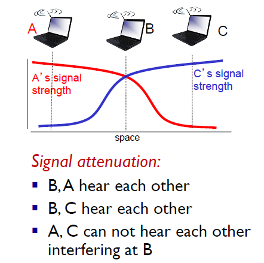
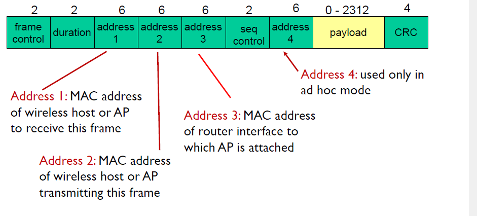

# 1.무선 네트워크 요소

## basestation

## handoff
    왜 이동하면서 통신이 끊어지지 않을까요? 그 이유는 handoff 기능이 있기 때문입니다.
    기본적으로 통신이 끊어지지 않기 위해서 수신 범위가 이어지도록 기지국을 구축합니다.
    신호를 두곳에서 다 받아요
    나 이제 새로운 놈하고만 통신할래 그럼 이제 다음 구역으로 이동한다면 새로운 base station과 통신을합니다.

# 2.무선의 특징

## 신호 강도의 감소
    무선은 기본적으로 거리가 멀어질수록 신호의 세기가 약해집니다.
    유선은 무선보다 거리가 멀어질수록 신호의 세기가 덜 약해집니다.

    스마트폰에 있는 와이파이 감도는 어떻게 판단할까요?
     단순히 거리에 따른 세기를 판단해서 보여주는 것 입니다.

## 다른 자원으로 부터의 간섭
    우리 주변 환경에는 무선으로 통신하는 다양한 장비들이 많이 있습니다. 예를 들어
    스마트폰, 공유기, 노트북 등 입니다.
    주변 장치들에 의해 신호가 충돌되어 주파수가 변형될 수 있습니다. 
    와이파이는 특히 이 현상이 심하게 발생합니다. 그 이유는 와이파이의 주파수는 무료 이므로
    사용하는 곳이 많기 때문입니다.

## multipath propagation
    주파수를 발생하면 모든 방향(3차원)으로 나갑니다. 

    예를 들어 볼가요?
        산에서 '야호'라고 말하면 어떻게 되던가요? 반대편 산에 반사되어 메아리가 들렸을겁니다.
        주파수도 이와 마찬가지로 주변 물체에 의해 반사가 될 수 있습니다. 이는 벽이 많은 집에서도
        다양하게 발생합니다.

    결국 주파수를 한번 발생했는데 주변 물체의 반사에 의해 목적지에 여러개의 주파수가 도착할 수
    있다는 것 입니다.

    그럼 multipath가 왜 문제가 되는 걸까요?
        반사된 주파수들이 시간 차이를 두고 목적지에 도착한다는 것 입니다. 
        그럼 주파수의 속도은 빛의 속도에서 공기에 의해 감소된 속도를 감안해서 
        2 * e8 이라고 해볼께요. 그럼 반사된 주파수들의 시간차이는 어떻게 되죠?
        2 * e-8으로 엄청나게 짧은 시간 차이가 발생합니다. 그러면 이를 수신한 장치는 오류가 발생할 수 있습니다.

    A와 C에서 B에게 주파수를 보낸다면 어떻게 될까요? A와 C 각가에 대해서는 정사적으로 송신했다고
    판단하겠지만 B는 주파수가 충돌이 났다고 생각할겁니다.

    이를 해결하기 위한 방법을 소개하겠습니다.

# 3.IEEE 802.11 Wireless LAN

## 3.1.무선 장치의 요소
    base station = AP(aceess point)

## 3.2.무선 연결의 과정
    802.11b는 2.4GHz ~ 2.485GHz를 사용하며 11 채널(주파수)을 보유하고 있습니다.

    1. 주파수 간섭이 일어나지 않기위해 AP는 간섭이 일어나지 않는 채널(주파수)을 선택합니다. 
    AP간에 수신 범위에 들어 있다면 서로 다른 채널을 선택하겠지만 AP간에 수신 범위에 들어가지 않아서
    서로의 정보를 알 수 없을 경우에는 동일한 채널을 사용할 가능성이 있습니다.

    2. 스마트폰에서 와이파이를 연결하기 위해서 와이파이 기능을 활성화 합니다.

    3. AP가 일정한 시간 간격으로 전송하는 정보(beacon frames)를 스마트폰이 받습니다.
    보통 와이파이를 활성화 했는데도 바로 AP의 목록이 나타나지 않는 이유는 스마트폰이 이를 수신하여
    보여주기 때문입니다.

    4. 사용자가 AP를 연결하면 AP에서는 IP를 할당합니다.

## 3.3.DCF(Distributed Coordination Function)
    CSMA/CA를 사용하는 방식을 DCF라고 한다.

### 3.3.1.DCF 특징
    1. 장치간의 경쟁이 있으므로 주파수 간섭이 발생할 수 있다.
    2. 충돌이 발생할 수 있으므로 원하는 시간에 통신이 안된다.

### 3.3.2Basic method와 RTS/CTS method
    DCF는 두가지 방식을 제공한다.

## 3.4.PCF(Point Coordination Function)
    Polling을 사용하는 방식을 PCF라고 한다.

    AP가 컨트롤러의 역활을 수행한다.
    
### 3.4.1.PCF 특징
    1. 컨트롤러가 송수신을 제어하므로 주파수 간섭이 발생하지 않는다.
    2. 원하는 시간에 데이터를 송신할 수 있다.

## 802.11 frame

    왜 무선에서는 ip 주소 영역이 4개나 될까요?

    먼저 유선에서 통신 과정을 확인해 보는게 좋겠습니다.

    PC A ------------- Router --------------- PC B
    
    info
    send IP A`s IP
    recv IP B`s IP
    send MAC A`s MAC
    recv MAC R_L`s MAC

    장치가 무선을 통해 외부로 전송한다고 하면 AP가 이를 중계해서
    라우터에게 정보를 전송합니다. 이떄 AP는 라우터에게 AP 자신의 MAC주소는 제외하여
    전송합니다. 그럼 라우터의 입장에서는 단순히 장치가 라우터에게 전송했다고 판단할 것
    입니다. 

# 4.CSMA/CA(Collision Avoidance) <-> CSMA/CD(Coolision Dection)
    CSMA/CA는 무엇일까요? CA의미 그대로 충돌을 피하겠다는 겁니다.
    그럼 CSMA/CA는 충돌이 발생하지 않나요? 그건 아닙니다. 충돌은 발생할 수 있습니다.

    CSMA/CD는 충돌이 발생했을때 충돌난 지점이후에 전송할 데이터는 버리고 일정시간이후에
    다시 전송을 시작합니다.

    CSMA/CA는 충돌이 발생했을때 전송중이던 데이터를 버릴수 가 없습니다. 그럼 전송중이던
    데이터를 다 완료하고 나서 일정시간 이후에 다시 전송을 시작합니다.

    <데이터 충돌시>
    전송할 데이터 - ㅁㅁㅁㅁㅁㅁㅁㅁ

                                      ↓ 재 전송
    CSMA/CD - ㅁㅁ|   wait a moment   |ㅁㅁㅁㅁㅁㅁㅁㅁ
                  ↑ 충돌발생하여 이후의 데이터는 제거

                                      ↓ 재 전송
    CSMA/CA - ㅁㅁ ㅁㅁㅁㅁㅁㅁ| wait |ㅁㅁㅁㅁㅁㅁㅁㅁ
                  ↑ 충돌발생해도 데이터를 게속 전송한다

    그래서 CSMA/CA 방식에서는 데이터 전송을 할때 일정 시간 이후에 전송을 합니다.
    
    예
            |       wait until         |ㅁㅁㅁㅁㅁㅁㅁㅁㅁㅁㅁㅁ
            start                      send

    전송하다 충돌이 발생한다면 재전송을 다시 수행합니다.

