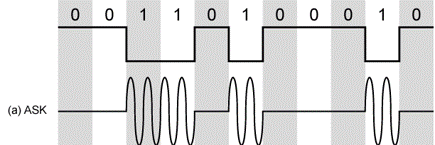
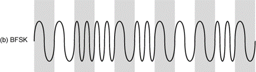
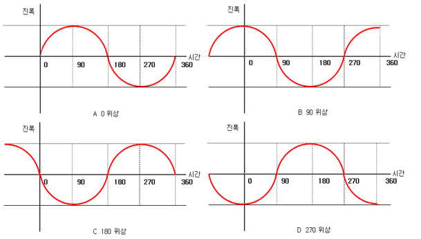
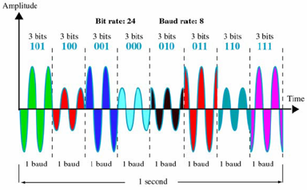
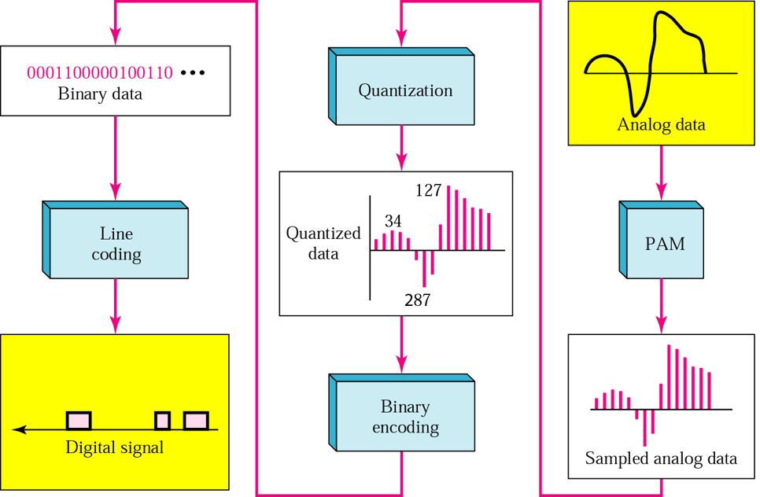
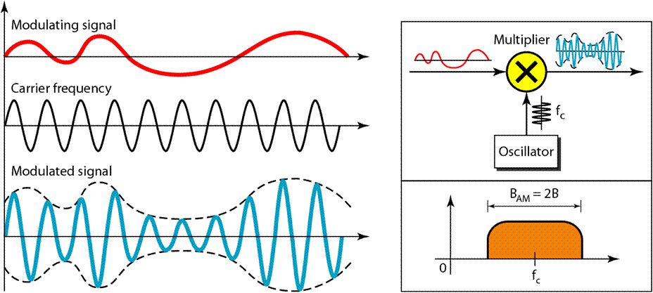
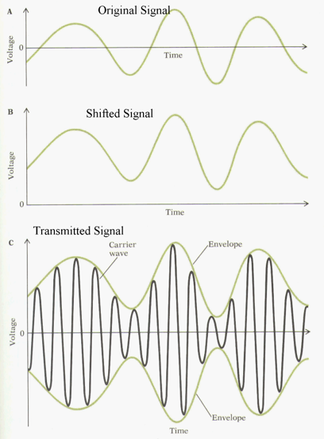
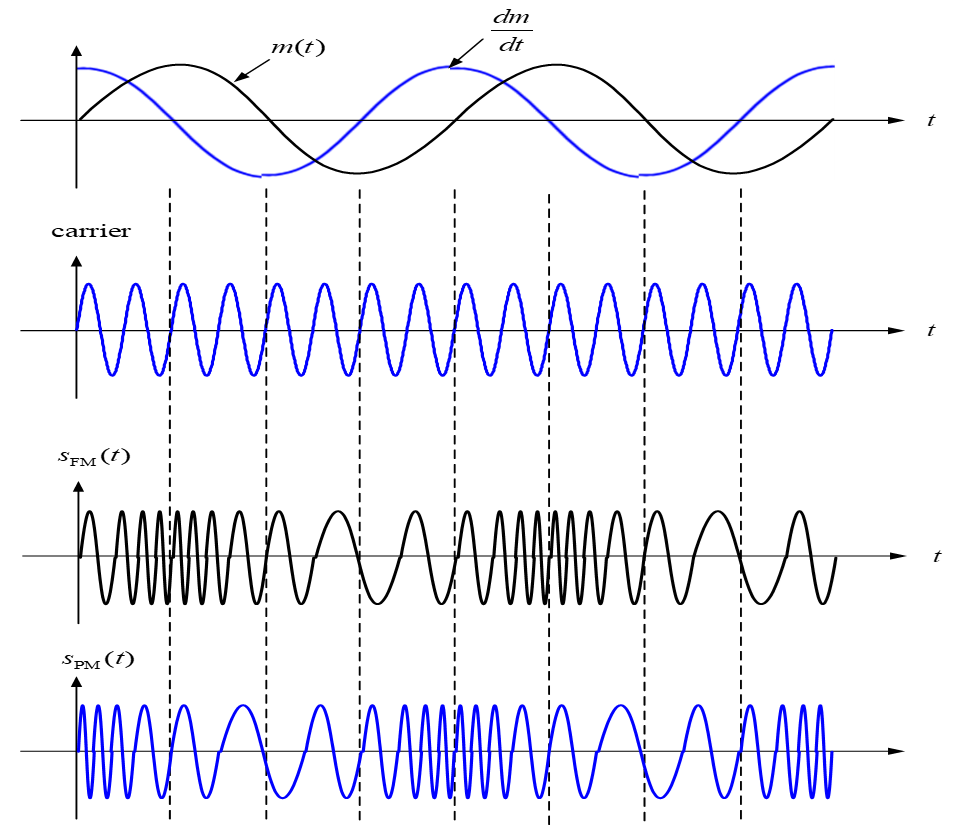

Commnuication
=============

신호 인코딩
------

# 1.Digital Data to Digial Signal

Line Coding에 대해 알아봅시다.

## DCComponents

## Synchronization

컴퓨터에도 시계가 있습니다. 하지만 오차가 없는 시계란 존재할 수 없습니다. 그럼  시계를 보지 않더라도 에너지가 바뀌는 구간을 알아서 동기화를 맞출 수 있다.

## Unipolar

## Polar
한쪽은 플러스 한쪽은 마이너스를 쓰는 방식이다. bit 1은 +값에서 0으로 바뀔때, bit 0은 -값에서 0으로 바뀔떄 사용하겠다는 것이다.

그럼 이렇게 생각할 것이다. +,-,0을 쓴다면 bipolar랑 뭐가 다른가요? polar에서는 +와 -값은 데이터를 의미하는게 아닙니다.

이 방식도 DCComponents 문제를 해결하지는 못했습니다. 대신 값이 게속 바뀌므로 동기화 문제는 해결했습니다.

## Manchester Encoding
값의 변화를 보고 bit를 판단한다. low에서 high로 가면 bit 1, high에서 low로 가면 bit 0으로 한다.

그럼 DCComponents를 해결했을까요? 네, 동기화는요? 네

## Bipolar AMI Encoding
+,-값에서는 bit 1, 0에서는 bit 0을 의미한다.

DCCompontes는 거의 해결했지만, 동기화는 해결하지 못한다.

# 2.Digital Data to Analog Signal

## ASK(Amplitude shift keying)
진폭 편이 방식

ASK는 높이로 구분을 하겠다는것인데, 진폭이 높아지면 그만큼 에너지도 커지므로 인체에 해로워 집니다. 

에너지는 순간적으로 변화하는게 아니라 연속적으로 변화하므로 에너지에 범위를 지정해서 0과 1로 나타낸다. 그럼 에너지를 낮추면 안되나요? 그러면 에너지의 범위가 점점 작아져서 중간값을 지정하기가 힘들어집니다.

## FSK(Frequency shift keying)
주파수 편이 방식

주파수는 하나의 자원이므로 여러개의 주파수를 사용하기에는 비용적 부담이 너무 크다.

## PSK(Phase shift keying)
위상 편이 방식

## QAM(Quadrature Amplitude Modulation)
직교 진폭 변조

사용하려는 신호의 수가 2^n이라면 필요한 비트수는 n이다.
예) 신호가 10개 라면, 4비트가 필요하다.

# 3.Analog Data to Digial Signal

아날로그 데이터를 어떻게 디지털 데이터로 바꿀까?

## [대표적인 방법!!]PCM(Pulse Code Modulation)

### 방법
1. Sapling(표본화)
아날로그 데이터를 일정한 간격으로 측정을 하는 것이다.
측정한 값을 PAM(Pulse Aplitude Modulation)이라 한다.

2. Quantization(양자화)
PAM값을 정수화 한다.

3. Binary Encoding(부호화)

예를들어 볼까요? 사람의 음성은 4000Hz 까지 낼 수 있다고 합니다. 그러면 이것을 (1)Sampling 해볼까요? 이것을 초당 8000번을 측정해볼께요. 그러면 버리는 값 없이 측정될겁니다. 대신 실수값은 무시를 합니다. 

### 용어
1. 양자화 비트 수 : n
    
    n은 sampling된 값을 몇개의 비트로 표현할지 나타내는 값이다.
2. 양자화 레벨 수 : L = 2^n
3. 최대 입력 범위 : D
4. 양자화 단위 : D/L = D/2^n

예를들어 n을 2로 하고 D를 10으로 정해볼게요.그러면
양자화 레벨 수는 2^2 = 4가 됩니다. 따라서 양자화 단위는 2.5가 될겁니다.

        10  |
    11      |
        7.5 |
    10      |       +--+
        5   |      |   |
    01      |     |     |
        2.5 |    |       |       |
    00      |   |         |     |
        0   |  |           |   |
        ----+----------------------

또다른 예를 들어 볼게요. n을 4로하고 표현 범위는 -10 에서 10이면 L = 2^4 =16이고 양자화 단위는 20/16 = 1.25가 됩니다.

        5.0 |
    0100    |
        3.75|
    0011    |       +--+
        2.5 |      |   |
    0010    |     |     |
        1.25|    |       |       |
    0001    |   |         |     |
        0   |  |           |   |
        ----+----------------------

즉, 비트가 커지면 원본(아날로그 데이터)에 가깝게 복원이 가능합니다. 

MP3도 아날로그 음성을 디지털 데이터로 바꾼것입니다. 그럼 MP3에서 음질은 어떻게 알수있나요? mp3 파일 뒤에 128kbps,256kbps라는 말을 들어봤지요? 이 값은 이렇게 계산됩니다.
초당 8000번의 sampling을 한다고 하면 표현하고자하는 비트수가 16비트이면 8000 * 16 = 128k가 됩니다.

# 4. Analog Data to Analog Signal
이것은 정통적인 라디오에서 사용하던 방식입니다.

Analog 신호는 기본적으로 sin파의 형태를 띄고 있습니다.

## AM(Amplitude Modulation)

각도로 비교할것인가.

AM은 원본 주파수를 다른 주파수에 실어(곱해서) 보내는 방식입니다. m(t)는 원본주파수이며 sin파 형태의 주파수에 실어 보냅니다. m(t) * sin(2pi() * frequency * time + )

그러면 곱하다 보면 음의 값이 나올 수도 있습니다. 거기에 어느 값을 더해 양수로 바꾸는 방식이 AM입니다. 그림은 원본 주파수(m(t))와 거기에 임의의 양수 값(A)을 더한 주파수 입니다.

송신의 원리는 다음과 같다면 수신은 어떻게 될까요? 

## FM(Frequency Modulation)

주파수로 비교할것인가.

s(t) = A * cos(2pi() * t + q(t))
q(t)가 원본 주파수 이며 A*cos(2pi())에 실어서 보낸다.
q(t)의 값에 따라서 주파수가 높아 졌다가 낮아졌다가 하는 방식

## PM(Phase Modulation)

각도로 비교할것인가.

어떻게 되는지 한번 볼께요. 2pi()는 360도로 알고 계실껍니다. 그럼 1초 동안에 주파수가 2번 발생하면 이는 몇도가 될가요? 720도가 됩니다. 즉 주파수가 각도가 되고 각도가 주파수가 된다는것입니다.

