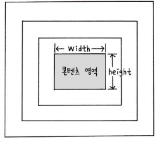

04 레이아웃
===

# 1. 박스모델

실제 콘텐츠 영역, 패딩(padding), 박스의 테두리(border), 그리고 마진(margin) 등의 요소로 구성됨



## 1.1 width, height 속성

실제 콘텐츠 영역의 크기 지정 값은 크기, 백분율, auto가 있다. **기본값은 auto**이며 자식 요소는 부모요소 안에서 속성값이 적용된다. 백분율을 지정시 자식 요소의 속성 값이 부모 요소의 경계를 벗어날 수 있다.


```CSS
.box1 {
    width: 200px; /* 고정 너비 */
    height: 100px; /* 높이 */
    padding: 20px;
    background:orange; /* 배경색 */
}

.box2 {
    width: 50%; /* 브라우저 창 너비의 50% */
    height: 100px; /* 높이 */
    background:aquamarine; /* 배경색 */
}
.box3 {
    width: auto;height: auto;
    background:greenyellow; /* 배경색 */
}
```

<style>
.box1 {
    width: 200px; /* 고정 너비 */
    height: 100px; /* 높이 */
    padding: 20px;
    background:orange; /* 배경색 */
}
.box2 {
    width: 50%; /* 브라우저 창 너비의 50% */
    height: 100px; /* 높이 */
    background:aquamarine; /* 배경색 */
}
.box3 {
    width: auto;height: auto;
    background:greenyellow; /* 배경색 */
}
</style>

<body>
<div class="box1">box1</div>
<div class="box2">box2</div>
<div class="box3">lorem20</div>
</body>

## 1.2 padding 속성

콘텐츠 영역과 테두리 사이의 여백(테두리 안쪽 여백)이다. 값은 크기, 백분율, auto가 있다.

```CSS
<style>
    .box1 { padding:10px 30px 10px 30px;} /* 상, 우, 하, 좌*/
    .box2 { padding:10px 30px;} /* 상,하: 10, 좌,우: 30*/
    .box3 { padding:10px;} /* 모두 10*/
</style>
```

## 1.3 border-style 속성

기본 값이 none으로 화면에 테두리 표시 안된다. 테두리를 그리기 위해서는 맨 먼저 테두리 스타일부터 지정한다. 스타일의 종류는 다음과 같다.

- hidden 
- dotted 
- dashed 
- solid 
- double 
- groove 
- ridge 
- inset 
- outset 
- initial 
- inherit

```CSS
<style>
    .box1 { border-style:solid; }
    .box2 { border-style:dotted; }
    .box3 { border-style:dashed; }
</style>
```

## 1.4 border 속성

boder는 두께와 색상을 지정할 수 있다.

```CSS
<style>
    h1 {
        padding-bottom: 5px;
        border-bottom: 3px solid #ccc; /* 아랫 부분 - 3px짜리 회색
        실선*/
    }
    p {
        padding: 10px;
        border: 2px dotted black; /* 모든 방향 - 3px 검정 점선 */
    }
</style>

```
## 1.5 border-radius 속성

박스 모서리 부분을 둥글게 처리 한다.

```CSS
<style>
    .round {
        width:100px;
        height:50px;
        border:2px solid red; /* 2px짜리 빨강 실선 */
        border-radius:20px; /* 모서리 20px 만큼 라운딩 또는 50%로 동일한 효과를 얻음*/
    }
    #bg {
        width:100px;
        height:50px;
        background:url(images/pic1.jpg) no-repeat;
        background-size:cover;
    }
</style>
```

## 1.6 box-sizing 속성

내가 지정한 width가 어디까지 포함 되는지 지정한다.

border-box는 width 속성 값을 테두리 까지 포함하므로 content영역이 작아진다.

content-box는 width 속성 값을 콘텐츠 영역 너비로 지정한다.

```CSS
box-sizing : content-box | border-box
```


# 2. 레이아웃 구성하기

## 2.1 요소

- 블록 요소
    
    요소를 삽입했을 때 혼자 한줄을 차지하는 요소로 요소의 너비가 100%이다. <div>,<p>등이 해당된다.

- 인라인 요소

    줄을 차지하지 않는 요소로 화면에 표시되는 콘텐츠 만큼만 영역을 차지하고 나머지 공간에는 다른 요소가 올 수 있다., <string>등이 해당된다.

## 2.2 display 속성

블록 레벨 요소를 인라인 레벨 요소로 바꾸거나 인라인 레벨 요소를 블록 레벨 요소로 바꿈

- inline-block : 요소를 인라인 레벨로 배치하며서 내용은 블록 레벨 속성을 지정
- block : 요소를 블록 레벨로 지정
- inline : 블록 레벨 요소를 인라인 레벨로 지정
- none : 화면에 공간을 차지하지 않으며 보이지 않음

    <-> visibility : hidden; 공간은 차지하지만 요소가 보이지 않음

```CSS
display : none | contents | block | inline | inline-block | table | table-cell

/* height와 width가 적용이 안됨*/
.inline {
    display: inline;
    width: 200px;
    height: 100px;
    background-color:yellowgreen;
    margin: 10px;
}

.inline-block {
    display: inline-block;
    width: 200px;
    height: 100px;
    background-color: aquamarine;
    margin: 10px;
}
```
<style>
    .inline {
    color : black;
    display: inline;
    width: 200px;
    height: 100px;
    background-color:yellowgreen;
    margin: 10px;
    }

    .inline-block {
        color : black;
        display: inline-block;
        width: 200px;
        height: 100px;
        background-color: aquamarine;
        margin: 10px;
    }
</style>

<div class="inline">box1</div>
<div class="inline">box1</div>
<div class="inline">box1</div>

<hr>

<div class="inline-block">box1</div>
<div class="inline-block">box1</div>
<div class="inline-block">box1</div>

## 2.3 메뉴 만들어 보기

```CSS
<style>
    ul>li{
    display:inline-block;
    width: 200px;
    height: 50px;
    line-height: 50px;
    background-color: black;
    border-right:3px solid red;
    text-align: center;
    margin-right : -0.25em;
    color:#ffffff;
    }
</style>

<ul>
    <li>FreeBoard</li>
    <li>Archive</li>
    <li>전공지식</li>
</ul>
```

<style>
    ul>li{
    display:inline-block;
    width: 200px;
    height: 50px;
    line-height: 50px;
    background-color: black;
    border-right:3px solid red;
    text-align: center;
    margin-right : -0.25em;
    color:#ffffff;
    }
</style>

<ul>
    <li>FreeBoard</li>
    <li>Archive</li>
    <li>전공지식</li>
</ul>

inlie-block의 공백을 없애고 싶다면 다음 코드를 참고한다.

```CSS
<style>
ul{
    font-size:0px;
}
ul>li{
    font-size:1rem;
}
</style>
```

또 다른 방법은 다음과 같다.

```CSS
<style>
ul{
    list-style-type:none;
}
ul>li{
    float:left;
}
</style>
```

## 2.4 float 속성

요서를 왼쪽이나 오른쪽에 떠 있게 만든다. 이미지를 어떻게 띄어서 텍스트와 조화롭게 배치할지를 결정한다.

```CSS

float : left | right | both

<style>
    .float-container{
        width: 400px;
        border: 2px solid #09c;
    }
    .float-container img{
        float: left;
        margin: 5px;
        padding: 5px;
        border: 2px solid #90C;
    }
</style>

<div class="float-container">
    
    lorem100
</div>
```

<style>
    .float-container{
        width: 400px;
        border: 2px solid #09c;
    }
    .float-container img{
        float: left;
        margin: 5px;
        padding: 5px;
        border: 2px solid #90C;
    }
</style>

<div class="float-container">
    
    안녕 내 이름은 펭수라고해. 앞으로 EBS 사장은 나야~
</div>

## 2.5 [중요!!]clear 속성

float 속성을 무효화 시키는 속성

## 2.6 Z-index

z축을 기준으로 더 앞에 올 요소를 결정한다. position 속성이 설정된 요소에 대해서만 적용이 가능하다.

```CSS
Z-index : 양수 | 음수
```

## 2.7 position 속성

요소들의 위치를 결정한다.

```CSS
position : static(기본값) | relative | absolute | fixed
```

- relative : offset으로 위치를 지정한다. offset이 없다면 static과 동일하다.
- absolute : 부모 요소가 기준이다. 부모가 없다면 body가 기준이 된다.
- fixed : 브라우저의 0,0을 기준으로 offset을 결정한다. **항상 고정된 위치에 요소를 배치하고 싶은 경우 사용하며, 공간을 차지하지 않고 떠 있다.** 
```CSS
body{
    border: 1px solid black;
}
div {width:200px;height:200px;}
div.box1 {
    background-color:red;
    position: relative;
    top:250px;
}
div.box2 {
    background-color:yellow;
}

<div class="box1">testdiv1</div>
<div class="box2">testdiv2</div>
```

<html>
<style>
body{
    border: 1px solid black;
}
div {width:200px;height:200px;}
div.box1 {
    background-color:red;
    position: relative;
    top:250px;
}
div.box2 {
    background-color:yellow;
}
</style>

<body>
<div class="box1">testdiv1</div>
<div class="box2">testdiv2</div>
</body>
</html>

## 2.8 margin 속성

현재 요소 주변의 여백

```CSS

margin : 크기 | 백분율 | auto

```
