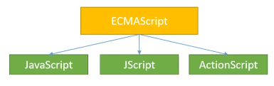

05 JavaScript
===

# 1. JavaScript

- 스크립트 언어 : C나 자바와 같이 컴파일을 요구하지 않는 언어

- 자바스크립트

    - 웹브라우저를 프로그래밍적으로 제어하기 위해 사용되는 언어
    - 웹페이지를 동적으로 동작 시키기 위해 사용하는 언어
    - 자바스크립트 엔진에 따라 컴파일만 하거나 인터프리팅 + 컴파일을 수행(직접 컴파일을 하는 것은 아님!!)

- ECMAScript

    

    자바스크립트는 1995년 넷스케이프(Netscape) 웹 브라우저에서 웹페이지에 동적인 요소를 구현하기 위해서 발명되었습니다.

    다양한 브라우저가 자바스크립트를 사용하면서 표준화 작업이 필요하게 되었습니다. ECMA 국제 기구에서 "ECMAScript Standard"라 불리는 스크립트 표준이 만들어집니다. ES6는 2015년에 만들어져 널리 사용중입니다. JavaScript 또한 ECMAScript의 규격에 맞춰 개발된 언어입니다.


# 2. 구성요소


- DOM(Document Object Model)

    HTML, XML과 같은 구조화된 문서의 프로그래밍 interface이다. 웹페이지를 수정하거나 생성하는데 사용되는 모든 property, method, event들이 obejcts로 구성되어 있다.

     ```HTML
    <!DOCTYPE html>
    <html>
    <body>

    <p id="demo"></p>

    <script>
    var w = window.innerWidth
    || document.documentElement.clientWidth
    || document.body.clientWidth;

    var h = window.innerHeight
    || document.documentElement.clientHeight
    || document.body.clientHeight;

    //DOM에서 지원하는 property와 method
    var x = document.getElementById("demo");    
    x.innerHTML = "Browser inner window width: " + w + ", height: " + h + ".";
    </script>

    </body>
    </html>

    <!-- 실행 결과 : Browser inner window width: 464, height: 729. -->
    ```

- BOM(Browser Object Model)
    
    BOM은 브라우저 창에 접근하고 조작할 수 있게하는 인터페이스를 말한다. 

# 3. Corss Browsing

**웹 페이지 제작 시에 모든 브라우저에서 깨지지 않고 의도한 대로 올바르게(호환성) 나오게 하는 작업을 말한다.** [HTML, CSS, Javascript 작성 시 W3C의 웹 규격에 맞는 코딩을 함으로써 어느 브라우저, 기기에서 사이트가 의도된 대로 보여지고 작동되는 기법.]

크로스 브라우징 작업이 필요한 원인은 무엇일까? 브라우저 마다 랜더링 엔진이 다르기 때문이다.

- 작동되지 않는 HTML5, Javascript 코드가 존재
- 해석하지 못하는 CSS 코드 존재
- 브라우저 버그들이 존재
- 브라우저마다 자체적인 CSS 스타일

# 4. 데이터 종류

## 4.1 변수와 상수

- 변수 : 저장된 값이 변할 수 있음
- 상수 : 저장된 값이 변할 수 없음

var name = "Marcus";
console.log(name);

var name = "Jogeonsang";
console.log(name);

output: Marcus
output: Jogeonsang

다음과 같이 name이라는 변수를 2번 선언했는데도 에러가 나오지않고 각기 다른 값이 출력되는걸 볼 수 있다.
    
- var : 변수의 재 선언, 재 할당이 모두 가능하다.
- let : 변수의 재 선언이 불가능하며, 재 할당은 가능하다.    ex. 자바의 변수
- const : 변수의 재 선언, 재 할당이 불가능하다.             ex. 자바의 final

## 4.2 Scope

var는 function-scoped 이고, let과 const는 block-scoped 입니다.

- function scope : 함수 내에서 선언된 변수는 함수 내에서만 유효하며 함수 외부에서 참조할 수 없다.

    ```Javascript
    fuction setWidth(){
        var width =100;
        console.log(width);
    }
    width = 150;
    // 실행결과 : Uncaught ReferenceError : width is not defined

    var age = 15;
    if(age>12){
        var dogyears = age * 7;
        console.log('you are ${dogyears} dog years old!!');
    }
    consolg.log('int outside ${dogyears}');
    /*
        실행결과
        you are ${dogyears} dog years old!!
        int outside ${dogyears}
    */
    ```

- block scope : 블록({,})내에서 선언된 변수는 블록 내에서만 유효하고 외부에서는 참조할 수 없다.

    ```JavaScript
    var age = 15;
    if(age>12){
        let dogyears = age * 7;
        console.log('you are ${dogyears} dog years old!!');
    }
    consolg.log('int outside ${dogyears}');
    
    /*
        실행결과
        Uncaught ReferenceError : dogyears is not defined
    */
    ```
## 4.3 데이터 타입

1. 원시 타입

    모든 원시 값은 불변이기 때문에, 값이 변경된다면 새로운 주소로 값이 할당되게 됩니다.

    - Number : 부동 소수점 형식을 사용하며, 이 형식은 통상적으로 double이라 부릅니다. 고성능 정수 연산이나 정밀한 소수점 연산은 불가능합니다. 예) 0.1 + 0.2 = 0.300..4
  
    - String

        문자열 템플릿 : 변수를 포함하는 문자열을 작성할때
        
        ```JavaScript
        var price = 2000;
        const ad = `It's ${price} won`;
        ```

        문자와 숫자의 혼합 :  **사용자 입력은 항상 문자열로 들어오기 때문에 필요한 경우 형변환을 하여야 합니다.**

        ```javascript
        var temp = 3 + '20'; // string : 320    덧셈 연산은 문자열을 붙인다고 판단함
        var temp = 2 * '20'; // number : 40     곱셉 연산은 숫자형의 산술연산으로 판단함

        var a = '40'
        typeof(a * 1)        // number : 40
        ```

        문자열 병합 : 덧셈과 병합은 모두 왼쪽에서 오른쪽으로 평가를 합니다.

        ```javascript
        var a = 3 + 6 + '9' // string : 99
        var b = 3 + '6' + 9 // string : 369s
        var c = 3 * '6' + 9 // number : 27
        ```

        multiline

        ```javascript
        let longString = "문자열이 길어진다면\
                          역슬레시로 여러줄으 표현\
                          할 수 있씁니다.";
        ```

    - boolean

    - (ES6)sysmbol
    
    - null : 변수에 무언가를 할당 했지만 그 값이 없는 것
    
    - undefined : 값을 할당하지 않은 변수는 undefined 값을 가집니다. 선언된 변수지만 값 할당이 없다는 것이죠.

    > null과 undefined는 다르지만 == 연산자는 둘을 같은 것으로 인식합니다!! 그렇기에 === 연산자를 사용해야 합니다.
    > == : 둘의 자료형은 다르지만 값이 같은가?
    > === : 둘의 자료형도 같고 값도 같은가?

    

    > ## literal
    >
    >값을 프로그램 안에서 직접 지정한다는 의미이다. 변수에 할당되는 값 그 자체가 문자 그대로 스크립트에 값을 제공한다.
    >
    >    ```Javascript
    >   const number = 20;
    >    const bool = true;
    >    const obj = {age:20, name:'kim'};
    >    ```

2. 참조 타입

    자바스크립트는 거의 모든 것이 객체로 구성되어 있습니다. null과 undefined를 제외한 모든 원시타입도 객체로 취급합니다. 원시 타입은 단 하나의 값만 나타낼 수 있지만, 객체는 여러가지 값이나 복잡한 값을 나타낼수 있습니다.

    객체의 내용은 property 혹은 member라고 부릅니다. property는 key와 value로 구성되어 있습니다.

    ```javascript
    var human = {
        "name" : "철수", 
        "age" : 10, 
        "gender" : "남",
        "show" : function(){
            document.write("name : "+this.name+"<br>")
            document.write("age : "+this.age+"<br>")
            document.write("gender : "+this.gender+"<br>")
        }
    };

    var human = {};
    human["name"] = "철수";
    human["age"] = 10;
    human["gender"] = "남";

    var human = new Object();
    human["name"] = "철수";
    human["age"] = 10;
    human["gender"] = "남";
    ```

    - 내장객체(Built-in Object)

        자바스크립트 엔진에 내장되어 있어, 필요한 경우 생성해 사용할 수 있다. 문자(string,), 정규식(regexp), 날짜(date), 배열(array), 수학(math)등이 있다.

    - 브라우저 객체 모델(Browser Object Model)

        브라우저에 계층적으로 내장되어 브라우저를 제어하는데 사용하는 객체이다. window, screen, location, history, navigation등이 있다.

    - 문서 객체 모델(Document Object Model)

        HTML 문서 구조로 HTML의 모든 요소들을 문서 객체로 선택하여 자유롭게 속성을 바꾸거나 CSS를 적용할 수 있다.

# 5. 객체

1. 값 접근

```javascript
var human = {
    "name" : "철수", 
    "age" : 10, 
    "gender" : "남",
    "show" : function(){
        document.write("name : "+this.name+"<br>")
        document.write("age : "+this.age+"<br>")
        document.write("gender : "+this.gender+"<br>")
    }
};

human.name
human['name']
```

2. 값 설정

```javascript
human.name = "바둑이"
human.address = "구미"  // 새로운 property 추가
delete human.address    // property 제거
delete human['address'] // property 제거
```

## 5.1 유용한 유틸

- length

    ```javascript
    Object.keys(human)
    Object.keys(human).length
    /*
        실행 결과
        ["name", "age", "gender", "show"]
        4
    */ 
    ```

- typeof

    ```javascript
    const list = {};
    const count = 2;
        
    typeof list
    typeof count
    typeof "test"
    typeof color

    /*
        실행결과
        object
        number
        string
        undefined
    */
    ```

## 5.2 Object

**자바스크립트의 최상위 객체로 자바스크립트의 객체들은 Object 객체에서 파생된 것입니다.** 자바스크립트의 객체들은 Object에서 파생된 것이므로 Object가 가지는 모든 method와 property를 가집니다.

```javascript
const list = {}
list

/*
    실행결과
    list
    {}__proto__: 
        constructor: ƒ Object()
        hasOwnProperty: ƒ hasOwnProperty()
        isPrototypeOf: ƒ isPrototypeOf()
        propertyIsEnumerable: ƒ propertyIsEnumerable()
        toLocaleString: ƒ toLocaleString()
        toString: ƒ toString()
        valueOf: ƒ valueOf()
        __defineGetter__: ƒ __defineGetter__()
        __defineSetter__: ƒ __defineSetter__()
        __lookupGetter__: ƒ __lookupGetter__()
        __lookupSetter__: ƒ __lookupSetter__()
        get __proto__: ƒ __proto__()
        set __proto__: ƒ __proto__()
*/
```


1. Object 객체의 method

- constructor: ƒ Object() : 생성자
- hasOwnProperty: ƒ hasOwnProperty(value) : 객체가 value 속성이 있는지 확인
- isPrototypeOf: ƒ isPrototypeOf(object) : 객체가 object의 프로토타입인지 검사 
- propertyIsEnumerable: ƒ propertyIsEnumerable(name) : 반복문으로 열거할 수 잇는지 확인
- toLocaleString: ƒ toLocaleString() : 객체가 호스트 환경에 맞는 언어의 문자열로 바꿈
- toString: ƒ toString() : 객체를 문자열로 바꿈
- valueOf: ƒ valueOf() : 객체의 값을 반환

```javascript
let o = new Object();
o.prop = 'exists';

function changeO(){
    o.newprop = prop;
    delete o.prop;
}

o.hasOwnProperty('prop');
changeO();
o.hasOwnProperty('prop');
o.hasOwnProperty('toString');   // hasOwnProperty는 부모의 property가 아닌 자신의 proprty를 검사한다. 그렇기에 toString을 가지지만 결과는 false가 된다.

/*
    실행결과
    true
    false
    false
*/
```

## 5.3 Number 객체

원시 타입 number를 다룰 때 유용한 property와 method를 제공하는 wrapper 객체이다.

```javascript

//Object 반환
var num = new Number(123);
var num = new Number('123');

// 원시 타입
var num2 = 234;
var num3 = Number(234);
var num4 = Number('123a');

num
num2
num3
num4

num instanceof Number
num2 instanceof Number
num3 instanceof Number

/*
    실행결과
    123
    234
    234
    NaN
    true
    false
    false
*/
```

## 5.4 Auto Boxing

new 키워드를 사용하지 않아도 String, Number, Boolean은 원시 타입이면서 객체 처럼 동작합니다. 앞에서 num2가 Number 객체가 아님에도 해당 property와 method를 사용할 수 있는 이유입니다.

## 5.5 Date

```javascript
// Date(year, month+1, day)
var date = new Date(2020,6,8);
var date2 = new Date();     //현재 시간

document.write("date : " + date + "<br>")
document.write("date2 : " + date2 + "<br>")

var day= ['일요일', '월요일', '화요일', '수요일' ,'목요일' ,'금요일' ,'토요일'];

// getDay의 범위는 0~6이며 0은 일요일이다.
document.write("오늘의 요일  : " + day[date2.getDay()] + "<br>")

var birthday = new Date("1997-09-30");

document.write("만 나이 : " + (new Date().getFullYear() - birthday.getFullYear()) + "<br>");
```

# 6. 메모리 모델

원시타입과 참조 타입 데이터의 저장 방식 이해하기

```javascript
let myNumber = 23;
let newNumber = myNumber;   //myNumber의 주소로 할당됩니다.

if(myNumber === newNumber)
    document.write("둘의 주소가 동일<br>");

//하지만 myNumber는 원시타입이기 때문에, myNumber의 값이 변경되면 새로운
//주소에 할당되며, newNumber는 이전의 myNumber주소를 그대로 가리키고 있게됩니다.
myNumber = myNumber + 1;

if(myNumber !== newNumber)
    document.write("둘의 주소가 동일하지않음<br>");
```

**[중요!!] array는 let으로 선언하는 것이 아닌 const로 선언해야 주소가 변경되지 않는다.**

```javascript
const myArray = [];

myArray.push(1);
myArray.push(1);
myArray.push(1);
myArray.push(1);

let myArray2 = [];

myArray2.push(1);
myArray2.push(1);
myArray2.push(1);
myArray2.push(1);
```

# 7. 함수

자바스크립트에서는 함수도 객체입니다. 
    
- 함수를 변수에 할당할 수 있음.
- 함수를 함수의 인자로 사용할 수 있음
- 함수를 반환값으로 사용할 수 있음

```javascript
// 함수를 변수에 할당
function getTitle(){
    return "hello world";
}

    // 1. 변수에 할당하거나
    var f = getTitle;
    document.write(f() + "<br>");

    // 2. 멤버변수에 할당하거나
    var message = {
        f : getTitle
    }
    document.write(message.f() + "<br>");

    // 3. 배열에 할당하거나
    var fArr = [1,2,3];
    fArr[0] = getTitle;
    document.write(fArr[0]() + "<br>");

// 함수 정의

    // 1. 함수 선언식
    function f1(a){
        return a;
    }

    // 2. 함수 표현식
    // 일급함수 : 프로그래밍 언어에서 함수를 값으로 다룰 수 있는 것
    var f2 = function(a){
        return a*a;
    }

    // 3. 익명 함수 : 즉시 실행이 필요한 경우
    (function(a){
        return a * a * a;
    })(3);

    var g = function f(y){
        return y*y
    }

    g(3)
    // f(3)은 안됩니다.

var vscope = "global";

function fscopse(){
    var vscope = "local";
    // 종속변수
    document.write(vscope+"<br>")

    // 전역변수
    document.write(this.vscope+"<br>")
}
fscopse()
```


	
function a(){}

a = {
    b:function(){
    }
};

function cal(func, num){
    return func(num)
}
function increase(num){
    return num+1
}
function decrease(num){
    return num-1
}

document.write("1+1 : " +cal(increase,1)+"<br>");
document.write("1-1 : " +cal(decrease,1)+"<br>");


function cal2(mode){
    var funcs = {
        'plus' : function(left, right){return left + right},
        'minus' : function(left, right){return left - right}
    }
    return funcs[mode];
}
document.write(cal2('plus')(2,1)+"<br>");
document.write(cal2('minus')(2,1)+"<br>"); 


var process = [
    function(input){ return input + 10;},
    function(input){ return input * input;},
    function(input){ return input / 2;}
];
var input = 1;
for(var i = 0; i < process.length; i++){
    input = process[i](input);
    document.write(input+"<br>")
}


function sortNumber(a,b){
    // 위의 예제와 비교해서 a와 b의 순서를 바꾸면 정렬순서가 반대가 된다.
    return b-a;
}
var numbers = [20, 10, 9,8,7,6,5,4,3,2,1];
document.write(numbers.sort(sortNumber)); // array, [20,10,9,8,7,6,5,4,3,2,1]


## 7.1 Closure

**생설될 당시의 환경을 기억하는 함수입니다.** 스코프가 해제되어야 할 시점에도 사라지지 않는 특징을 가집니다. 

- 함수 안에 또 다른 함수를 정의
- 내부 함수가 외부 함수의 스코프에 접근 할 수 있게 하는것

```javascript
function factory_movie(title){
    return {
        get_title : function (){
            return title;
        },
        set_title : function(_title){
            title = _title
        }
    }
}

document.write("<br>")

ghost = factory_movie('Ghost in the shell');
matrix = factory_movie('Matrix');
 
document.write(ghost.get_title() + "<br>");
document.write(matrix.get_title() + "<br>");
 
ghost.set_title('공각기동대');
 
document.write(ghost.get_title() + "<br>");
document.write(matrix.get_title() + "<br>");
```

### 7.1.1 은닉화

외부 함수의 매개 변수를 마치 private 변수 처럼 관리 할 수 있음

```javascript
function makeAdder(x){
    return function(y){
        return x+y;
    };
}

var add5 = makeAdder(5);
var add10 = makeAdder(10);

add5(2);
add10(2);

//변수 x의 초기화는 오직 makeAdder함수 생성시에만 가능하다.
```

### 7.1.2 Closure로 private method 흉내내기

```javascript
var counter = (function(){
    var privateCounter = 0;

    function changeBy(val){
        privateCounter += val;
    }

    return {
        increment : function(){
            changeBy(1);
        },

        decrement : function(){
            changeBy(-1);
        },

        value : function(){
            return privateCounter;
        }
    };
})();
```

## 7.2 Hoisting

자바스크립트는 함수나 전역 스코프 전체를 살펴보고 var로 선언한 변수를 맨 위로 끌어올립니다. 즉 var를 최 상단에서 선언한 것 처럼 인식한다는 것입니다. **이러한 문제를 방지하기 위해서는 let을 선언해야 합니다.!!**

- 전역 범위(global scope) : 전역 범위에서는 스크립트 단위에서 최상단으로 끌어 올려짐
- 함수 범위(function scope) : 함수 범위에서는 해당 함수의 최상든올 끌어 올려짐

아래는 hoisting의 예제이다. 앞서 x는 선언되지 않았기에 undefined가 되야하지만, 실제로는 x에 3이 출력된다.

```javascript
console.log(x); // 원래는 is not defeind으로 되어야하지만 undefined으로 출력된다.
var  x = 3;
console.log(x); //3
```

위의 코드는 다음과 같이 해석될 수 있다.

```javascript
var x;
console.log(x);
x = 3;
console.log(x);
```

또다른 예제를 살펴보자.

```javascript
function ho1(){
    if(true){
        var name = 'yuddomack';
    }
    console.log(name);
}

function ho2(){
    for(var i=0; i<5; i++){
        // to do
    }
    console.log(i);
}

if(true){
    var score = 100;
}

console.log(score);
```

위의 코드는 호이스팅에 의하여 다음과 같이 해석될 수 있다.


```javascript
var score;

function ho1(){
    var name;
    if(true){
        name = 'yuddomack';
    }
    console.log(name);
}

function ho2(){
    var i;
    for(i=0; i<5; i++){
        // to do
    }
    console.log(i);
}

if(true){
    score = 100;
}

console.log(score);
```

마찬가지로 함수 또한 hoisting이 일어납니다.

```javascript
f()
function f(){
    console.log('hello');
}
```

하지만 hoisting이 일어나도 변수에 함수를 선언할때는 다음과 같은 문제가 발생합니다.

```javascript
sayName();
var sayName = function(){
    console.log('yuddomack');
}

// 다음 코드는 호이스팅에 의하여 다음과 같이 해석될 수 있습니다.

var sayName;
sayName();      // 오류 발생!!
sayName = function(){
    console.log('yuddomack');
}
```

## 7.3 고계함수(Higher-order function)

인자나 반환값으로 함수를 사용하는 함수입니다. 주로 함수형 프로그래밍에서 나오는 개념입니다.

```javascript
function twice(f,x){
    return f(f(x));
}

function f(x){
    return x * x;
}

twice(f,7);
```

## 7.4 일급함수

프로그래밍 언어에서 함수를 값으로 다룰 수 있는 것 (함수 스스로 객체취급)

# 8. Event

event란 문서나 브라우저 창에서 특정 순간에 일어나는 일을 뜻합니다. event를 다루는 방법은 여러가지가 있으며, 그중에 listener를 사용하는 방법이 있습니다. listener란 일어난 event를 적절하게 처리하는 함수를 뜻합니다.

event를 등록하는 3가지 방법은 다음과 같습니다.

1. inline
2. on property에 listener(handler)를 등록
3. **addEventListener()**

가장 추천하는 방식은 3번째 이며, 그 이유는다음과 같습니다.

- **이벤트의 흐름을 조절할 수 있다.**
- **동일한 이벤트에 여러 개의 핸들러를 등록할 수 있다.**
- **표준적인 사용법으로 받아들여지고 있다.**

## 8.1 inline

tag에 함수를 등록하는 방법입니다. 이 방식은 코드의 유지보수면에서도 바람직하지 않습니다.

```html
<div onclick="alert('clicked!')">Click me!!</div>

<div id="div" onclick="handler()">Click me!!</div>
<script>
    function handler() {alert("clicked!");}
</script>
```

## 8.2 on property에 listener를 등록

간단하고 빠른 개발을 위해 사용되며, 모든 요소에는 이벤트 핸들러 프로퍼티가 있습니다.

```html
<script>
    var element = document.getElementById("div");
    element.onclick = function(){alert("clicked!");}
</script>

<script>
    var element = document.getElementById("div");
    element.onclick = function(){alert(this.id);}

    // event handler 제거
    element.onclick = null;
<script>
```

## 8.3 addEventListener()

기본 형식은 target.addEventListener(type, listener, options); 입니다.

```html
<script>
    var element = document.getElementById("div");
    element.addEventListener("click",function(){
        alert("clicked!"),false;
    })
</script>


<!-- multi binding -->
<script>
    var element = document.getElementById("div");
    element.addEventListener("click",function(){
        alert("clicked!");
    },false)
    element.addEventListener("click",function(){
        alert("hello world");
    },false)
</script>

<script>
    var element = document.getElementById("div");
    element.addEventListener("click", function(){
        // write code
        alert("hello world");
    },{
        capture : false,
        once : true,
        passive : false

        // passive : true 면 이벤트를 받는 composite 쓰레드가
        // main 쓰레드의 처리를 기다리지 않고 화면 그리기를
        // 수행 즉 이벤트가 발생할 경우 빠르게 화면에
        // 표시( 대표적인 예 스크롤 )
    });
</script>
```

## 8.4 Event 객체

DOM과 관련된 이벤트가 발생하면 관련 정보는 모두 event라는 객체에 저장됩니다. 그렇기에 이벤트 핸들러에 매개변수로 event를 전달할 수 있습니다.

```javascript
var element = document.getElementById("div");
element.onclick = function(event){alert(event.type);}

var element = document.getElementById("div");
element.addEventListener("click",function(event){
    alert(event.type);},false)
```

event에서 자주 사용되는 property와 method는 다음과 같습니다.

- target : 발생된 이벤트와 가장 밀접한 요소
- type : 발생한 이벤트 타입
- eventPhase : 1은 capturing, 2는 target, 3은 bubbling
- preventDefault() : 프로그래머가 지정하지 않아도 기본적으로 등록되어 있는 핸들러를 중지합니다. 예) a태그에 href를 지정하면 핸들러 지정 없이 새로운 웹페이지로 이동합니다.
- stopPropagation() : capturing 혹은 bubbling이 더이상 전파되지 않도록 막습니다.

## 8.5 이벤트 위임(delegation)

버블링을 이용하는 방법으로, 요소마다 핸들러를 할당하지 않고, 다수의 요소에 공통적으로 적용되는 이벤트 핸들러를 공통된 조상 요소에 단 한 번만 연결하는 것이다.

단일 핸들러를 통해 모든 후손 및 미래에 생길 후손에게 까지 이벤트를 적용할 수 있다.

## 8.6 javascript 코드의 위치

```html
<!DOCTYPE html>
<html>
<head>
    <meta charset='utf-8'>
    <meta http-equiv='X-UA-Compatible' content='IE=edge'>
    <title>Page Title</title>
    <meta name='viewport' content='width=device-width, initial-scale=1'>
    <link rel='stylesheet' type='text/css' media='screen' href='main.css'>

    <!-- 외부 파일로 불러오기 -->
    <script type="text/javascript" src="05 JavaScript.js"></script>
</head>
<body>

    <!-- body 내부에서 사용하기 -->
    <script>
        function f(){
            console.log('hello');
        }

        f()
    </script>

</body>
</html>
```