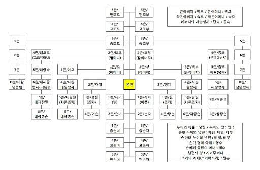

05 혼인과 가족
===

- [05 혼인과 가족](#05-%ed%98%bc%ec%9d%b8%ea%b3%bc-%ea%b0%80%ec%a1%b1)
- [단원의 기초](#%eb%8b%a8%ec%9b%90%ec%9d%98-%ea%b8%b0%ec%b4%88)
  - [가족관계와 법](#%ea%b0%80%ec%a1%b1%ea%b4%80%ea%b3%84%ec%99%80-%eb%b2%95)
  - [가족의 범위](#%ea%b0%80%ec%a1%b1%ec%9d%98-%eb%b2%94%ec%9c%84)
  - [친족관계](#%ec%b9%9c%ec%a1%b1%ea%b4%80%ea%b3%84)
  - [친생자](#%ec%b9%9c%ec%83%9d%ec%9e%90)
  - [입양제도](#%ec%9e%85%ec%96%91%ec%a0%9c%eb%8f%84)
  - [가족관계등록제도](#%ea%b0%80%ec%a1%b1%ea%b4%80%ea%b3%84%eb%93%b1%eb%a1%9d%ec%a0%9c%eb%8f%84)
    - [등록의 신고](#%eb%93%b1%eb%a1%9d%ec%9d%98-%ec%8b%a0%ea%b3%a0)
- [1. 약혼과 혼인](#1-%ec%95%bd%ed%98%bc%ea%b3%bc-%ed%98%bc%ec%9d%b8)
  - [1.1 약혼과 파혼은 어떻게 할까](#11-%ec%95%bd%ed%98%bc%ea%b3%bc-%ed%8c%8c%ed%98%bc%ec%9d%80-%ec%96%b4%eb%96%bb%ea%b2%8c-%ed%95%a0%ea%b9%8c)
    - [1.1.1 약혼과 파혼](#111-%ec%95%bd%ed%98%bc%ea%b3%bc-%ed%8c%8c%ed%98%bc)
    - [1.1.2 약혼에 대해](#112-%ec%95%bd%ed%98%bc%ec%97%90-%eb%8c%80%ed%95%b4)
    - [1.1.3 파혼에 대해](#113-%ed%8c%8c%ed%98%bc%ec%97%90-%eb%8c%80%ed%95%b4)
  - [1.2 혼인은 어떻게 이루어질까](#12-%ed%98%bc%ec%9d%b8%ec%9d%80-%ec%96%b4%eb%96%bb%ea%b2%8c-%ec%9d%b4%eb%a3%a8%ec%96%b4%ec%a7%88%ea%b9%8c)
    - [1.2.1 사실상의 혼인에 대해](#121-%ec%82%ac%ec%8b%a4%ec%83%81%ec%9d%98-%ed%98%bc%ec%9d%b8%ec%97%90-%eb%8c%80%ed%95%b4)
    - [1.2.2 법률상의 혼인에 대해](#122-%eb%b2%95%eb%a5%a0%ec%83%81%ec%9d%98-%ed%98%bc%ec%9d%b8%ec%97%90-%eb%8c%80%ed%95%b4)
    - [1.2.3 혼인의 무료, 취소](#123-%ed%98%bc%ec%9d%b8%ec%9d%98-%eb%ac%b4%eb%a3%8c-%ec%b7%a8%ec%86%8c)
    - [1.2.4 혼인에 의해 발생하는 권리, 의무](#124-%ed%98%bc%ec%9d%b8%ec%97%90-%ec%9d%98%ed%95%b4-%eb%b0%9c%ec%83%9d%ed%95%98%eb%8a%94-%ea%b6%8c%eb%a6%ac-%ec%9d%98%eb%ac%b4)
- [2. 가정생활의 이모저모](#2-%ea%b0%80%ec%a0%95%ec%83%9d%ed%99%9c%ec%9d%98-%ec%9d%b4%eb%aa%a8%ec%a0%80%eb%aa%a8)
  - [2.1 부부간의 재산관리는 어떻게 할까](#21-%eb%b6%80%eb%b6%80%ea%b0%84%ec%9d%98-%ec%9e%ac%ec%82%b0%ea%b4%80%eb%a6%ac%eb%8a%94-%ec%96%b4%eb%96%bb%ea%b2%8c-%ed%95%a0%ea%b9%8c)
    - [2.1.1 부부별산제](#211-%eb%b6%80%eb%b6%80%eb%b3%84%ec%82%b0%ec%a0%9c)
    - [2.1.2 일상가사대리란](#212-%ec%9d%bc%ec%83%81%ea%b0%80%ec%82%ac%eb%8c%80%eb%a6%ac%eb%9e%80)
  - [2.2 아이를 입양하려고 할 떄](#22-%ec%95%84%ec%9d%b4%eb%a5%bc-%ec%9e%85%ec%96%91%ed%95%98%eb%a0%a4%ea%b3%a0-%ed%95%a0-%eb%96%84)
- [3. 이혼](#3-%ec%9d%b4%ed%98%bc)
  - [3.1 협의이혼](#31-%ed%98%91%ec%9d%98%ec%9d%b4%ed%98%bc)
    - [3.1.1 협의이혼의 절차](#311-%ed%98%91%ec%9d%98%ec%9d%b4%ed%98%bc%ec%9d%98-%ec%a0%88%ec%b0%a8)
    - [3.1.2 협의이혼의 무효](#312-%ed%98%91%ec%9d%98%ec%9d%b4%ed%98%bc%ec%9d%98-%eb%ac%b4%ed%9a%a8)
  - [3.2 재판상 이혼](#32-%ec%9e%ac%ed%8c%90%ec%83%81-%ec%9d%b4%ed%98%bc)
    - [3.2.1 재판상의 이혼](#321-%ec%9e%ac%ed%8c%90%ec%83%81%ec%9d%98-%ec%9d%b4%ed%98%bc)
    - [3.2.2 재판상의 이혼의 절차](#322-%ec%9e%ac%ed%8c%90%ec%83%81%ec%9d%98-%ec%9d%b4%ed%98%bc%ec%9d%98-%ec%a0%88%ec%b0%a8)
  - [3.3 이혼으로 인한 변화](#33-%ec%9d%b4%ed%98%bc%ec%9c%bc%eb%a1%9c-%ec%9d%b8%ed%95%9c-%eb%b3%80%ed%99%94)
    - [3.3.1 재산상의 변화](#331-%ec%9e%ac%ec%82%b0%ec%83%81%ec%9d%98-%eb%b3%80%ed%99%94)
    - [3.3.2 재산 이외의 변화](#332-%ec%9e%ac%ec%82%b0-%ec%9d%b4%ec%99%b8%ec%9d%98-%eb%b3%80%ed%99%94)
- [4. 상속과 유언](#4-%ec%83%81%ec%86%8d%ea%b3%bc-%ec%9c%a0%ec%96%b8)
  - [4.1 누구에게 얼마나 상속되는가](#41-%eb%88%84%ea%b5%ac%ec%97%90%ea%b2%8c-%ec%96%bc%eb%a7%88%eb%82%98-%ec%83%81%ec%86%8d%eb%90%98%eb%8a%94%ea%b0%80)
    - [4.1.1 누가 상속받을 것인가?](#411-%eb%88%84%ea%b0%80-%ec%83%81%ec%86%8d%eb%b0%9b%ec%9d%84-%ea%b2%83%ec%9d%b8%ea%b0%80)
    - [4.1.1 얼마나 상속받을 수 있는가?](#411-%ec%96%bc%eb%a7%88%eb%82%98-%ec%83%81%ec%86%8d%eb%b0%9b%ec%9d%84-%ec%88%98-%ec%9e%88%eb%8a%94%ea%b0%80)
    - [4.1.3 상속재산에 특별한 기여를 한 상속인이 있는 경우](#413-%ec%83%81%ec%86%8d%ec%9e%ac%ec%82%b0%ec%97%90-%ed%8a%b9%eb%b3%84%ed%95%9c-%ea%b8%b0%ec%97%ac%eb%a5%bc-%ed%95%9c-%ec%83%81%ec%86%8d%ec%9d%b8%ec%9d%b4-%ec%9e%88%eb%8a%94-%ea%b2%bd%ec%9a%b0)
  - [4.2 상속의 승인과 포기](#42-%ec%83%81%ec%86%8d%ec%9d%98-%ec%8a%b9%ec%9d%b8%ea%b3%bc-%ed%8f%ac%ea%b8%b0)
    - [4.2.1 상속의 승인과 포기의 자유](#421-%ec%83%81%ec%86%8d%ec%9d%98-%ec%8a%b9%ec%9d%b8%ea%b3%bc-%ed%8f%ac%ea%b8%b0%ec%9d%98-%ec%9e%90%ec%9c%a0)
    - [4.2.2 단순승인](#422-%eb%8b%a8%ec%88%9c%ec%8a%b9%ec%9d%b8)
    - [4.2.3 한정승인](#423-%ed%95%9c%ec%a0%95%ec%8a%b9%ec%9d%b8)
    - [4.2.4 상속포기](#424-%ec%83%81%ec%86%8d%ed%8f%ac%ea%b8%b0)
  - [4.3 유언](#43-%ec%9c%a0%ec%96%b8)
    - [4.3.1 유언의 방식](#431-%ec%9c%a0%ec%96%b8%ec%9d%98-%eb%b0%a9%ec%8b%9d)
    - [4.3.2 유언의 내용](#432-%ec%9c%a0%ec%96%b8%ec%9d%98-%eb%82%b4%ec%9a%a9)

# 단원의 기초

## 가족관계와 법

한사람이 태어나면 출생신고를 해야 하고, 결혼을 하면 새로운 친족들과 일정한 관계를 맺으며, 가족 중 누군가 사망하면 상속의 문제가 발생한다. 이와 같이 법은 가정생활과 밀접한 관련이 있다. 사람은 태어나면서부터 죽을 때까지 법에 따른 일정한 지위를 가지며, 가정생활에서 일어나는 일들에 법이 적용되는 경우가 많기 때문이다.

## 가족의 범위

민법에서 가족은 **배우자, 직계혈족 및 형제자매, 직계혈족의 배우자, 배우자의 직계혈족 및 배우자의 형제자매**로 제한된다. 그러나 직계혈족의 배우자, 배우자의 직계혈족 및 배우자의 형제자매의 경우에는 생계를 같이할 때에만 가족이 될 수 있다.

예를 들어, 한국인 씨와 처제는 함께 살고 있는 경우에만 민법상 가족이라고 할 수 있다.

## 친족관계

민법은 배우자, 혈족 및 인척을 친족으로 정의하고 있다. 친족관계를 구성하는 친족의 종류에 대하여 구체적으로 알아보도록 한다.

- 혈족 : 혈연관계가 있는 사람을 의미한다.
  
    - 자연혈족 : 출생이라는 자연적 사실에 의해 발생한 혈족이며, 부모나 조부모, 외조부모, 형제자매를 의미한다.

    - 법정혈족 : 출생이 아닌 입양으로 생기는 혈족의 관계를 의미하며, 양친자관계라고도 한다.

    - 직계혈족 : 자기의 직계존속과 직계비속을 의미한다.

    - 방계혈족 : 자기의 형제자매와 형제자매의 직계비속, 직계존속의 형제자매 및 그 형제자매의 직계비속을 의미한다.
    
    > 직계존속과 직계비속??
    >
    > 직계는 증조부모, 조부모, 부모, 자녀, 손자, 증손과 같이 곧바로 이어나가는 관계를 말한다. 
    > 
    > 직계 친족중 본인부터 위의 계열에 있는 이들을 직계 존속이라 하고, 반면 자손의 계열에 있는 아들, 딸, 손자, 손녀 등은 직계 비속이라 한다.

- 인척 : 혼인으로 성립하는 친족이다.

**친족의 범위는 8촌 이내의 혈족, 4촌 이내의 인척, 배우자로 제한된다.**

## 친생자

자연적 혈연관계(자연혈족)가 있는 친생자는 혼인 중의 출생자와 혼인 외의 출생자로 나뉜다.

- 혼인 중의 출생자 : 아내가 혼인 중에 임신한 아이는 남편의 자식, 즉 친생자로 추정된다.

- 혼인 외의 출생자 : 부모가 혼인하지 않은 상태에서 출생한 자녀를 말한다.

    혼인 외의 출생자는 모(母)와의 사이에서는 출생과 동시에 친자관계가 발생하지만, 부(父)와의 사이에서는 **인지**가 있어야 친자관계가 발생한다.

    > 인지 : 혼인 외의 출생자를 그의 생부 또는 생모가 자기의 자녀라고 인정하는 것이며, 임의인지와 강제인지가 있다.
    >
    > - 임의인지 : 혼인 외의 출생자의 부 또는 모가 자신의 자녀로 신고하는 것이다.
    > - 강제인지 : 혼인 외의 출생자가 그의 부 또는 모를 상대로 인지청구의 소를 제기하여 인지의 효과를 발생하는 것이다.

## 입양제도

입양은 부모가 없거나 부모가 있더라도 더 이상 보호할 수 없는 아동들이 가정을 찾을 수 있도록 돕는 제도이다. 과거에는 혈연관계를 중시하는 전통적인 사고방식으로 인하여 입약을 꺼렸다. 그러나 오늘날에는 난임이 증가하고, 새로운 세대들이 혈연 중심의 사고방식에서 벗어나면서 입양신청이 늘고 있다.

- 일반양자 입양 : 입양을 하려는 자와 입양되는 자, 즉 양부모와 양자 사이에 입양을 한다는 합의가 있을 때 성립한다. 이때 **입양 신고**를 해야 양부모와 양자 사이에는 법적 친자관계가 생긴다.

    - 미성년자를 입양하려는 사람은 가정법원의 허가를 받아야 한다. 
    
    - 양부모는 성년자이어야 하며, 피성년후견인의 경우에는 성년후견인의 동의를 얻어야 하고, 배우자가 있는 사람은 배우자와 공동으로 입양해야 한다. 

    > 성년후견인 : 질병, 노령등으로 정신적 제약을 가진 인물을 대신해 법정대리인 역할 등을 하는 사람이나 법인을 말한다.
    
    - 양자는 양부모의 존속 또는 연장자가 아니어야 하며, 법정대리인의 동의 또는 승낙을 받아야 한다.

- 친양자 입양 :  입양된 자녀의 복리를 위하여 양자를 **혼인 중의 출생자**로 보는 제도이다. 일반양자와 달리 친양자는 입양이 확정된 때부터 친생부모와의 친족 관계 및 상속관계가 모두 종료되고, 양부모의 성과 본을 따르게 된다.

## 가족관계등록제도

가족관계등록제도는 **친족법상의 지위가 타인에게 미치는 영향을 고려하여 친족관계를 확실하게 공적으로 기록하고 공시**하게 하기 위해 도입된 제도이다.

가족관계등록부에 개인별로 출생, 혼인, 사망등 가족관계의 발생 및 변동사항을 입력하여 처리하고 있다.

### 등록의 신고

출생, 혼인, 입양 등의 신고는 신고사건 본인의 등록기준지 또는 신고인의 주소지나 현재지에서 할 수 있다. 신고는 서면이나 말로 할 수 있다. 만약 등록 사건에 관하여 신고 사건 본이이 시, 읍, 면에 출석하지 아니하는 경우에는 신고사건 본인의 주민등록증, 운전면허증, 여권, 그 밖에 대법원규칙으로 정하는 신분증명서를 제시하거나 신고서에 신고사건 본인의 인감증명서를 첨부하여야 한다.

# 1. 약혼과 혼인

두 남녀는 혼인을 통하여 부부의 연을 맺음으로써 가족을 형성한다. 혼인은 사회를 구성하는 기본단위인 가정, 가족을 형성하는데 그 기초가 되는것이다. 결혼을 하면 두사람 사이에 부부관계가 생기고 아울러 그에 따른 여러 법률관계가 생긴다.

## 1.1 약혼과 파혼은 어떻게 할까

### 1.1.1 약혼과 파혼

약혼은 두 남녀가 장차 **혼인하기로 하는 약속**이다. 약혼식을 하는 경우도 있지만 약혼에 특별한 방식이 있는 것은 아니다. 

약혼은 약속이기 때문에 지켜져야 하지만 다른 한쪽에 대해 강제로 혼인을 요구할 수 있는 것은 아니다. 따라서 약혼한 두 남녀가 혼인하지 않겠다고 합의를 하거나 일정한 사유가 발생한 경우 파혼할 수 있다.

### 1.1.2 약혼에 대해

> 미성년자도 약혼을 할 수 있을까?
> 
> 성인은 자유롭게 약혼을 할 수 있다. 그러나 미성년자가 약혼을 하기 위해서는 두 남녀가 모두 **만 18세**가 되어야 하고, 부모나 미성년후견인의 동의를 받아야 한다. 만약 부모의 동의 없이 약혼을 하였다면, 본인이나 부모는 그 약혼을 취소할 수 있다.

약혼을 하면 두 남녀는 가까운 장래에 상대방과 혼인을 할 의무를 지게 된다. 그러나 상대방에게 혼인할 것을 강제할 수는 없다. 혼인을 하면 법률상의 친족관계가 생기는 것과 다르게, **약혼은 약혼자 사이에서나 약혼자 일방과 상대방의 가족 사이에 친족관계가 발생하지 않는다.**

### 1.1.3 파혼에 대해

> 파혼은 언제든지 가능할까?
> 
> 두 약혼자가 합의를 한다면 이유를 불문하고 언제든지 파혼할 수 있다. 그러나 두 사람 사이의 합의가 없는 상태에서 약혼자 일방이 아무런 이유도 없이  파혼할 수는 없다.

파혼을 하기 위해서는 특별한 절차가 필요하지 않으며 혼인을 하지 않겠다는 의사를 상대방에게 직접 이야기하거나 전화나 편지 등의 방법을 통해 전달하면 된다. 그러나 후일 발생할 수도 있는 소송 등의 분쟁에 대비하기 위해서는 **파혼의 의사를 밝혔다는 사실을 증명할 수 있는 내용증명**을 보내는 것이 좋다.

약혼을 할 때에는 보통 예물을 교환하는데, 약혼자들이 서로 합의하여 파혼을 했다면 상대방으로부터 받은 예물을 돌려주면 된다.

## 1.2 혼인은 어떻게 이루어질까

### 1.2.1 사실상의 혼인에 대해

민법은 남녀가 혼인하고자 하는 마음이 서로 일치되고 혼인신고를 마쳐야 법적으로 혼인을 인정하고 있다. 만약 두 남녀가 결혼식을 올리고 부부로서 함께 생활하더라도 혼인신고를 하지 않았다면 법률상의 부부로 인정되지 않는다.

사실혼이란 **혼인신고를 하지 않았으나 남녀가 부부로서 혼인생활을 하고 있는 것**을 말한다. 사실혼으로 인정받기 위해서는 두 사람 사이에 혼인관계를 영위하려는 의사가 있고, 객관적으로 볼 때 사회관념상의 부부생활이라고 인정할만한 사실이 있어야 한다.

> 사실혼은 어떻게 보호될까?
> 
> 사실혼은 원칙적으로 혼인신고를 전제로 하는 법적 보호를 받지 못한다. 그러나 사실혼은 혼인신고가 없다는 점에서 법률혼과 차이가 있을 뿐, 부부 사이의 **혼인의 의사나 부부생활의 실체는 동일하기 때문에 보호할 필요성이 인정된다.** 그러므로 법은 일정한 범위 내에서 사실혼을 법률혼과 마찬가지로 보호하고 있다.

사실상의 혼인관계가 성립되어 있는 경우 가정법원에서 '**사실상 혼인관계 존부 확인**'을 청구함으로써 사실혼을 법률혼으로 만들 수 있다. 

### 1.2.2 법률상의 혼인에 대해

혼인은 두 남녀가 부부관계를 맺기로 하는 친족법상의 합의이다. 일정한 조건을 갖춘 경우 법으로써 보호되는 혼인으로 인정된다.

- 혼인할 의사가 합치되어야 한다.

- 혼인신고를 해야 한다.

### 1.2.3 혼인의 무료, 취소

두사람 사이에 혼인이 성립되었으나 일정한 경우에 혼인이 무효가 되거나 취소될 수 있다.

- 혼인이 무효가 되는 경우 

    - 혼인신고를 하였더라도 두 사람 사이에 혼인의 합의가 없는 경우
    - 8촌 이내 혈족 사이의 혼인인 경우
    - 당사자 간에 직계 인척 관계가 있거나 있었던 경우
    - 당사자 간에 양부모계의 직계 혈족관계가 있었던 경우

    **혼인이 무효가 되면 혼인의 두 당사자는 처음부터 부부가 아니었던 것으로, 다시 말해 혼인이 없었던 것과 같이 된다.**

    이로인해 당사자는 재산분할을 청구할 수 없고, 혼인을 기초로한 상속은 무효가 된다. 만약 두 사람사이에서 태어난 자녀가 있다면, 그 자녀는 혼인 외의 자로 된다.

- 혼인을 취소할 수 있는 경우

    - 두 남녀 연령이 만 18세 미만인 경우
    - 부모의 동의 없이 미성년자나 피성년후견인이 혼인한 경우
    - 배우자가 있는 자가 이중으로 혼인한 경우
    - 6촌 이내 혈족의 배우자
    - 배우자의 6촌 이내 혈족
    - 배우자의 4촌 이내 혈족의 배우자인 인척이거나 이러한 인척이었던 자
    - 6촌 이내 양부모계의 혈족이었던 자와 4촌 이내 양부모계의 인척이었던 자 사이의 혼인이 이루어진 경우
    - 혼인 당시 악정 질환 기타 중대한 사유가 있었던 것을 모르고 혼인한 경우
    - 사기나 강박에 의한 혼인인 경우

    **혼인이 취소되면 두 당사자는 그 취소된 때 붜 부부가 아닌 거으로 된다.** 

    이로인해 당사자 일방은 그 상대방에게 재산분할을 청구할 수 있고, 혼인에 기해 이루어진 상속이 무효로 되지 않는다.

### 1.2.4 혼인에 의해 발생하는 권리, 의무

- 새로운 친족 관계
- 부부의 동거의무
- 부부의 부양, 협조의 의무
- 미성년자의 성년의제 : 미성년자가 혼인을 하면 민법내에서 만 성년이 된 것으로 본다. 미성년자도 자기 자녀에 대해 친권을 행사할 수 있고 부모의 동의 없이 스스로 금전적인 거래를 할 수 있다.

# 2. 가정생활의 이모저모

## 2.1 부부간의 재산관리는 어떻게 할까

### 2.1.1 부부별산제

부부가 혼인하기 전부터 가지고 있던 재산을 계속해서 가지고 있거나 혼인 후에 새로이 재산을 취득하는 경우에 그 재산이 누구에게 속하며 누가 관리를 해야 하는 것인지가 문제될 수 있다. 이 문제에 대하여 민법은 **우선 부부 사이의 합의에 의해 재산관계를 정하도록 하고, 그러한 합의가 없는 경우에는 부부별산제를 일률적으로 적용하도록 규정하고 있다**.

부부별산제란 **부부 각자의 재산을 인정하고 그에 따라 부부 재산을 산정하는 것이다.** 한편 부부 중 누구에게 속한 것인지 분명하지 아니한 재산은 부부의 공유재산으로 추정된다.

- 특유재산의 명의와 소유자

    별산제의 경우 재산의 소유자를 누구의 명의로 했는지가 중요하지만, 단순히 그 명의자를 소유자로 보아서는 안 되는 경우가 있다.

    예를 들어, 아파트가 남편 명의로 되어있고, 그 아파트의 분양대금을 아내가 부담했다면 그 아파트의 소유자는 아내라고 보아야한다.

- 재산분할의 대상이 되는 특유재산

    혼인 중에 부부가 공동으로 협력하여 취득한 재산은 비록 그 명의가 부부 일방의 이름으로 되어 있어도 실질적으로 부부의 공유에 속하는 재산으로 보아 이혼 시 재산분할의 대상이 된다.

### 2.1.2 일상가사대리란

일상가상대리란 **부부의 일방이 일상의 가사에 관하여 상대방을 대리할 수 있는 권리**이다. 여기서 일상가사란 부부의 공동생활을 위하여 필요한 활동을 말한다.

- 식료품이나 생활용품 구입
- 집의 월세 또는 자녀의 양육비 지급

그러므로 사치품을 구매하거나 부부 일방 소유의 부동산을 매각하는 행위 등에 대해서는 대리권이 인정되지 않는다.

일상가사에 관하여 부부 중 어느 한 쪽이 지는 채무에 대해서 부부는 연대책임을 지지만, 제 3자(채권자)에 대해서 이미 다른 한 쪽이 책임지지 않겠다고 분명하게 의사를 밝힌 경우에는 연대책임이 없다.

## 2.2 아이를 입양하려고 할 떄

# 3. 이혼

**이혼(離婚)이란 부부가 합의 또는 재판으로 혼인관계를 끝내는 것이다.** 이혼은 혼인 본래의 목적인 부부의 영속적 공동생활관계를 파괴하는 것이지만, 이혼을 억제하면 오히려 더 큰 폐해와 비극을 초래할 수도 있다. 그러므로 오늘날 대부분의 국가에서는 이혼제도를 인정하고 있다.

## 3.1 협의이혼

### 3.1.1 협의이혼의 절차

협의이혼을 하려고 하는 경우, 변호사 등 대리인에 의한 신청은 할 수 없다. **협의이혼을 하려는 부부가 직접 법원에 협의의혼 의사를 밝혀야 한다.**
신분증과 도장을 가지고 등록기준지 또는 주소지를 관할하는 법원을 방문하여 **협의이혼의사확인신청서**를 작성하여 필요한 서류를 제출하고 협의이혼에 관한 안내를 받아야 한다.

1. 이혼 합의
2. 협의이혼의사확인신청서 제출
3. 이혼숙려기간
4. 법원 출석(판사의 확인)
5. 협의이혼의사확인서 수령
6. 3개월 내에 등록기준지 또는 주소지에 신고

### 3.1.2 협의이혼의 무효

당사자 사이에 이혼의 합의가 없는 경우 무효가 된다. 

예를들어 이혼의사가 없고 부부 공동생활을 영위하면서 사업이 잘 되지 않아 늘어난 남편의 빛 때문에 하는 이혼은 무효라고 할 것이다. 

## 3.2 재판상 이혼

### 3.2.1 재판상의 이혼

재판상의 이혼은 **일정한 사유가 있을 때 당사자 일방의 청구로 가정법원의 판결에 의하여 이혼하는 것**을 말한다. 재판상의 이혼은 일정한 사유가 있는 경우에만 허용되며 민법은 제 840조에서 6가지 재판상의 이혼사유를 규정하고 있다. 6가지 이혼사유는 각각 독립적이므로, 각각의 이혼사유로 이혼을 청구할 수 있다.

- 배우자의 부정한 행위
- 악의의 유기
- 배우자 또는 그의 직계존속에 의한 심히 부당한 대우
- 자기의 직계존속에 대한 배우자의 심히 부당한 대우 : 자신의 배우자가 자신의 부모나 조부모를 신체적, 정신적으로 학대 폭행, 모욕을 당한 경우
- 3년 이상의 생사불명
- 기타 혼인을 계속하기 어려운 중대한 사유

    1. 부부의 공동생활관계가 회복할 수 없을 정도로 파탄된 경우
    2. 1번 혼인생활의 계속을 강제하는 것이 일방의 배우자에게 참을 수 없는 고통이 되는 경우

    **1번과 2번의 요건을 모두갖추어야 이혼 사유에 해당된다.**

### 3.2.2 재판상의 이혼의 절차

재판상 이혼을 하려는 사람은 먼저 가정법원에 조정을 신청하여야 하고, 조정신청 없이 이혼소송을 제기한 경우에는 특별한 사정이 없는 이상 법원이 그 사건을 조정에 회부한다. 조정이 성립되면 재판상 화해와 동일한 효력이 있어 곧바로 이혼의 효력이 발생하지만, 조정이 성립되지 않으면 재판에 의해 이혼 가능여부를 판단하게 된다.

> 조정 : 재판에 의하지 않고 제3자의 중개를 통해 당사자간 화해에 이르는 분쟁해결을 제도이다.

## 3.3 이혼으로 인한 변화

### 3.3.1 재산상의 변화

- 이혼과 위자료

    위자료는 **이혼의 책임이 있는 당사자에게 청구하는** 정신적 고통에 대한 **손해 배상**이다. 이혼하는 부부 일방은 다른 일방 뿐만 아니라 혼인의 파탄에 책임이 있는 제 3자에 대하여도 손해배상을 청구할 수 있다.
  
- 이혼과 재산분할청구권

    재산분할청구권은 **이혼을 한 당사자의 일방이 다른 일방에 대하여 재산의 분할을 청구할 수 있는 권리**이다. '이혼을 한' 당사자에게 인정되는 권리이므로 이혼과 동시에 또는 그 이후에만 청구할 수 있다는 점에 주의해야 한다.

    재산분할청구권은 혼인생활 중에 형성한 공동재산에 대한 분할을 청구하는 것으로써, 위자료와는 법적 성격과 목적이 다르므로 **이혼에 책임이 있는 당사자라 하더라도 재산분할청구권을 행사하는 것이 가능**하다.

    재산분할의 대상은 원친적으로 부부가 혼인 중에 함께 노력하여 형성한 재산에 한정되나, 부부 일방이 혼인 전부터 가진 고유재산 또는 상속증여 유증을 받은 재산이라 하더라도 다른 일방이 혼인 중에 적극적으로 협력하여 그 트육한 재산의 유지와 증식에 기여하였다고 인정되는 경우에는 분할의 대상이 될 수 있다. 이 때 처의 가사노동도 포함된다.

### 3.3.2 재산 이외의 변화

- 양육에 관한 사항의 결정

    슬하에 미성년인 자녀가 있는 경우, 부부는 이혼시 미성년인 자녀의 친권행사에 관한 사항 뿐만 아니라 양육에 관한 사항 즉, 양육자의 결정, 앙육비용의 부담, 면접교섭권의 행사여부 및 그 방법 들을 미리 협의해야 한다.

    협의를 할 수 없거나 협의가 이루어지지 않는 경우에는 당사자의 청구나 법원의 직권에 의하여 가정법원이 결정하게된다.

- 양육비의 청구

    이혼한 뒤 자녀를 맡아서 양육하는 양육자가 그렇지 않은 일방에 대하여 자녀가 성년이 될 때 까지 장래의 **양육비를 지급하라고 청구**할 수 있다. 뿐만 아니라 법원은 과거의 양육비에 관하여도 상대방이 **분담함이 상당하다고 인정되는 경우에는 일정 범위 내에서 그 비용의 상환을 청구**할 수 있다.

- 면접교섭권

    친권자나 양육자가 아니어서 미성년의 자녀를 보호/양육하지 않는 부나 모, 그리고 자녀가 상호간에 직접 만나거나 전화 등을 통하여 연락할 수 있는 권리이다. 특별한 경우 자녀를 양육하지 않는 부모 일방의 직계존속(예. 할아버지, 할머니)도 가정법원에 손자녀와의 면접교섭을 청구할 수 있다.

    면접교섭권이 보장된다고 하더라도 자녀를 만나는 것은 양육자의 양육권을 침해하지 않는 범위 내에서 허용된다.

# 4. 상속과 유언

사람은 살아있는 동안 경제적 활동을 하게 되며, 사람들은 죽을 때 빚이든 재산이든 그 경제 활동의 결과를 남기게 된다. 죽음이란 사회구성원이면 누구나 거치게 되는 과정이므로 사람이 사망한 후에 남겨진 경제활동의 결과를 어떻게 처리하는가 하는 것은 사회적으로도 중요한 의미를 가진다.

우리 법은 사망한 사람의 유족에게도 **일정한 몫을 남겨줄 수 있는 상속을 규정**하고 있으며, **사망한 사람의 의사를 존중하는 유언을 규정**하고 있다. 이 장에서는 유언과 상속을 둘러싸고 일상에서 벌어지는 일들을 살펴보기로 한다.

## 4.1 누구에게 얼마나 상속되는가

### 4.1.1 누가 상속받을 것인가?

- 상속순위
- 
    상속인이 생전에 유언으로 누구에게 얼마나 상속받도록 할 것인가에 대해 생전에 유언으로 정해 둔 경우에는 그 유언이 유효한 것인 한 그 유언에 따라 상속받게 된다. 그러나 유언이 없는 경우에는 민법이 정한 순서와 비율대로 상속된다. 
    
    1. 제 1순위 : 사망한 사람의 직계비속(자녀, 손자녀등)
    2. 제 2순위 : 사망한 사람의 직계존속(부모, 조부모)
    3. 제 3순위 : 사망한 사람의 형제자매
    4. 제 4순위 : 사망한 사람의 4촌 이내 방계혈족(삼촌, 고모등)

    1순위와 2순위가 함께 상속인이 되는 상황은 없다. 예컨대 할아버지와 손자가 함께 상속을 받는 일은 없는 것이다. 피상속인에게 자식이 있는 한 피상속인의 부모는 상속인이 될 수 없다.

    같은 순위 내에서 촌수가 같은 자가 여럿이면 이들은 공동상속인으로서 피상속인의 재산을 1/n으로 나눠가진다.

    배우자는 위 순위에서 직계비속이나 직계존속이 상속인이 될 때 그들이 받는 상속 재산에 0.5를 가산하여 상속받은 공동상속인이 된다. 만약 사망한 사람이 부모나 자녀도 없이 배우자만 남는 경우, 오로지 배우자만 상속인이 된다.

- 대습상속

    추정상속인이 상속의 개시 이전에 사망 또는 결격으로 인하여 상속권을 상실한 경우에 그사람의 직계 비속또는 배우자가 이를 상속하는 것이다. 배우자와 자녀가 공동으로 상속받거나 자녀가 없다면 단독으로 대습상속을 받을 수 있다.

- 상속결격

    상속인이 된 사람도 패륜적인 행동을 하였다면 법률이 상속자격을 박탈해버린다. 이것이 바로 '상속결격'이다. 민법이 정하는 상속결격사유는 다음과 같다.

    - 직계존속이나 피상속인에 대하여 살인, 살인미수, 상해치사 등의 범죄행위를 한 경우
    - 상속의 선순위이거나 동순위인 자를 살해하려 한 경우
    - 사기나 강박으로 유언하도록 하는 경우

    상속결격이 된 자는 상속이 아닌 유언으로 재산을 받을 예정이었더라도 그것으 받을 수 없다.

### 4.1.1 얼마나 상속받을 수 있는가?

누구에게 얼마나 상속받도록 할 것인가에 대해 생전에 유언으로 정해둔 경우에는 그 유언이 적법한 것인 한 그 유언에 따라 상속받게 된다. 그러나 유언이 없는 경우에는 다음과 같이 법에서 정한 비율대로 상속된다.

- 같은 상속순위를 가진 사람들은 재산의 1/n으로 상속받는다.

    자녀들 중 법률 혼관계에서 태어난 자녀와 그 외의 관게에서 태어난 자녀, 장남과 차남, 아들과 딸, 기혼과 미혼 사이에 **상속액의 차이는 없다.**

- 배우자가 자녀와 공동으로 상속받는 경우에는 자녀들의 상속분의 1.5배를 상속받고, 시부모 또는 장인/장모와 공동으로 상속받는 경우에도 마찬가지로 1.5배를 상속받는다.

    예. 배우자와 두명의 자녀

    배우자 : 자녀 A : 자녀 B = 1.5 : 1 : 1

    배우자의 상속분 = 총재산 * 1.5 / (1.5 + 1 + 1)

    예. 배우자와 장인, 장모

    배우자 : 장인 : 장모 = 1.5 : 1 : 1

    배우자의 상속분 = 총재산 * 1.5 / (1.5 + 1 + 1)

### 4.1.3 상속재산에 특별한 기여를 한 상속인이 있는 경우

상속인 중에서 피상속신을 특별히 보살폈거나 그 재산을 유지하거나 증가시키는 데 특별한 기여를 한 자가 있다면, 다른 상속인들과의 합의로 그 기여에 대해 일정보상액을 정할 수 있다. 이 경우 상속의 기준이 되는 재산은 그 사람의 보상액을 제한 재산이 된다.

    상속 재산 = 기존 상속 재산 - 보상액

## 4.2 상속의 승인과 포기

### 4.2.1 상속의 승인과 포기의 자유

상속은 사망한 사람의 **적극재산 뿐만 아니라 채무도 한꺼번에 상속인에게 넘어가게 하는 제도**이다. 따라서 재산보다 빚이 많은 자가 사망한 경우, 상속인이 단순히 상속을 승인하게 되면 상속을 받는 것이 오히려 손해가 될 수 있다. 그리하여 민법은 상속에 의한 권리의무의 당연승계를 인정하면서 다른 한편으로 상속인 스스로 일정 기간 내에 이를 승인하거나 포기할 수 있도록 하고 있다. **상속인에게 권리취득의 자유를 인정하고 채무가 많은 경우 불이익 부담을 강요하지 않기 위해서이다.**

### 4.2.2 단순승인

단순승인은 **재산이든 채무든 상관없이 상속을 받겠다는 뜻**이므로, 피상속인의 재산보다 채무가 많은 경우라면 상속인은 일반적으로 단순승인을 하지 않으려 할 것이다. 이때 주의해야할 것이 잇다. 바로 **법정단순승인**이라는 것인데, 상속인이 **어떠한 행동**을 해버리면 상속인이 단순승인할 의도가 있었는지 여부와 상관없이, 심지어 무심코 그러한 행동을 하였더라도 바로 법률상 단순승인한 것으로 취급되어 채무까지 떠안게 되는 경우이다.

- 피상속인의 사망으로 상속개시 되었음을 알았음에도 그로부터 3개월이 지나도록 상속포기 등의 의사표시를 하지 않은 경우
 
- **상속재산을 처분한 경우**

    상속재산을 타인에게 매도하거나 아버지의 채무자들에게 연락하여 변제를 받거나, 상속인들끼리 상속재산분할협의를 하는 해위까지도 '처분행위'에 해당되므로 주의해야 한다.

- 한정승인이나 상속포기를 한 후에 몰래 그 재산을 써버리거나 숨긴 경우, 고의로 재산목록에서 누락시킨 경우

### 4.2.3 한정승인

한정승인은 **상속으로 취득하게 될 재산의 한도에서 피상속인의 채무를 변제하는 것을 조건으로 상속을 승인**하는 것이다. 한정승인을 할 경우, 피상속인의 상속인이 되므로 채무를 부담하게 된다.다만 한정승인의 효과로 상속재산의 범외 안에서만 책임을 지는 것이므로 피상속인의 채권자로부터 채무이행청구를 받았을 때마다 한정승인사실을 따로 주장하여야 한다는점을 주의를 요한다.

### 4.2.4 상속포기

상속받을 재산보다 빚이 많은 것이 확실하다면, 사망을 안 날부터 **3개월 내에 가정법원에 상속포기 신고**를 하면된다. 우선순위에 있던 상속권자가 상속포기를 한 경우에는 그 다음 순위 상속권자에게 상속된다. 예를 들어 할아버지가 사망한 경우 가족 모두가 상속 포기를 하려고 한다면 아내, 아들과 며느리 뿐만 아니라 손자녀들, 할아버지의 형제자매, 할아버지의 4촌이내의 방계혈족까지 모두 함께 상속포기를 하여야 한다는 점을 주의해야 한다.

> 유류분제도 : 유언을 하는 자는 원칙적으로 자기의 재산을 자유로이 처분할 수 있다. 그러나, 모든 재산을 사회에 기부한다든지, 상속인 중 소수에게 몰아준다든지 하여 다른 상속인이 생활하기조차 힘들어지는 등 상속인들의 지나친 희생을 강요하는 경우가 생길 수 있다. 이런 경우 상속인들을 보호하기 위해 법률이 상속 재산 중의 일정한 비율을 그들에게 보장해 주는 데, 이를 유류분이라 한다.
>
> ### 보장의 범위 
> 1. 사망한 사람의 직계비속은 상속분의 1/2
> 2. 사망한 사람의 배우자는 상속분의 1/2
> 3. 사망한 사람의 직계존속은 상속분의 1/3
> 4. 사망한 사람의 형제자매는 상속분의 1/3
>
> 예를들어, 아버지가 자신의 전 재산 7억 원을 사회에 기부했고, 그의 아내와 두 딸이 이에 불만을 가지고 유류분을 주장한다면 각각 다음의 액수를 보장을 받을 수 있다.
>
> 배우자와 자녀의 상속 비율은 1.5 : 1 이므로 아내와 자녀들의 각각의 상속분은 1.5/3.5 : 1.0/3.5 : 1.0/3.5 이다.
>
> 배우자 : 7억원 * 1.5/3.5 * 1/2(유류분)        각 자녀 : 7억원 * 1/3.5 * 1/2(유류분)

## 4.3 유언

### 4.3.1 유언의 방식

유언은 반드시 법에 정한 형식을 그대로 지켜야 한다. 실제로 모 대학에 123억을 기부하겠다는 유언자의 자필유언장에 날인이 없어 유언에 의한 증여가 무효가 된 사건은 유명하다. 또한 이름과 연월일, 내용 등을 모두 기재하고 날인까지 했는데, 주소만을 빠뜨려서 유언자체가 뮤효가 된 사건도 있었다.

우리 민법에서는 다음과 같은 다섯 가지의 경우만을 적법한 유언으로 인정하고 있다.

- 자필증서에 의한 유언

    유언자가 **유언하는 내용과 작성연월일, 주소, 이름을 직접 쓰고 도장을 찍는 것**으로 가장 간단한 방식이다. 유언내용을 고치려면 고쳐 쓴 내용 위에도 도장을 찍어야 한다. 자필증서에 의한 유언은 간편하기는 하지만 사망한 후 유언서를 처음 발견한 사람에 의해 **위조, 변조되거나 은닉될 위험성이 크다는 것**이 단점이다.

- 녹음에 의한 유언

    유언하는 사람이 **유언의 내용과 성명, 날짜를 말하고 이에 참여한 증인이 유언의 정확함과 이름을 말하여 녹음**하는 방식이다.

- 공정증서에 의한 유언

    **유언자가 증인 2명과 공증인(변호사) 앞에서 유언내용을 말하는 방식**이다. 공증인이 유언자가 남긴 말을 필기 낭독하면 유언자와 증인이 정확한지 여부를 확인한다.

- 비밀증서에 의한 유언

    **유언자가 유언의 내용을 기록하여 그 증서를 봉투에 넣고 밀봉한 다음 2명 이상의 증인에게 제출**해야 한다. 또한 밀봉한 봉투 겉면에 유언서의 제출연월일을 기록하고 유언자와 증인들이 각자 서명하거나 도장을 찍어야 한다.  이때 **반드시 표면에 기재된 날부터 5일 이내에 유언서를 공증인 또는 법원에 제출하여, 봉인상에 확정일자를 받아야 한다.**

- 구수증서에 의한 유언

   **2인 이상의 증인을 참여시키고 그 중 1명에게 유언을 받아적게 한 후 각자 서명하거나 도장을 찍은 다음 법원에 검인을 신청**하는 방식이다. 구수증서에 의한 유언은 질병 및 기타 급박한 사유로 인하여 앞에서 살펴본 4가지 방식에 의한 유언을 할 수 없는 경우에 한해 예외적으로 인정되는 것이다.

### 4.3.2 유언의 내용

형식적인 요건을 갖추었다고 하더라도 어떤 내용이든 유언으로 인정되는 것은 아니다. 유언은 법에 정한 사항에 관하여만 할 수 있다. 민법에서 정한 유언으로 할 사항은 **재산관계**와 **친족관계**에 관한 사항 등인데, 주로 분쟁의 대상이 되는것은 유언자 재산의 처분에 관한 것이다. 그러나 **유언이 그 방식을 제대로 지키지 아니하여 무효가 된 경우이거나, 상속재산에 관해 유언이 없는 경우에는 법률이 정하는대로 상속이 이루어진다.**