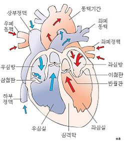

03 심폐소생술과 자동심장충격기
===

# 학습목표

1. 성인과 소아, 영아의 갑작스런 심정지, 호흡장애에 대한 즉각적이고 효과적인 심폐소생술을 시행할 수 있다.

2. 이물에 의한 기도폐쇄에 대한 응급처치법을 시행할 수 있다.

3. 전기 충격으로 심장 리듬을 소생시키는 제세동 방법을 설명할 수 있다.

# 학습목차

1. 심폐소생술
2. 자동심장충격기

# 1. 심폐소생술

## 1.1 심장발작과 심정지

**심장발작**이란 심장근육으로 가는 혈액 공급이 많이 줄거나 멈췄을 때 일어난다. 근육은 죽을 때 까지 계속 일하는 장기입니다. 그렇기 떄문에 계속 산소와 영양소가 필요합니다. 

심정지는 하나나 여러개의 관상동맥 안의 혈전 때문에 종종 일어난다. 관상이란 말은 월관 즉 관의 모양 처럼 생겼다는 의미입니다. 혈전은 순수한 우리말로 피떡이라고 합니다. 음식을 많이 섭취하여 영양소나 지방이 혈관에 쌓여서 생깁니다.

심장근육 손상이 너무 심하면 심장박동이 멈출 수 있고 이 상태를 심정지라고 한다. 일부는 갑작스런 임상적 사망인 심정지가 일어났을 때 빠른 응급처치를 못해 병원에 들어가기전 생물학적 사망인 임상이라고 한다. 이때 빠른 심폐소생술을 통해 살아날 수 있습니다. 하지만 4~6분 이내에 실시하지 않는다면 뇌의 세포가 죽어 뇌사할 수 있습니다.

### 1.1.1 심정지 처지

심정지가 일어났을 때 행해야 하는 처치는 생존사슬 또는 소생의 사슬이라 한다. 5가지 생존사슬이 가능한 빨리 유기적으로 이루어져야 심정지 환자가 소생할 수 있다.

- 심정지 예방 : 어른의 심정지는 주로 심장질환이 악화되어 발생한다. 소아의 심정지는 호흡부전이나 쇼크에 의해 발생한다.

- 신속한 심정지 확인과 신고 : 심정지라고 판단된다면 즉시 119에 신고한다.

- 신속한 심폐소생술 : 가슴압박은 심폐소생술(CPR)동안 심장과 뇌에 혈액을 공급한다. 효과적인 가슴압박은 응급구조사가 올 때까지 시간을 벌어준다.

- 신속한 제세동(심장전기충격)

- 효과적인 전문소생술과 심정지 후 통합치료 - 전문소생술이란 정맥주사요법, 약물치료, 전문기도관리술, 병원으로의 빠른 이송등을 말한다.

그렇다면 심정지가 발생하는 위험 요인은 무엇인가?

- 불변적인 요인
	- 유전 : 가족력에 의해 나타난다.
	- 성별 : 여성의 경우 에스트로젠이 심장 질환을 보호하기에 남성이 더 발생할 가능성이 높지만, 폐경 후 여성에서 심장질환으로 인한 사망률이 높아진다.
	- 연령

- 비불변적 요인
    - 흡연 : 흡연자는 비 흡연자에 비해 심장질환의 발생률이 2~4배 높다
    - 고혈압 : 심장의 작업부하를 증가시킨다.
    - 고콜레스테롤 : 너무 높은 콜레스테롤은 동맥벽의 비대를 초래한다.
    - 당뇨병 : 혈중 콜레스테롤과 중성지방에 영향을 미친다.
    - 과제충 및 비만 : 복부 근처의 과도한 체지방은 심장질환의 발생 가능성을 증가시킨다.

> [질문] 심폐소생술에서 성인, 소아, 영아 환자를 어떻게 정의하는가?
>
> CPR 기법은 연령에 따라 약간의 차이가 있을 뿐 동일하다.
> * 신생아는 생후 4주
> * 영아는 1세 미만
> * 소아는 1세 부터 사춘기
> * 성인은 사춘기부터 그 이상의 연령

## 1.2 심폐소생술의 실시

심장박동이 멈췄을 때 환자는 CPR, 제세동, EMS 전문가를 빨리 필요로 한다. CPR(CardioPulmonary Resuscitation)은 **가슴압박**으로 심장과 폐의 순환을 유도해 산소화된 **혈액**을 뇌에 공급하고 **인공호흡**으로 환자의 폐에 **산소**를 공급한다.

### 1.2.1 의식확인

환자의 움직임이 없으면 어깨를 가볍게 두드리며 “괜찮으세요?” 라고 물어보고 의식을 확인합니다. 의식이 없으면 먼저 주변사람들에게 **119에 신고**해달라고 부탁하고, **자동심장충격기**를 가져다 달라고 부탁한다.

환자가 숨을 쉬지 않거나(**무호흡**) 헐떡거리기(**심정지 호흡**)만 한다면 심폐소생술이 필요하다.

> 미국심장협회에서는 의식이 없는 소아와 구조자만 있는 경우 먼저 2분간의 심폐소생술을 실시한 뒤 119에 신고하도록 하고 있다. 하지만 우리나라의 경우 연령에 상관없이 119에 먼저 신고한 뒤 심폐소생술을 하도록 권장한다.

### 1.2.2 심폐소생술의 실행

#### 1. 가슴압박

가슴압박은 심폐소생술의 가장 중요한 단계로 가능하면 **딱딱하고 평평한 바닥**에서 실시하는 것이 효과적이다. 가슴압박은 연령에 따라 손의 형태를 달리한다. 

- 성인은 두손을 사용하고, 깊이는 5cm
- 소아는 한 손이나 두 손, 깊이는 4~5cm
- 영아는 두 손가락으로 4cm로 한다.

가슴압박은 분당 100~120회의 속도로 실시하며 자동심장충격기나 환장의 반응이 나타날 때 까지 실시합니다. 

15~18초 동안 가슴압박을 30회 하고, 2회의 인공호흡을 실시(심폐소생술)하거나, 아니면 가슴 압박을 계속 시행한다.

#### 2. 인공호흡

1. **인공호흡을 하기전 머리를 뒤로 젖히고 턱을 들어올려 기도를 개방해줍니다.** 이를 통해 혀가 목구멍을 막는 것을 도와줍니다. 
2. 기도가 개방되면 환자의 코를 막고 숨을 들이마셔 환자의 입에 **1초 동안** 2회 불어 넣습니다. 호흡을 불어 넣을 때 환자의 가슴이 올라오는지 확인한다.

> 중요!!
> 익수 환자의 경우 폐에 산소가 없기 때문에 인공호흡 후에 가슴압박을 실시한다.

## 1.3 기도폐쇄

모든 음식은 기도폐쇄를 일으킬 수 있고, 특히 사탕, 땅콩, 포도 등이 주 원인이다. 영아나 소아의 경우 풍선, 작은 공, 구슬, 장난감, 동전등이 기도폐쇄로 인한 사망원인이 될 수 있다.

이물질에 의한 기도폐쇄는 **부분폐쇄**와 **완전폐쇄**로 나뉜다. 부분폐쇄는 일부분이 막혀있으므로 적은 양이나마 숨을 쉴 수 있다. 이때는 환자가 기침을 하려고 하면 도와줘야 한다.

완전폐쇄의 징후는 다음과 같다.

-  호흡이 점점 힘들어짐
- 약하고 도움되지 않는 기침 
- 말을 하거나 숨을 쉴 수 없음
- 청색증 : 피부와 손톱, 입 안이 청회색으로 변함
- 목을 부여잡는 자세

### 1.3.1 기도폐쇄 응급처치

"목이 막혔나요?"란 질문에 대답하지 못하고 고개를 끄덕이면 즉시 응급처치를 시행해야 한다. **기도폐쇄는 엄청난 응급상황이므로 주변사람이 없다면 119 신고보다 응급처치를 우선으로 해야한다.**

1. 하입리히법을 실시한다. 
2. 환자의 뒤에 서서 배꼽 위치에 두손을 잡고 
3. 위쪽 방향으로 빠르게 당겨 올린다.

영아의 경우 무릎위에  한손으로 영아의 가슴을 받친후 다른 한손으로 영아의 등을 강하게 5회를 친다. 그 후에 두 손가락으로 가슴압박을 실시한다.

> 중요!!
> 임산부의 경우 아이가 다칠 위험이 있으므로 가슴 정중안에 두손을 잡고 빠르게 당겨 올린다.

# 2. 자동심장충격기(AED)

자동심장충격기는 **심장의 리듬을 분석**하고 심정지 시 심장에 **심장전기충격을 주는** 전기 장치이다.

전기충격을 하는 이유는 비정상적인 심장의 전기 활동을 바로 잡아 심전도 리듬과 펌프 기능을 정상적으로 되돌리는 것이다.

AED의 패드를 환자의 몸에 부착하면 환자의 심장으로 부터 나온 미세한 전류가 AED까지 타고 흘러가 심전도를 체크한다.

## 2.1 공공장소의 제세동

우리나라의 경우 심혈관계 질환이 2대 사망 원인 중 하나로 갑작스런 심정지에 의한 사망은 아직까지도 해결되지 않고 있다.

심정지 환자에게 빠른 CPR과 AED(자동심장충격기)를 이용한 응급처치는 환자가 극적으로 회생하는데 도움이 됩니다.

우리나라에서 응급의료에 관한 법률 제47조 2항에 따라 병원 및 구급차 외의 **다중이용시설**(예. 학교, 공항, 관공서 등)에도 AED의 구비를 의무화하도록 하여 누구나 쉽게 발견하여 사용할 수 있습니다.

## 2.2 심장의 기능

심장은 4개의 속이 빈 방으로 이루어진 기관이다. 오른쪽(파랑색)에 있는 2개의 방은 몸에서 혈액을 받아 혈액을 산소화하기 위해 폐로 보낸다. 왼쪽(붉은색) 2개 방은 폐에서 산소화된 신선한 혈액을 온 몸으로 보낸다.

심장의 근육은 매초 마다 수축해야 하므로 관상동맥을 통해서 충분한 산소와 영양분을 공급받아야 한다. 

급성 심정지는 **심장의 경련 즉, 심실세동**에 의해 일어난다. 심장은 규칙적인 전기 신호에 의해 수축과 이완이 규칙적으로 일어나야 하지만, 정상적으로 펌프질이 안될경우 혈액순환이 되지 않아 쓰러지게 된다.

심정지 상태에서는 혈액순환은 중지되고 몸 전체에 산소와 영양소 공급이 중단된다. 심장이 멎은 상태에서는 매 1분 마다 환자의 회생 가능성은 7~10%씩 낮아진다. 

자동심장충격기(AED)가 도착할때 까지 심폐소생술을 실시하는 것이 환자의 회생 가능성을 높이는 중요한 응급처치가 된다.

## 2.3 자동심장충격기의 사용

1. 환자의 가슴을 노출시켜 접착패드 2개를 가슴에 붙인다.
2. 붙인 이후에는 환자의 몸에서 나온 전기 신호를 체크해야 하므로 환자로 부터 떨어져야 한다.
3. 상황에 따라 전기 충격의 필요성이 나타나면 기계는 전기를 충전합니다.
4. AED에서 전기충격 신호를 보내면 버튼을 눌러 전기 충격을 실시합니다.
5. 전기충격 이후 다시 심폐소생술을 수행합니다. 또는 AED의 지시에 따라 행동하면 됩니다.

## 2.4 특별히 고려해야 할 사항

- 물은 전기가 통하기 때문에 AED로 부터 전기가 통할 수 있습니다.
- 소아의 심장마비의 원인은 대게 기도폐쇄와 호흡 부전이 원인이다. AED에는 소아용 심장충격기 패드와 케이블이 있다. 만약에 없는 경우 성인용을 사용하도록 한다.
- 약물패치는 AED로 부터 전달되는 전기 에너지를 차단, 흡수할 수 있으므로 제거해야 한다. 심지어는 타서 화상을 입을 수도 있다.
- 만약 환자의 몸 안에 이식된 심장 박동 조절 장치가 있는 경우 이식형 심장충격기가 주기적으로 작동하므로 AED를 사용하지 않도록 한다.
