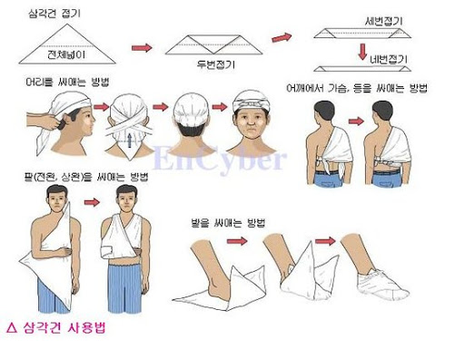

04 출혈과 상처
===

# 학습목표

1. 개방창의 출혈을 멈출 수 있고, 지혈법을 설명할 수 있다.
2. 내출혈의 증상과 징후를 파악하여, 쇼크에 대비할 수 있다.
3. 상처의 특성에 맞는 응급처치를 시행할 수 있다.
4. 적절한 드레싱과 붕대법을 설명할 수 있다.

# 1. 외출혈과 내출혈, 상처 관리

## 1.1 외출혈

외출혈이란 손상된 피부, 즉 상처 때 피부가 다쳐서 이 피부 바깥으로 피가 나오는 것이다. 출혈이란 단시간 내에 많은 양의 혈액이 **혈관 밖으로** 흘러나오는 것을 의미한다. 외출혈이 발생하면 출혈의 형태나 상처의 종류에 관계없이 응급처치는 **지혈을 우선**한다.

외출혈의 원인은 세 종류로 나뉜다.

1. 동맥출혈은 맥박에 따라 피가 뿜듯이 솟아나온다. 이 피는 비교적 밝은 붉은색이고, 높은 압력 때 문에 출혈 속도가 빠르고, 지혈을 하려면 좀 더 강하게 압박해야 한다.

2. 정맥출혈은 동맥출혈에 비해 피가 서서히 흘러나오기 때문에 지혈이 쉽다. 그러나 몸 안 깊숙이 자리 잡은 정맥에 생긴 출혈이라면 동맥출혈의 경우처럼 출혈량이 많고 지혈하기 힘들 수도 있 다.

3. 모세혈관출혈은 피가 조금씩 배어나오며 가장 흔한 출혈이다. 대개는 증상이심하지 않으며 자연 적으로 쉽게 멈춘다.

개방상처의 종류는 다음과 같다.

* 찰과상은 마찰에 의해 피부의 가장 겉층이 벗겨진 상처로 출혈은 아주 적다. 찰과상은 피부에 있 는 신경 말단(끝)이 함께 다치기 때문에 통증이 아주 심하다. 찰과상이 넓게 생기거나,상처에 물체가 박히게 되면 염증을 일으킬 수 있다. 찰과상은 대개 넘어져 바닥에 피부가 긁히거나 쓸려서 생긴다.

* 열상(찢긴 상처)은 톱니와 같이 일정하지 않은 날로 베인 상처를 말한다. 이런 상처는 피부조직이 심하게 찢겨지면서 발생한다.

* 절상(베인 상처)은 수술도구나 종이 같은 부드러운 날로 베인 상처를 말한다. 출혈량은 상처의 깊 이와 위치, 크기에 따라 다르다.

* 관통상은 보통 못이나 칼 같은 예리하고 뾰족한 물체에 찔린 깊고 좁은 상처를 말한다. 예리한
물체가 관통하면서 장기가 다칠 수 있다. 감염의 위험성이 높고, 관통한 물체가 상처에 박혀 있을 수도 있다.

* 적출상또는 결출상(벗겨진 상처)은 주로 손가락이나 귀, 손에서 생기며, 살이 찢어져 늘어진 상처를 말한다. 살점이 상처에 붙어 있기도 하고 완전히 떨어져 나가기도 한다. 이런 상처는 출혈이 심하며, 살이 떨어지지 않고 붙어 있다면 원래 자리에 펴서 놓아야 한다.

* 절단상은 신체의 일부가 잘려나간 것을 말한다. 이런 상처는 대부분 손가락, 발가락, 손, 발, 팔이 나 다리에서 생긴다.

외출혈의 응급처치 방법은 다음과 같다.

1. 의료용 장갑을 끼고 상처를 노출시킨다. 의료용 장갑이 없다면 비닐 장갑을 여러겹 착용해도 괜찮다.

2. 두툼한 거즈나 헝겊을 대고 직접압박을 한다. 상처 부위를 직접 압박할 수 없는 경우(탈구, 머리뼈 골절, 물체가 박힘)는 거즈를 도넛 모양의 고리를 만들어 지혈한다. 네 손가락에 거즈를 여러번 감아서 상처 부위에 감싸 압박한다.

3. 팔과 다리의 상처는 압박하면서 심장보다 높게 들어준다. 이는 심장으로 부터 오는 혈액이 제대로 전달되지 못하여 지혈하는데 도움을 준다. 하지만 출혈이 게속되면 상처를 직접압박함과 동시에 **압박점(동맥점)**에 압박을 가하여 피의 흐름을 늦춘다. 압박점은 피부 가까이 뼈 위를 지나는 동맥이다. 압박점의 정확한 위치를 찾지 못하면, 압박점을 이용한 지혈법은 전혀 도움이 안된다.

4. 상처 위아래로 드레싱을 덮고 그 위로 붕대를 감아 압박한다.

## 1.2 내출혈

내출혈은 외출혈과 달리 출혈이 보이지 않기 때문에 발견이 쉽지 않아 생명이 위험할 수 있다. 신장 파열, 간 열상, 비장 파열은 외부 출혈은 없지만 복강 내(뱃속)로 많은 출혈을 일으켜 쇼크가 일어날 수 있다.

내출혈의 증상은 대개 빨리 나타나며 며칠이 지난 후에도 나타날 수 있다.

* 피부의 멍이나 타박상
* 배의 통증, 압통, 강직(뻣뻣함), 찰과상
* 구토나 기침을 할 때 섞여 나온 피(토혈 또는 객혈)
* 검은색 대변 또는 피가 섞인 대변(혈변)

심하지 않은 내출혈이 발생하면 RICE(쉬-얼-압-올)의 순서를 따른다.

1. Rest - 상처를 쉬게한다.
2. Ice - 상처에 얼음팩이나 얼음을 댄다.
3. Compression - 상처 부위를 붕대로 압박한다.
4. Elevation - 팔과 다리는 골절이 의심되지 않는다면 다친 부위를 올려준다.

심한 내출혈은 아래의 순서를 따른다.

1. 119를 부른다.
2. 쇼크에 대비해서 환자의 다리를 15~30 cm 정도 들어 올려주고, 코트나 담요 등으로 환자를 덮어 서 따뜻하게 해준다(쇼크에 대한 자세한 정보는 제7장에서 다룬다.)
3. 구토에 대비한다 만약 구토를 하면 구토물이 폐로 들어갈 수 . 있으므로 이를 방지하기 위해 옆으로 환자를 돌려 눕힌다.
4. 호흡을 지속적으로 관찰한다.

> 주의
>
> 환자에게 먹을 것이나 마실 것을 주지 않는다. 음식물을 섭취하면 메스꺼워지거나 구토를 일으킬 수 있으며 음식물이 폐로 들어갈 수 있다. 음식물을 먹고 수술할 경우 폐렴 등의 합병증을 일으킬 수 있다.

## 1.3 상처 관리

상처는 감염 방지를 위해 세척해야 한다. 깊이가 얕은 상처는 출혈에 관계없이 세척을 해야하낟. 심한 출혈 또는 감염의 위험이 높은 상처는 환자가 의료인의 도움을 받을 때까지 압박을 실시한다.

깊지 않은 상처는 다음과 같이 처치한다.

1. 비누와 물로 상처 안쪽을 씻어낸다.
2. 흐르는 물로 상처를 씻어낸다. 감염의 위험성이 높은 상처(동물에 물린 상처, 깊은 관통상, 심한상처) 는 병원에서 치료한다.
3. 세척으로도 제거되지 않는 작은 이물질은 소독된 핀셋으로 제거한다.
4. 출혈이 다시 시작되면 직접압박을 한다.
5. 항생제 연고를 바르고, 멸균드레싱을 하되 가능하면 습윤 드레싱을 한다.
6. 더러워지거나 젖은 드레싱은 교환한다. 드레싱이 상처에 달라붙었을 때는 상처가 다 나을 때까지 그 자리에 둔다. 드레싱을 갈기 위해 딱지를 떼게 되면 상처가 낫는 시간이 지연된다. 상처에 달라붙은 드레싱을 꼭 제거해야 한다면, 따뜻한 물에 담그면 딱지가 부드럽게 되어 쉽게 제거할 수 있다.

## 1.4 감염된 상처

모든 상처는 감염이 될 수 있다. 일단 감염이 되면 상처가 더 커질 수 있으므로 예방이 최선의 방법이다. 감염의 증상은 다음과 같다.

* 상처 주위의 부종(부어오름)과 발적(붉어짐)
* 열감(따뜻함)
* 통증(욱신거림)
* 고름
* 열
* 임파선 부종(림프선이 커짐)
* 상처에서 심장 쪽으로 이어진 하나 이상의 붉은 줄

상처에 감염되면 파상풍이 발생할 수 있다. 파상풍은 자상과 같이 산소가 희박한 상처(예, 관통상)로 파상풍균이 들어가면 이 균이 강력한 독소를 만들어낼 수 있고, 독소가 신경계를 통해 뇌와 척수로 가게 되면 일부 근육(특히, 턱의 근육)에 강한 수축을 일으킨다. 그럼 근육이 경련을 일으켜 몸을 막 떨게 된다. 파상풍은 백신으로 예방할 수 있다. 면역을 갖기 위해서는 예방접종 일정에 따라서 접종을 하는 것이 필요하다.5~10년마다 추가접종을 해야 면역체계를 유지할 수 있다. 파상풍 예방 추가접종 지침은 다음과 같다.

---

# 2. 상처와 드레싱

## 2.1 주의를 요하는 상처 - 절단과 박힌 물체

### 2.1.1 절단

절단은 신체 일부가 잘려 나간 것으로 즉시 병원 치료를 받아야 한다. 절단 부위 처치는 다음과 같이 한다. 

1. 잘린 부위를 들어 올리고 직접압박을 하여 지혈을 한다. 지혈대는 사용하지 않도록 한다. 지혈대를 사용하면 강한 압박으로 인해 혈관과 신경, 조직이 파괴될 수 있다.
2. 쇼크를 치료한다.
3. 절단 부위를 회수하고, 부위는 환자와 함께 병원에 이송한다.
4. 절단 부위는 다음과 같이 관리해야 한다.
    * 절단 부위는 세척하지 않는다.
    * 절단 부위는 마른 멸균거즈나 깨끗한 천으로 싼다.
    * 감싼 절단 부위는 비닐봉지나 기타 방수용기에 담는다.
    * 절단 부위는 차게 하되 얼리면 안된다. 조직에 얼음결정이 생기면 조직이 괴사할 수 있다.
5. 즉시 병원으로 이송한다.

> 심한 감염의 증상
>
>상처에서 심장 쪽으로 이어진 하나 이상의 붉은 줄이 보인다면 감염이 퍼지고 있다는 심각한 증상이며 사망의 가능성도 있다. 오한과 발열의 진행은 감염이 순환계를 침범했다는 뜻이다.

> 절단 부위 관리
>
> 절단 부위는 냉장 상태로 보관하지 않았을 때 6시간까지 상태가 유지되고, 냉장 상태로 보관했을 때는 최대 18시간 까지 상태가 유지된다. 혈액이 없는 근육은 4~6시간 안에 괴사하게 된다.

### 2.1.2 박힌 물체

유리, 칼, 못과 같은 물체들이 몸에 박힐 수 있다. 이런 상처를 처치하기 위해서는 다음과 같이 한다.

1. 상처 주위의 의복을 제거하거나 잘라내어 상처를 노출시킨다.
2. 몸에 박혀 있는 물체는 제거하거나 움직이지 않도록 한다. 조금이라도 움직이면 출혈이 심해지거 나 조직손상을 일으킬 수 있다.

> 박힌 물체를 제거하지 않는 이유는 칼 끝이 뼈에 부딪히면서 칼 끝이 휘어져 있을 수 있기 때문이다.

3. 박힌 물체 주변을 압박하여 지혈한다. 박힌 물체는 누르지 않는다.
4. 부피가 큰 드레싱이나 깨끗한 옷 등을 이용하여 박힌 물체를 고정한다.
5. 필요하다고 판단될 때만 박힌 물체를 짧게 자른다.

## 2.2 병원치료가 필요한 상처

어떤 상처는 응급실로 가서 치료를 받아야 하는지 결정하기 어려울 수가 있다. 병원에서 응급치료를 받아야 하는 상처는 다음과 같다.

* 5분 이상 직접압박을 해도 지혈이 되지 않는 상처
* 봉합이 필요한 길거나 깊은 상처
* 관절 부위에 베인 상처
* 입술이나 눈꺼풀과 같이 기능의 장애가 올 수 있는 상처
* 손가락 끝이 떨어져나간 것 같이 피부의 전층이 떨어져나간 상처
* 사람이나 동물에 물린 상처
* 피부 아래에 있는 신경, 힘줄(건), 관절이 다쳤거나 다쳤을지도 모를 상처
* 골절이 의심되는 상처
* 눌린 상처
* 물체가 박혔거나 관통상일 때

다음과 같은 경우에 즉시 119를 부른다.

* 처음 15분 동안 압박을 해도 출혈이 멈추지 않는 경우
* 쇼크의 증상이 보일 때
* 목이나 가슴이 찔려 호흡이 어려울 때
* 중간 통증에서 심각한 통증을 유발하는 복부의 깊은 열상
* 안구의 열상
* 팔이나 다리의 절단

> 봉합
>
> 봉합이 필요하면 6~8시간 안에 봉합수술을 받아야 한다. 봉합은 치유를 촉진하고, 감염을 감소시키며, 흉터의 크기를 축소시킨다. 양쪽 가장자리가 잘 붙는 상처나 2.5cm이하의 얕은 상처는 봉합을 하지 않는다. 

## 2.3 드레싱과 붕대법

드레싱은 상처 부위 의 혈액을 흡수하고, 감염을 방지하고, 추가적인 손상을 방지할 수 있도록 상처 부위를 덮는 것을 말한다. 드레싱은 크기, 모양, 종류별로 다양하다. 드레싱은 큰 상처를 덮는 데 사용되는 거즈패드, 작은 상처나 베인 곳에 사용하는 접착밴드 등이 있다

### 2.3.1 드레싱 종류

* 거즈 패드 - 작은 상처에 사용된다. 크기에 따라 **2by2**(5cm * 5cm), **4by4**(10cm * 10cm)라고 부른다. 미국식 표현법에 따라 2.5cm는 1인치이므로 다음과 같이 부른다.
* 접착밴드 - 일회용 반창고와 같은 것은 작게 베인 상처와 찰과상에 사용한다. 멸균드레싱과 붕대를 혼합한 형태이다.
* 외상용 드레싱 - 크고 두꺼운 흡습성 소재로 소독되어 있다. 개별 포장된 여성용 생리대는 크고 흡습성이 있어서 사용이 가능하지만 생리대는 대개 살균 처리가 되어 있지 않다.

### 2.3.2 드레싱 사용법

드레싱은 개방상처를 덮기 때문에 상처 부위에 직접 접촉하게 된다. 따라서 드레싱은 가능하면 멸균된 것이어야 하고, 멸균드레싱이 없다면 깨끗한 천(손수건, 세탁한 천, 수건)을 사용한다. 또한 상처보다 큰 것을 사용하며 두껍고, 부드러우며, 압박이 가능하여 상처 위로 골고루 압력이 분포될 수 있는 것을 사용하는 것이 좋다.

1. 가능하면 의료용 장갑을 착용한다.
2. 상처 부위를 모두 덮을 수 있을 만큼 충분한 크기의 드레싱을 사용한다. 드레싱의 한쪽 끝을 잡는다. 상처에 직접 드레싱을 놓는다. 상처에서 미끄러지지 않도록 한다.
3. 여러 가지 붕대 중 용도에 맞는 것으로 드레싱을 감거나 덮는다.

### 2.3.3 붕대법

붕대는 상처를 덮은 드레싱을 고정하고 드레싱 위를 직접 압박하여 지혈을 하는 데 도움을 준다. 이렇게 압박을 해주면 다친 부위가 붓는 것을 막을 수 있고 팔다리나 관절을 고정해 줄 수도 있다.

붕대를 너무 압박하면 다음과 같은 증상이 나타난다.

* 손톱이나 발톱에 푸른 기가 감돈다.
* 피부가 파래지거나 창백해진다.
* 감각이 없어지거나 저려온다.
* 팔다리가 차가워진다.
* 손가락이나 발가락을 움직일 수 없다.

### 2.3.4 붕대의 종류

롤붕대는 폭, 길이, 소재가 다양하다. 신체 부위에 따라 다른 넓이를 사용하는 것이 효과적이다.

* 2.5cm(1inch) : 손가락
* 5cm(2inch) : 손목, 손, 발
* 7.5cm(3inch) : 발목, 팔꿈치, 팔
* 10~15cm(4inch~) : 무릎, 다리, 발목

롤붕대로는 접착붕대, 거즈붕대, 탄력붕대가 있다. 그중하나인 접착붕대는 약간의 탄력성이 있는 거즈와 같은 재질로 접착성이 있으며, 다양한 폭으로 제작되어 감은 상태로 시판되고 있다. 면으로 만든 거즈붕대는 뻣뻣하고 탄력성이 없다. 탄력붕대는 염좌(삠), 타박상이 있을 때 압박용으로 사용한다. 붕대가 없으면, 즉석에서 넥타이나 시트 같은 것을 찢어서 붕대로 사용할 수 있다. 접착테이프(반창고)는 감은 형태로 여러 가지 폭을 가지고 있다. 주로 감은 붕대를 고정하거나 작은 드레싱을 고정할 때 사용한다. 접착테이프에 알레르기가 있는 사람은 종이테이프나 특수 피부용 테이프를 사용해야 한다.

### 2.3.5 삼각건 사용법

머리에 댄 드레싱을 고정할 때, 특히 머리에 넓은 상처를 입었을 때 사용한다. 먼저 머리에 있는 상처 부위에 드레싱을 올려놓는다. 삼각건은 밑변 부위를 폭이 약 5 cm 되게 접은 뒤 드레싱 위로 머리를 덮되 접힌 부분이 밖으로 나오게 하여 삼각건의 양 옆을 쥐고 밑변의 중앙부가 이마의 가운데 닿도록 눈썹 가까이에 댄 채 이것을 기점으로 하여 삼각건 양끝을 머리 뒤로 돌려 감는다. 양끝을 양쪽 귀 위로 가게 하여 뒷머리의 밑에서 엇갈려 다시 앞으로 오게 하여 앞이마 중앙에서 묶는다. 다음 한손으로는 머리를 꼭 잡고 다른 손으로는 삼각건의 꼭짓점 쪽을 밑으로 , 잡아당겨 뒷머리에서 핀을 이용하거나 묶는다. 만약 핀을 구하지 못했다면 끝을 삼각건이 교차된 곳 밑으로 접어 넣어도 좋다. 어깨나 위팔에 댄 넓은 드레싱을 고정하기 위해 삼각건과 한 개의 비슷한 헝겊(폭 : 약 5cm, 길이 : 10cm)을 사용한다. 만약 2개의 삼각건을 쓸 경우에는 그 중의 한 개는 좁게 접는다. 먼저 펴놓은 삼각건의 중심에서 다른 삼각건의 꼭짓점을 놓고 밑변이 평행하도록 하여 밖에 있는 꼭짓점을 밑변에 대어 세번 접는다. 넓은 삼각건으로 상처를 덮고 접은 삼각건의 양끝은 부상당하지 않은 쪽의 겨드랑이 바로 앞에서 묶는다. 그런 후에 상처에 드레싱을 대고 그 위로 넓게 퍼져 있는 삼각건을 덮고 삼각건의 양끝을 겨드랑이 밑으로 돌렸다가 다시 위팔에 돌려서 단단히 맨다. 가슴에 창상이나 화상을 입었을 때 넓은 드레싱을 고정시키는 데 삼각건을 사용한다. 부상당한 쪽의 어깨 너머로 편삼각건의 꼭짓점을 넘겨놓고 삼각건으로 가슴에 있는 상처를 덮은 다음, 삼각건의 양끝을 등에 돌려 부상당한 어깨의 바로 밑에서 묶되 삼각건의 한쪽 끝은 길게, 그리고 다른 쪽끝은 짧게 남기면서 맨다. 길게 남아 있는 삼각건의 끝을 등위로 올려서 어깨 위에 넘겨진 삼각건의 끝과 함께 묶는다.

