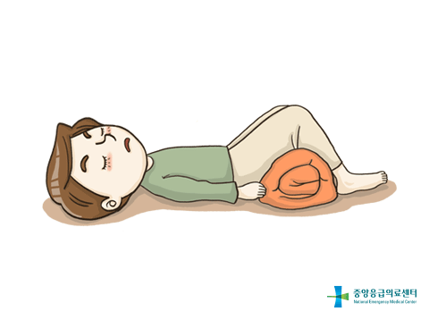
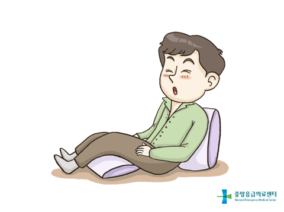
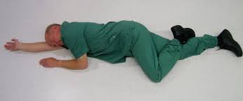

05 쇼크
===

# 1. 쇼크의 정의

**관류**란 체내 조직과 기관 안의 많은 세포에 피와 산소가 적절히 공급되는 것이다. 몸의 조직이 산소가 포함된 혈액을 충분히 받지 못했을 때 **쇼크**가 일어난다. 이것은 전기 충격(감전)이나, 깜짝 놀라거나 겁 먹은 것 같은 정신적 충격을 말하는 것이 아니다. 쇼크(관류 저하)는 혈액순환이 줄어들고 결국 멈춰 생긴 심혈관계 기능 이상의 상태를 뜻한다. 쇼크는 심장 발작부터 심각한 알레르기 반응까지 다양한 상황이 원인일 수 있다.

# 2. 쇼크의 원인

쇼크의 기본적인 생리적 원인을 알면 쇼크를 다룰 때 더 잘 대처할 수 있을 것이다.
쇼크로 인한 손상은 어느 신체 부위에 얼마나 오랫동안 산소가 공급되지 않았느냐에 따라 다르다. 예컨대 산소결핍 시 뇌는 4~6분, 복부 장기는 45~90분, 피부와 근육 세포는 3~6시간 이내 산소를 공급하지 않는다면 회복할 수 없어 손상된다.

## 2.1 관류 삼각형

쇼크를 이해하기 위해 순환계 세 가지 요소를 생각해야 한다.

1. 심장(펌프작용) : 심장이 적절한 펌프 기능을 하지 못하면 몸으로 피를 충분히 공급하는 관류 기능을 할 수 없다.
2. 혈관(그릇)     : 모든 혈관이 평소보다 팽창하면, 혈류량이 혈관을 충분히 채우지 못하고 적절한 관류 기능을 못하게 된다.
3. 혈액(내용)     : 혈액이나 혈장이 손실되면, 혈관 내 체액이 신체가 필요로 하는 관류를 하기에 모자르게 된다.

이 세 요소는 관류 삼각형이라고도 하며, 셋 중 하나라도 손상되면 조직 내 혈액이 손실돼 쇼크가 일어난다. 즉 쇼크의 원인은 심혈관이나 심혈관 외의 것일 수 있다. 심혈관 외적인 요소는

1. 불충분한 호흡
2. 신경성 쇼크(심인성 쇼크)
3. 과민증(이물질에 대한 심각한 알레르기 반응)등

## 2.2 쇼크의 심혈관적 원인

* 펌프작용 이상 : 심장 발작은 심장 기능 이상이나 펌프작용을 하지 못해 일어난다. 심장근육이 정상적으로 펌프작용을 지속해야 혈액이 순환한다. 많은 질병이 이 근육에 염증이나 파괴를 일으킨다. 심장은 이런 문제에 일부 적응하지만, 근육 손상이 너무 많다면 더 이상 제 기능을 할 수 없어 **심장발작**이 일어난다. 가장 중요한 영향은 폐에 혈액이 정체되는 것이다. 이렇게 폐에 체액이 쌓이면 **폐부종**이 된다.

* 혈액 이상 : 부상 시 쇼크는 체액이나 혈액 손실로 인해 자주 발생한다. 이런 쇼크의 유형은 **순환혈액량 감소성 쇼크** 혹은 출혈성 쇼크라고 한다. 혈액 손실은 체내나 체외 출혈 때문에 발생할 수 있다. 순환혈액량 감소성 쇼크는 심각한 열화상 시에도 생긴다. 이런 상황들의 공통적인 요소는 조직들에 충분한 관류를 제공하는 순환계내의 **혈액량 부족** 때문이다.

* 혈관 기능 손실 : 척추손상은 신경계에서 혈관 굵기와 근육 탄력을 조절하는 부분을 손상시킬 수
있다. 이 결과 신경성 쇼크가 일어난다. 혈관 내 근육은 수축하도록 하는 자극을 중단시키고, 혈관의 굵기와 수용량을 늘려 넓게 팽창(이완)한다. 그러면 체내의 피는 더 이상 확장된 혈관을 채우지 못하게 된다.

* 혈관과 혈액 기능 이상 혼합 : 심각한 독성 박테리아에 감염되면 패혈성 쇼크를 일으키기도 한다. 독소가 혈관 벽을 손상시키면 혈액이 새고 혈관이 수축을 잘 못하게 된다. 손상된 혈관 벽을 통해 손실된 혈장과 함께, 넓게 팽창된 혈관은 쇼크를 일으킨다. 패혈성 쇼크는 대개 심각한 질병, 부상, 수술 합병증이며, 과민증과 함께 일어나기도 한다.

## 2.3 쇼크의 비심혈관적 원인

* 호흡 부족 :  심각한 흉부 부상이나 기도폐쇄 시 환자는 숨을 충분히 쉬지 못한다. 혈액 내 산소량 부족은 심혈관 기능이 정상이더라도 쇼크를 일으킨다. 산소화 되지 않는 피의 순환은 환자에게 도움이 되지 못한다.

* 아나필락시스 쇼크(**과민성 쇼크**) :  아나필락시스 또는 과민성 쇼크는 민감성 물질에 면역계가 과민 반응할 때 일어난다. 심한 알레르기 반응은 대개 다음과 같은 것들에 노출될 때 발생한다. 과민성 반응은 환자가 알레르기를 일으키는 물체들과 접촉했을 때, 몇 분 혹은 몇 초 내에 일어날 수 있다. 이러한 알레르기 반응의 징후는 다른 쇼크 형태들과 구별된다. 과민성 쇼크의 징후와 증상은 다음을 참고하라. 과민성 쇼크 시 혈액이나 혈관 손상은 없고 약간의 심장근육 손상 가능성만 있더라도, 넓게 팽창된 혈관은 산소화와 조직 관류를 하지 못해 사망에 이를 수 있다.

    알레르기 반응

    - 약물(페니실린, 페니실린 유사약물, 아스피린, 설파제)
    - 음식(갑각류, 견과류 특히 땅콩, 계란)
    - 곤충에 물렸거나 쏘였을 때(꿀벌, 말벌, 불개미 등)

    과민성 쇼크의 징후와 증상

    - 피부 : 얼굴이나 가슴 상부의 홍조, 가려움, 화끈거림. 몸 전체로 넓게 두드러기가 퍼져나간다. 얼굴, 혀, 입술이 부어오른다.
    - 순환계 : 맥박이 약해지고 거의 느낄 수 없다. 현기증, 기절, 무반응이 나타난다.
    - 호흡계 : 재채기나 콧구멍 안이 가렵다. 마른 기침이 멎지않고 가슴이 뻐근하다. 호흡곤란이 온다.

> 면역계
>
> 생물이 질병으로부터 자신을 보호하기 위해 구축한 다양한 구조와 과정으로 이루어진, 자가 방어 능력을 가지는 기관 및 세포이다.

* 정신성 쇼크 : 정신성쇼크는 일시적인 혈관 팽창을 일으키는 갑작스런 신경계 반응으로, 기절이나 졸도를 야기한다. 팽창된 혈관 내 갇힌 피는 뇌로 가는 피를 줄이고, 사람은 의식을 잃게 된다. 기절의 원인(심장성 쇼크)은 불쾌한 것을 봤거나(대개 피) 두려움, 나쁜 소식 등이다.

# 3. 쇼크의 진행

쇼크 그 자체는 눈에 보이지 않더라도 쇼크의 징후와 증상은 진행된다. 초기 단계의 출혈성(혈액 손실) 쇼크는 신체가 아직 혈액 손실을 보충할 때로 **보상성 쇼크**라고도 한다. 이후 단계는 혈압이 떨어질 때로 **비보상성 쇼크**다. 비보상성 쇼크는 우리 몸 스스로가 이길 수 없고 의료적인 치료가 필요하다. 쇼크를 더 이상 손쓸 수 없을 때가 마지막 단계로 **비가역성 쇼크**라고 한다. 이 시점에서는 수혈하더라도 환자가 거의 살아날 확률이 없다.

> 비가역성 : 다시 거슬러 올라갈 수 없다.

# 4. 쇼크의 응급처치

모든 부상은 순환계에 일정 정도 영향을 주므로, 응급 처치자는 모든 부상 환자가 **쇼크 가능성이 있다고 자동적으로 생각**해야 한다. 쇼크는 부상 환자의 주요 사망 원인 중 하나다. 부상 환자가 쇼크 징후나 증상을 보이지 않더라도, 응급 처치자는 쇼크에 대한 처치를 해야 한다. 순서에 맞는 응급처치는 쇼크의 악화를 막을 수 있다.

## 4.1 일반적인 쇼크의 응급치료

1. 호흡을 관찰하고, 호흡이 미약할 때는 심폐소생술을 실시한다.
2. 모든 드러나는 외출혈을 지혈한다.
3. 환자의 등이 바닥에 닿게 눕힌다(바로 누운 자세). 심장마비나 폐 질병 환자는 무릎을 구부리고 앉는 자세가 호흡을 더 쉽게 해준다.

> 쇼크 환자에게 다리를 높게 위치시키는 것이 효과가 있을까?
>
> 다리를 높이는 것이 효과가 있다는 정확한 연구 결과는 아직 없다. 환자의 골반이나 머리 손상을 잘 알기 어렵기 때문에 환자의 다리를 올리면 큰 손상을 입힐 수 도 있다.

4. 골절이나 머리, 척추, 몸통 부상이 의심된다면 환자를 움직이면 안 된다. 옷의 목, 가슴, 허리를 느슨하게 끌러준다.
5. 뼈나 관절 부상에 부목을 대면 통증과 출혈을 줄일 수 있고, 추가적인 조직 손상도 방지한다.
6. 환자를 따뜻하게 해준다. 담요를 아래에 깔아주고 몸에도 덮어준다. 핫팩, 뜨거운 물병 같은 외부 열원은 사용하면 안 된다.
7. 환자를 부드럽게 다룬다.
8. 즉각적인 응급치료를 찾는다. 119에 신고하거나 구급차가 도착하지 않으면 환자를 승용차에 태워
병원으로 이송해야 할 것이다.

---
### 주의!!
쇼크 환자에게 다음과 같은 처치는 하면 안됩니다.

1. 호흡곤란, 흉부 부상, 눈 관통산, 심장발작 환자는 뒤로 눞히면 안된다.
2. 환자에게 일체 음료수나 음식을 주면 안된다. 메스꺼움이나 구토를 유발할 수 있으며 수술시 합병증을 유발할 수 있다.
3. 침대나 들것의 발을 들어올리면 안된다. 환자의 호흡에 영향을 줄 것이며, 뇌정맥 혈류가 방해를 받아 뇌 부종을 야기할 수 있다.
4. 머리손상, 뇌졸중, 흉부 부상, 호흡 곤란, 심장발작이 의심되는 환자의 다리를 올려서는 안 된다.
5. 외부 열원을 사용하면 안 된다. (핫팩, 뜨거운 물병 등)
---

## 4.2 과민성 쇼크의 응급처치

1. 즉시 119에 신고한다.
2. 호흡을 관찰하고 호흡이 미약하다면 심폐소생술을 시작한다.
3. 환자가 개인적으로 에피네프린을 처방받았다면, 사용할 수 있게 도와준다. 어떤 환자는 응급상황 시 에피네프린을 스스로 주입할 수 있는 에피네프린 자동주사기를 갖고 있을 것이다. 응급처치자가 직접 주사기를 사용해야 한다면 아래 절차를 따른다.

    1. 환자가 의사에게 처방받은 에피네프린을 받아, 환자의 것이 맞고 유효기간이 지나지 않았는지 확인한다.
    2. 에피네프린 자동주사기의 안전뚜껑을 제거한다.
    3. 환자의 다리가 움직이지 않게 붙잡는다.
    4.  허벅지 바깥쪽 중간쯤에 주사기의 끝을 찔러 넣도록 준비한다. 얇은 옷이면 위로 찌를 수 있다.
    5. 빠르고 확실하게 주사기를 허벅지에 찌르고, 10초간 그 상태로 가만히 있는다. 이 때, 환자에게 약물이 주입된다.
    6. 허벅지에서 주사기를 뽑는다. 한 손으로 사용한 주사기를 바늘이 안으로 가게 튜브 안에 넣고, 적절한 방식으로 폐기한다.

4. 환자가 베나드릴 등 안티히스타민제를 복용하도록 돕는다. 효과가 나타날 때까지 약 20분 정도 걸리므로 환자를 소생시키지는 않지만, 추가적인 반응을 예방할 수 있다.

## 4.3 기절 응급처치(심장성 쇼크)
많은 경우, 기절한 환자가 일단 쓰러져서 누우면, 뇌로 가는 혈액순환이 재개되고 반응성이 다시 돌아온다. 기절할 것 같다면 눕거나 앉는다. 기절하면 바닥에 쓰러지기 때문에, 어지럽다고 머리를 무릎 사이에 넣으면 안 된다. 또한 이 자세는 몸을 구부러지게 해 다리에서 심장으로 돌아가는 혈류를 막는다.

다른 사람이 기절했다면 아래와 같이 한다.
1. 호흡을 확인하고, 호흡이 미약하다면 심폐소생술을 시작하고 119를 부른다.
2. 환자를 편안한 자세나 등을 대고 바로 누운 자세를 취하게 한다. 머리나 척추 손상이 의심되지 않으면 다리를 15~30cm 정도 올려준다.
3. 가능한 머리나 척추 손상이 있는지 확인한다(특히 노인 환자의 경우). 환자가 쇠약감, 현기증, 통증이 없이 보행이 불가능하면, 머리 손상이나 다른 문제를 의심해야 한다. 119에 즉시 전화하고 가능한 척추손상을 응급 처치한다.
4. 환자가 쓰러진다면, 검사하고 다른 부상을 처치한다.
5. 환자가 신선한 공기를 마시도록 한다(예. 창문 열기). 주변 사람들을 떨어져 서게 한다.

> 쇼크가 발생한 환자를 언제 움직여야 할까?
> 
> 가능한 환자를 움직이지 말도록하며, 위험한 주변 환경에 처해 있다면 환자를 안전한 곳으로 옮겨야 한다. 만약 환자가 구토나, 체액으로 호흡이 어렵거나 환자를 잠시 남겨놓아야 할때에는 HAINES(High Arm In Endangered Spine) 회복자세를 취해준다. 

> 기절하거나 무반응인 환자에게, 냄새 자극제나 암모니아 흡입제 캡슐을 사용해야 하나?
>
> 사용해서는 안된다. 또한 환자의 의식을 확인하기 위해 물을 끼얹거나 뺨을 때려서도 안된다. 환자가 냄새 자극제로 인해 갑자기 머리를 흔든다면, 경추 부상을 입은 환자의 경우 악영향을 줄 수 있다.