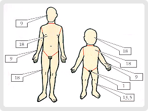

06 화상
===

# 목차

[1. 화상의 분류와 열화상](#1.-화상의-분류와-열화상)

[1.1 화상의 분류](#1.1-화상의-분류)

[1.2 열화상](#1.2-열화상)

[1.3 열화상의 응급처치](#1.3-열화상의-응급처치)

[1.3.1 1도 화상 응급처치](#1.3.1-1도-화상-응급처치)

[1.3.2 적은 부위(20% 이하) 2도 화상 응급처치](#1.3.2-적은-부위(20%-이하)-2도-화상-응급처치)

[1.3.3 넓은 부위(20% 이상) 2도 화상 응급처치](#1.3.3-넓은-부위(20%-이상)-2도-화상-응급처치)

[1.3.3 3도 화상 응급처치](#1.3.3-3도-화상-응급처치)

# 1. 화상의 분류와 열화상

## 1.1 화상의 분류

화상은 열화상(뜨거운 열), 화학화상(화학물질), 전기화상으로 분류할 수 있다.

* **열화상** : 열화상 모두가 불에 의한 것은 아니다. 뜨거운 물체, 가연성 기체의 폭발에 의한 불꽃, 증기, 뜨거운 액체와의 접촉으로도 흔히 일어난다.

* **화학화상** : 여러 가지 화학물질이 피부에 닿으면 조직을 손상시키고 생명을 위협할 수 있다. 열화상과 마찬가지로 화학약품에 의한 화상도 약품의 접촉 시간, 피부의 두께, 약품의 강도에 따라 조직의 손상 정도가 다르게 나타난다. 화학물질은 피부에서 제거될 때까지 계속하여 조직을 파괴하게 된다. 화상을 입히는 물질로는 산, 알칼리, 유기화합물 등이 대표적이다.

* **전기화상** : 감전 시 전류의 종류(직류 또는 교류), 전압, 신체 접촉 부위, 그리고 감전 시간 등에 의해 손상의 정도가 좌우된다.

## 1.2 열화상

열화상을 입으면 다음 단계에 따라 화상의 정도를 평가하고 응급처치를 해야한다.

1. **화상의 깊이(정도)를 확인**한다.  화상의 응급처치 방법을 결정하기 위해서는 화상 깊이를 평가하는 것이 중요하다. 그러나 경험이 많은 전문가들도 화상의 깊이를 파악하는 것은 어렵다.

    

    * 1도 화상(**표피 화상**)은 피부 바깥층(표피)에 화상을 입은 경우를 말한다. 피부는 빨갛게 되고 약간 부어오르며 압통(누르거나 만지면 통증이 있다)과 통증이 있는 것이 특징이다. 흉터 없이 대개 1주일 이내에 낫는다.

    * 2도 화상(**부분층 화상**)은 피부 바깥층(표피)이 완전히 손상되고 피부 속(진피)까지 손상을 입은 경우를 말한다. 물집, 부종, 진물, 심한 통증이 특징이다. 진피의 모세혈관이 손상되어 진물이 나온다. 터지지 않은 물집(수포)은 무균상태이며, 외부로부터 보호막 역할을 한다. 그러나 일단 물집이 터지면 상처에서 진물이 나고 감염의 위험성이 증가한다.

    * 3도 화상(**전층 화상**)은 모든 피부층은 물론 피하지방과 근육층까지 손상된 심한 화상을 말한다. 피부는 가죽처럼 보이거나 진주처럼 회색으로 보이고, 때로는 숯처럼 보인다. 모세혈관이 파괴되어 더 이상 체액이 통하지 않기 때문에 화상 부위는 건조하고, 진물이 나오지 않는다. 화상을 입은 피부는 완전히 죽어서 눌러보아도 피부색이 변하지 않는다. **3도 화상 환자는 통증을 느끼지 못한다.** 이는 신경세포가 완전히 파괴되었기 때문이다. 통증은 주변의 손상이 적은 피부에서 느끼게 된다. 3도 화상 환자는 죽은 세포를 제거하고 피부 이식 수술이 필요하므로 병원치료를 받아야 한다.

2. **화상의 넓이를 확인**한다.   화상의 면적을 확인할 때는‘**9의 법칙**’을 이용한다. 성인의 몸 전체를 100%로 하고 각각의 부분을 백분율로 나눈다. 성인은 머리 9%,앞가슴과 배 18%, 등과 허리 18%, 팔 각각 9%, 다리 각각 18%, 성기 1%이며, 소아와 영아는 머리 18%, 앞가슴과 배 18%, 등과 허리 18%, 팔 각각 9%, **다리 각각13.5%, 성기 1%** 이다 . 작은 화상이나 부분적인 화상은 환자의 손바닥을 1%로 측정한다. 성인과 소아는 다리와 성기에서 비율이 다르다.

    

3. **몸의 어느 부위가 화상을 입었는지 확인**한다.  **얼굴, 손, 발 및 성기의 화상은 몸의 화상보다 일반적으로 심각**하다. 손가락, 발가락, 팔, 다리, 목, 또는 가슴 부위를 둘러싼 화상은 상처가 수축하면서 호흡과 혈액순환을 방해하기 때문에 더 심각하며, 병원치료가 필요하다.

4. 외상과 동반된 화상이거나, 이전에 질병이 있던 화상 환자이거나, **55세 이상이나 5세 이하**는 같은 화상이라도 더 심각해질 수 있다.

5. **화상의 중증도를 결정**한다.  중증도의 결정은 화상환자의 응급처치 . 방법을 결정하는 데 도움이 된다. 대부분의 화상은 집에서 일어나기 때문에 화상이 부위가 작고, 병원치료가 필요하지 않다. 화상의 중증도 분류표를 참고한다.

    구분| 경미한 화상 |  중등도 화상 | 중화상 
    :---:|---|---|---
    성인| <= 50%  1도(얼굴,손,발,생식기 제외)   <= 15%  2도    <= 2%  3도(얼굴,손,발,생식기 제외)| >= 50% 1도   15~30% 2도   2~10% 3도(얼굴,손,발,생식기 제외) |>= 70% 1도   >= 30% 2도   >= 10% 3도
    유아/노인| <= 10% 2도 | 10~20% 2도 | >= 20% 2도   >= 2% 또는 손, 얼굴, 눈, 발, 생식기 3도 
    공통|||대부분의 흡입화상, 전기화상

## 1.3 열화상의 응급처치

다음 환자들은 특별한 치료가 필요하나 감염 예방과 상처 건조 방지, 통증 감소를 염두에 두고 응급 처치를 한다.

* 55세 이상과 5세 이하의 환자
* 호흡기계 화상을 입은 후 숨 쉬기 어려운 환자
    > 밀폐된 공간에서 뜨거운 화염이나 유독가스를 들이마신 경우 호흡기계 화상을 입을 수 있다.
* 다른 부위의 외상이 동반된 환자
* 전기 화상이 동반된 환자
* 손, 발, 얼굴 및 성기의 화상 환자
* 신체의 15% 이상의 2도 화상 환자
* 3도 화상 환자
* 질병을 갖고 있는 화상 환자

    > ### 주의!!
    >
    > * 피부에 들러붙은 옷을 제거하지 말아야 합니다. 피부에 들러붙은 옷을 제거할 때 피부가 함께 떨어질 수 있다.
    > * 화상 부위에 착요하고 있는 반지나 팔찌를 제거해야 한다. 부종이 생기면 반지나 팔찌를 제거하기 힘들 수 있다.

### 1.3.1 1도 화상 응급처치

1. 통증이 없을 때까지 **찬물이나 찬수건 등으로 통증을 감소**시키고 화상을 가라앉힌다. 보통 통증은 10분 내에 사라지지만, 45분 이상도 걸릴 수 있다. 찬물을 사용할 수 없을 때는 **찬 크림이나 찬용액 등을 사용**하여 피부의 온도를 낮추고 화상이 피부 속으로 더 이상 진행 되지 않도록 할 수 있다.

1. 통증과 염증을 경감시키기 위해 **이부푸로펜(스테로이드성 진통소염제)을 주고, 어린이에게는 아세타미노펜(해열, 진통제)을 준다.** 어른은 스테로이드를 써도 되나 소아는 쓰지 않는 것이 좋기 때문에 진통소염제를 가려서 써야 한다.

    > ### 주의!!
    > 
    > * 성인은 체표면적 20% 이상, 어린이는 10% 이상 냉각을 하면 안된다. 저체온증을 유발할 수 있다.
    > * 화상에 민간요법을 하면 안된다. 갈은 감자, 된장, 간장, 소주, 바셀린, 로션등과 같은 물질은 화상 부위의 열을 가두어 화상을 더 진행 시키며 감염의 우려가 있다.

1. 열을 식힌 후, 알로에 젤을 바르거나 보습제를 발라주면 피부의 수분을 유지하고, 가려움과 피부가 벗겨지는 것을 줄일 수 있다.

1. 화상을 입은 팔과 다리는 올려준다.

### 1.3.2 적은 부위(20% 이하) 2도 화상 응급처치

1. 1도 화상의 응급처치 1과 2의 순서를 따른다.

2. 화상이 식은 후에, **바시트라신(Bacitracin) 연고**를 얇게 바른다. 
    > 바시트라신 같은 국소 항생제 치료법은 상처를 소독하지는 못하지만, 인체가 방어기능으로 통제할 수 있는 수준으로 세균 수를 줄이고, 세균의 침입을 방지한다. 인체가 막아낼 수 있는 정도의 세균 수까지 바시트라신 연고가 감소시킬 수 있어 세균에 의한 감염을 막아낼 수 있다. 세균이 감염을 일으키는 데는 상당한 양의 세균이 필요한데(예: 건강한 사람의 경우 감염이 되려면 세균수가 10^7~10^9개가 되어야 감염이 되고, 그 미만인 경우에는 감염을 일으킬 수 없다), 물론 면역력이 떨어지는 사람(에이즈, 간경화, 장기이식이나 각종 질환으로 면역억제제나 스테로이드를 사용하는 사람)은 그보다 적은 수의 세균에도 쉽게 감염이 될 수 있다. 

3. 화상 부위를 마른 거즈나, 달라붙지 않는 멸균 드레싱 또는 깨끗한 천으로 덮는다.  화상 부위를 덮어주면, 노출된 신경 끝이 공기와 접촉되지 않아 통증을 줄일 수 있다. 화상에 드레싱을 하는 주 목적은 화상을 깨끗이 유지하고, 기화로 인한 수분의 손실을 방지하고, 통증을 줄이는 것이다. 발가락이나 손가락의 화상은 손가락과 발가락 사이에 마른 드레싱을 한다.

4. 메스꺼움이 생기지 않는 한 되도록 많은 물을 마시도록 한다.

### 1.3.3 넓은 부위(20% 이상) 2도 화상 응급처치

저체온에 빠지지 않는 한도 내에서 차가운 것으로 통증을 감소 시킨다.

1. 20% 이하의 2도 화상의 처치 순서 3과 4를 따른다.

2. 병원치료를 받게 한다.

### 1.3.3 3도 화상 응급처치

1. 마른 거즈나, 달라붙지 않는 멸균드레싱 또는 깨끗한 천으로 상처를 덮는다.

1. 다리를 올리고, 깨끗한 시트나 모포로 체온을 유지하여 쇼크에 대비한다.

1. 병원치료를 받게 한다.

# 2. 화학화상과 전기화상

## 2.1 화학화상

화학약품에 의한 화상은 부식성 물질이 피부에 닿아 일어난다. 화학물질이 피부에 닿으면‘ 화상’이 계속 진행되므로, 가능하면 빨리 화학물질을 제거해야 한다. 중화제를 사용하여 화학물질을 중화시키는 특별한 경우를 제외하고, 모든 화학물질에 의한 화상의 응급처치는 똑같다. 배수관 세척제와 같은 알칼리는 조직을 더 깊이 침투하고, 장시간 작용을 하기 때문에 건전지의 산보다 더 심한 화상을 일으킨다. 석유 화학제품과 같은 유기화합물 역시 화상을 입힐 수 있다.

> Tip. 알칼리는 단백질을 녹이는 성질이 있습니다.
> ### 주의!!
>
> * 고압의 물은 화학물질을 조직 깊숙이 침투 시킬 수 있다.
> * 중화제는 열을 발생시켜 조직을 심하게 손상시킨다.

## 2.2 화학 약품에 의한 화상의 응급처치

1. **흐르는 물**로 화상 부위를 씻어내어 즉시 화학약품을 제거한다. 가능하면 호스나 샤워기를 사용한다. **분말은 물로 씻어내기 전 충분히 털어낸다.** 물은 건조한 화학물질을 활성화시켜, 피부에 더 많은 손상을 준다. 화학물질에 자신이 노출되지 않도록 주의해야 한다.
2. 물로 씻어내면서 **화학약품이 묻은 의류/장신구 등을 제거**한다. 옷에 화학물질이 묻어 있다면, 피부에 닿아있는 한 계속해서 화상을 입을 수 있다.
3. 20분 이상 물로 씻는다(피부, 눈). 많은 양의 물로 씻으면 화학약품의 농도를 희석시키고, 완전히 씻어낼 수 있다.
4. 화상 부위를 마른 멸균드레싱으로 덮거나, 화상 부위가 넓다면 깨끗한 옷이나 천으로 덮는다.
5. 모든 화학화상은 즉시 병원치료를 받게 한다.

## 2.3 전기화상

## 2.4 전기에 의한 화상의 응급처치