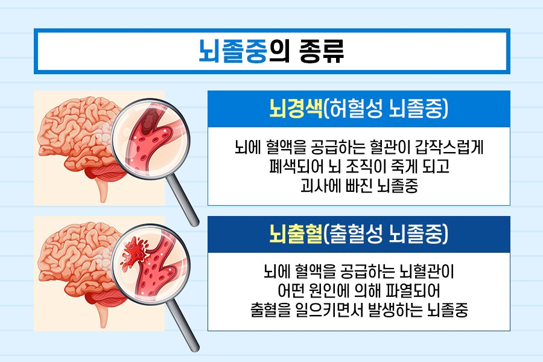
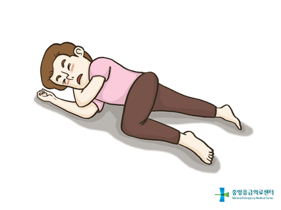

10 급성질환
===

# 1. 심장발작과 뇌졸

## 1.1 심장발작

심장발작은 **심장근육으로 가는 혈액 공급이 많이 줄어들었거나 정지되었을 때 일어납니다.** 심장근육으로 피를 공급하는 관상동맥이 혈전에 의해 막히거나, 경련이 유발되어 산소공급이 중단되면 심장박동이 멈출 수 있다.

환자는 심장발작이 발생했는지 판단하기가 매우 어렵다. 심장발작은 응급처치 여부에 따라 환자의 생존과 회복에 중요한 영향을 끼치기 때문에 심장발작이 의심되면 즉시 119를 호출하는 것이 중요하다.

### 징후와 증상

- 불쾌한 압박감, 꽉 찬 느낌, 조이는 느낌, 통증이 가슴 중앙에서 몇 분 이상 지속됨

- 등, 어깨, 목, 팔로 퍼지는 통증

- 현기증, 실신, 발한(식은 땀), 메스꺼움

- 숨이 차는 증상과 가슴의 불편감
  
심장발작이 발생할 때마다 이런 증상이 반드시 나타나는 것은 아니다. 일부 심장발작 환자들은 자신이 심장발작이 발생할 수 있다는 것을 애써 부정하려고 한다. 환자가 심장발작의 가능성을 부정한다고 해서 심장발작이 발생한 가능성을 간과해서는 안 된다. **그냥 무시하게 되면 돌이킬 수 없는 심각한 상태로 발전할 수 있다.**

---

### 응급처치

1. 119를 부르거나 24시간 응급심장 치료가 가능한 가장 가까운 병원으로 이송한다.

2. 환자의 **ABC(기도-호흡-순환)** 상태를 확인한다.

3. 통증을 줄일 수 있는 자세를 유지하도록 도와준다.

    

    목과 가슴을 조이는 옷은 풀어주고 주위를 조용하게 하여 환자를 안심시킨다.

4. 10분 이상 가슴 통증이 지속되면 환자가 씹고 삼킬 수 있고, 아스피린에 알레르기가 없다면 어른 아스리핀 한 알(375mg)이나 씹어먹는 소아용 아스피린(81mg) 두 알을 복용하도록 한다.

     **아스피린은 위장에서 소화가 될 수 있는 제품을 사용하여 빠른 시간안에 흡수 될 수 있도록 한다.**

5. 환자가 관상동맥질환이 있었는지, 니트로글리세린을 사용하고 있는지를 확인한다. 니트로클리세린 알약이나 분무제를 혀 아래에 뿌리거나, 니트로글리세린 연고를 피부에 발라주면 가슴통증을 줄일 수 있다.

    **니트로글리세린**은 **관상동맥을 확장**시켜 심장근육으로 가는 혈액의 흐름을 증가시키며 혈압을 낮추고, **정맥혈관을 확장**시켜 심장근육의 부담을 줄이고, 심장의 산소요구량을 줄인다.

6. 환자가 의식이 없다면, ABC(기도-호흡-순환) 평가를 실시하고 심폐소생술을 실시합니다.

## 1.2 협심증

협심증은 심장근육에 필요한 만큼의 혈액이 공급되지 못할 때 발생한다. 격한 신체운동, 추위에의 노출, 흥분, 과식 즉, **산소가 부족할 때 발생한다.**

협심증은 **심장발작과 증상이 비슷하지만 10분 이상 지속되지 않는다.** 니트로글리세린을 사용하면 대개 증상이 좋아진다. 

**심장발작으로 생긴 가슴통증은 활동 여부에 관계없이 나타나고, 10분 이상 지속되며, 니트로글리세린을 투여해도 사라지지 않는다.**

### 응급처치

1. 환자를 편안하게 해준다.
2. 환자가 니트로글리세린을 사용하고 있다면 사용할 수 있도록 도와준다.
3. 통증이 10분 이상 지속된다면 심장발작을 의심하고 즉시 119를 부른다.

## 1.3 뇌졸중(뇌중풍)

뇌졸중은 산소를 뇌로 운반하는 **동맥혈관이 터지거나(뇌출혈) 막혀서(뇌허혈), 뇌에 필요한 혈액이 공급되지 못할 때 발생**한다.

> 그렇다면 동맥혈관은 왜 터지는 것인가? 고혈압이 있거나 혈관의 선청성 기형이 있으면 뇌동맥이 늘어나는 경우가 있다. 이렇게 늘어나는 것을 혈관 꽈리라고 하며, 터질 가능성이 있다.

산소가 뇌에 공급되지 못하면 뇌의 신경세포는 제 기능을 하지 못하고 **몇 분** 안에 죽는다. **뇌 세포는 일단 죽으면 회복되지 않기 때문에 뇌졸중이 발생하면 뇌기능이 영구적으로 상실된다.**

### 일시적 뇌허혈과 뇌졸중

일시적 뇌허혈은 '**작은 뇌졸중**'이라고도 한다.

일시적 뇌허혈(TIAs, Transient Ischemic Attacks)의 증상은 뇌졸증과 여러 가지로 비슷해 잘 혼동합니다. 일시적 뇌허혈이 뇌졸중과 다른 점은 증상이 몇 분(75% 정도가 5분 이하)에서 몇 시간 동안만 계속되다가 신경기능이 정상으로 돌아온다는 점이다.

일시적 뇌허혈은 언젠가는 뇌졸중으로 이어질 심각한 징후로 봐야 합니다. 일시적 뇌허혈 환자의 1/3은 처음 증상이 나타나고, 2~5년 후 뇌졸중이 일어날 가능성이 높다.

### 뇌졸중 증상

- 힘이 없음, 무감각, 신체 한쪽(얼굴, 팔, 다리) 마비
- 시력 감퇴, 눈이 잘 안보임, 특히 한쪽 눈에 이상
- **언어 장애, 이해 능력의 저하**
- 어지러움, 뭄의 균형을 잘 잡지 못함
- 원인을 알 수 없는 심한 두통
- 눈이 한쪽으로 돌아가거나 양쪽 동공 크기가 차이가 남 : 뇌의 산소 부족

### 뇌졸중 검사

1. 눈을 감고 양팔을 앞으로 편다.
2. 한쪽 팔이 밑으로 쳐진다면 뇌졸중을 의심한다.

### 뇌졸중 응급처치

1. 환자가 반응이 없다면 A-B-C(기도-호흡-순환) 상태를 점검한다.
2. 119를 부른다.
3. 환자의 의식에 따라 다르게 처치한다.
   - 환자가 의식이 있다면 환자를 눕혀 머리와 어깨를 약간 올리면 뇌압이 떨어진다. 
   
   - 의식이 없고 호흡이 있다면 회복자세를 유지한 후 턱을 들어올려 왼쪽으로 눕힌다. (기도가 유지되어 구토물이 기도로 들어가지 않고 입밖으로 흘러나온다.)

    

### 주의 할점

- 뇌졸중 환자에게 마실 것이나 먹을 것을 주지 않는다.
- 환자는 목구멍이 마비되어 삼키지 못한다.

### 참고

- LA 뇌졸중 선별검사(LASS) : 뇌졸중 환자를 빠르게 확인하기 위해 증명된 방법을 사용하는데, 응급처치자도 사용할 수 있다.

    1. 양쪽 팔의 강도
        눈을 감고, 손바닥을 아래로 하고 양 팔을 뻗으면서 천천히 5까지 세어본다. 만약 한쪽 팔이 아래로 쳐지면 뇌졸증을 의심한다.

    2. 미소짓기
        환자가 웃으며 이를 보인다. 만약 한쪽 얼굴이 움직이지 않는다면 뇌졸중이다.

    3. 손잡기
        환자에게 응급구조사의 손가락 두 개를 동시에 잡도록 한다. 힘의 강도가 다르면, 뇌졸중을 의심한다.

# 2. 호흡 응급, 실신, 발작

## 2.1 천식

천식은 특정한 자극원(꽃가루, 담배, 연기, 찬 공기, 운동, 자극적인 냄새, 대기오염 등)에 노출시 발생한다. **기도에 부종이 유발되고, 점액 분비가 증가되어 원할한 공기 흐름을 막아 호흡곤란이 유발되는 질환이다.**

천식의 원인은 선천적인이거나, 과민한 면역반응 때문이다.

### 증상

- 기침
- **청색증(푸른색 피부)**
- 숨이 차서 말을 끝까지 못하고 중간에 하던 말을 멈춤
- 숨 쉴 때마다 콧구멍이 벌름거림
- **특징적인 숨소리**(휘파람 소리같은 높은 소리)를 포함한 호흡곤란

### 응급처치

1. 환자가 편안하게 숨 쉴 수 있또록 앉은 자세를 유지시켜 준다.
2. A-B-C(기도-호흡-순환) 상태를 확인한다.
3. 사용하고 있는 천식약이 있는지 물어본다. 대부분의 천식 환자는 분무식 천식약을 소지하고 있다.
4. 환자가 앉아 있는 상태에서 천식약을 들이쉰디, 약이 흡수될 때 까지 숨을 참는다.
5. 환자가 분무식 천식약으로도 상태가 나아지지 않거나 호흡곤란이 심해지면 즉시 119를 부른다.

## 2.2 과호흡

과호흡은 정신적인 스트레스나 불안으로 인해 빠르고 깊은 호흡을 하는 일시적인 증상이다.

정상적인 호흡보다 빠르게 호흡하게 되면 이산화탄소가 많이 배출이 됩니다. 이 이산화탄소는 몸속에서 탄산으로 변하고 이 탄산은 산이다. 산이 많이 빠져나가면 우리 몸은 알칼리로 변한다. 이때 피를 알칼리 혈증이라 한다.

### 증상

- 현기증, 어지러움
- 무감각
- 손발 저림
- 가쁜 숨(호흡곤란)
- 분당 40회 이상의 빠른 호흡수

### 응급처치

1. 환자를 편안하게 해주고 안심시킨다.
2. 배의 근육을 이용해 천천히 숨을 쉬도록 해준다. 코로 숨을 몇 초간 완전히 들이쉬게 했다가 입을 오므려 천천히 내쉬게 한다. 이 때, 종이 봉지 안으로 숨을 내쉬도록 하지 않는다.

    > 이산화탄소가 부족할 때는 종이 봉지로 호흡하는 것도 좋은 방법이지만, 환자의 정확한 상태를 알지 못할 때는 종이 봉지로 호흡하지 않도록 한다.

## 2.3 실신(기절)

실신은 대개 뇌로 향하는 혈류량의 감소로 인해 발생한다.

### 혈류량의 감소 원인

- 저혈당
- 느린 심장박동 : 부교감 신경(미주 신경)이 공포, 불안, 약물, 과로 등으로 지나치게 자극을 받을 때 나타남
- 부정맥(불규칙한 심장박동)
- 탈수
- 일사병
- 빈혈
- 출혈

특히 무더운 환경에서 움직이지 않고 오랫동안 앉아 있거나 서 있게 되면 혈관이 확장되어 혈액이 고일 수 있다. 그러면 정상적인 순환 혈액량을 잃게 되어 혈압이 떨어지고, 뇌로 가는 혈류가 감소하여 의식을 잃고 쓰러진다.

### 증상

- 갑자기 발생한 무의식
- 창백한 피부
- 발한(축축한 피부)

### 응급처치

1. A-B-C(기도-호흡-순환) 상태를 확인한다.
2. 환자의 다리를 15~30cm 정도 올려준다.
3. 꽉 끼는 옷과 허리띠는 느슨하게 풀어준다.
4. 환자가 쓰러질 때 다른 손상을 입지 않았는지 확인한다.
5. 환자가 의식이 회복되면 잠시 동안 앉아 있도록 하고 삼킬 수 있다면 당분이 있는 시원한 음료를 마시게 하고, 자세를 천천히 똑바로 하도록 도와준다.
6. 맑은 공기를 마시게하고 얼굴에 찬 물건을 대주면 회복에 도움이 된다.

대부분의 실신은 위험하지 않고 곧바로 회복된다. 그러나 다음과 같은 경우에는 병원치료를 받는다.

- 반복해서 의식 상실이 생길 때
- 의식이 빨리 돌아오지 않을 때
- 앉거나 누워 있을 때 발생한 의식상실
- 원인을 알 수 없는 실신

### 주의할 점

- 환자의 얼굴에 물을 뿌리거나 붓지 않는다.
- 냄새자극제나 암모니아 흡입제 등의 자극제를 사용하지 않는다.
- 환자의 얼굴을 때리지 않는다.
- 환자가 완전히 회복되기 전까지는 마실것을 주지 않는다.

## 2.4 발작(경련)

발작은 **뇌세포가 비정상적으로 자극을 받아 나타나는 현상**이다. 여러 가지 질병은 뇌의 불안정을 증가시키거나 자극을 증가시켜 경련을 일으킬 수 있다.

- 간질 : 정신질환이나 저지능의 징후가 아니며, 전염성도 없다. 경련이 없을 때는 간질 환자도 정상적인 생활을 한다.
- 열사병
- 중독
- 전기 감전
- 저혈당
- 어린이의 고열
- 뇌손상, 뇌종양, 뇌졸중
- 알코올 금단 증상, 약의 남용과 과용

### 증상

- 갑작스러운 낙상
- 무의식
- 몸의 강직과 활처럼 뒤로 휘어지는 등
- 갑작스러운 근육 경련

### 응급처치

1. 머리에 방석, 타월, 상의 들을 대준다. 부딪혀 다칠 수 있는 것들을 치운다.
2. 목에 꽉 끼는 옷, 특히 목 주위를 느슨하게 한다.
3. 왼쪽으로 눕힌다.
4. 간질경련이 끝나면 도와준다. 대부분의 간질환자의 경련은 응급상황이 아니며 아무런 해가 없이 1~2분 후에 끝난다.

5. 다음과 같은 경우에는 119를 부른다.

    - 간질이 없는 사람이 경련이 일어날 때
    - 경련이 5분 이상 지속될 때
    - 회복이 더디거나, 다시 경련이 일어나거나, 경련 후에 호흡곤란이 있을 때
    - 임신이나 다른 질병이 있을 때
    - 부상이나 질병의 증상이 있을 때

### 주의할 점

- 먹거나 마실 것을 주지 않는다.
- 환자의 치아 사이에 아무것도 넣지 않는다.
- 경련을 억지로 막지 않는다.
- 환자의 얼굴에 물을 붓거나 뿌리지 않는다.
- 추가적인 위험이 없는 한, 환자를 함부로 옮기지 않는다.

# 3. 당뇨 응급, 임신 응급

## 3.1 당뇨병

당뇨병은 인슐린이 부족하거나 역할을 하지 못해 오줌을 통해 당분이 빠져나가는 병이다.

사람은 음식을 먹고, 발생하는 에너지를 이용하여 활동을 한다. 이 때, 췌장에서 분비되는 호르몬인 인슐린은 포도당을 에너지로 이용한다. 인슐린은 포도당을 세포로 운반하고, 세포는 고혈당(인슐린 부족)시 지방을 연료로 사용한다.

인체의 주 연료 역할을 하는 포도당이, 세포로 가지 않으면 세포는 포도당을 사용하지 못하게 되고, 혈액에 그대로 남아 있는당은 소변으로 빠져나가게 된다. 결국은 포도당이라는 주 연료를 사용하지 못하고 버리게 되는 것이다.

### 당뇨병의 유형

- 제 1형 : 아동기에 발병하는 **인슐린 의존형 당뇨병**. 외부에서 인슐린을 투여하여 혈액 속에 있는 당을 세포로 운반한다.

- 제 2형 : 성인기에 발병하는 **인슐린 비의존혀 당뇨병**. 제 2형은 비만에 원인이 있고, 외부에서 인슐린을 투여할 필요가 없다. 그러나 체내 인슐린이 부족해지면 세포 내의 당 부족으로 당 샌상이 증가해서 혈당수치가 높아진다. 그렇게 되면 포도당이 소변으로 나오게 되고 수분도 배출되므로 탈수증이 일어난다.

인체는 끊임없이 당과 인슐린 사이의 균형을 유지하고 있다. 만약 인슐린이 너무 많고 당이 충분하지 않으면, 저혈당증을 일으켜 인슐린 쇼크가 일어날 것이다. 혈당이 많고 인슐린이 적으면 고혈당증을 일으켜 당뇨성 혼수가 발생할 것이다.

## 3.2 저혈당

저혈당은 혈액에 당이 부족한 것을 말하며, '**인슐린 반응**'이라고도 한다. 저혈당으 인슐린 과다, 너무 적은 식사, 늦은 식사, 과도한 운동, 술 또는 이러한 것들이 복합적으로 작용하여 일어날 수 있다.

### 증상

- 갑작스런 발병 : 저혈당은 고혈당과 다르게 갑자기 나타납니다.
- 조정능력 저하, 비틀거리는 걸음
- 분노, 거친 태도
- 창백한 피부
- 의식 혼미, 지남력 장애
- 갑작스런 배고픔
- 심한 발한
- 떨림
- 의식 상실

### 응급처치

당뇨 진단을 받은 적이 있으며, 의식상태가 변하고, 삼킬 수 있을 정도로 의식이 있는 사람에게는 '**15의 법칙**'을 사용하여 당을 공급한다.

1. 15g의 당을 섭취한다.
2. 15분간 기다린다.
3. 증상이 좋아지지 않으면, 15g의 당을 더 준다.
4. 증상이 좋아지지 않으면, 즉시 병원치료를 받게 한다.

## 3.3 고혈당

고혈당은 혈중에 너무 많은 당이 있을 때 일어난다. 고혈당은 인슐린 부족, 과식, 운동 부족, 질병, 스트레스 또는 이러한 것들이 복합적으로 작용하여 일어날 수 있다.

### 증상

- 서서히 발병
- 말을 시킬 때만 말을 함(졸린 것처럼 보임)
- 심한 갈증
- 잦은 소변
- 얼굴이 붉어짐
- 구토
- 숨 쉴 때 과일 냄새가 남
- 심호흡
- 의식 상실

### 응급처치

1. 환자가 고혈당인지 저혈당인지 잘 모를 때는 당이 들어 있는음식이나 음료를 준다.
2. 15분 내에 좋아지지 않으면 병원치료를 받게 한다.

## 3.4 임신 응급상황

대부분의 임신은 정상이며 합병증은 거의 없다. 그러나 때로는 문제가 생겨서 병원 치료를 필요로 할 때가 있다.

### 증상

임신부에서 다음과 같은 증상이 있을 떄는 즉시 의사에게 연락해야 한다.

- 질 출혈
- 하복부의 통중
- 얼굴, 손가락의 부종
- 지속적인 심한 두통
- 현기증, 실신
- 시력 저하, 점들이 눈에 보임
- 심한 구토

### 응급처치

임신부가 질 출혈이나 복통이 있다면 다음과 같이 한다.

1. 안심시키고 따뜻하게 해준다.
2. 환자나 다른 여성에게 생리대나 깨끗한 패드를 질 입구에 대도록한다.
3. 환자나 다른 여성에게 피에 젖은 생리대나 사용한 휴지를 모두 버리지 말고 의사에게 보여주도록 한다.
4. 즉시 병원치료를 받게한다.
