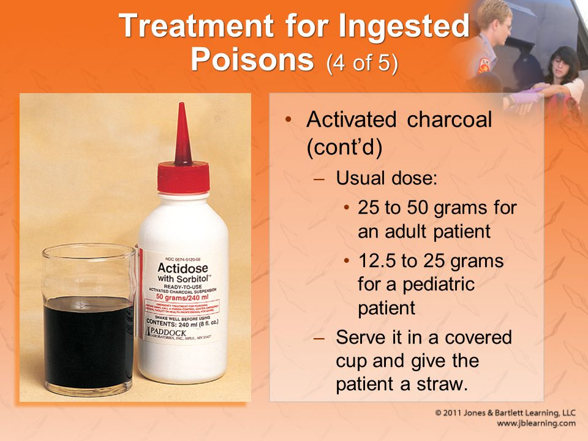

11 중독과 동물이나 곤충에 물린 상처
===

# 1. 중독

## 1.1 독

독은 몸에 들어가거나 피부에 닿을 때 화학 반응을 일으켜 **건강을 해치거나 죽음을 야기하는 어떤 물질을 말한다.**

### 원인

- 약물
- 뱀의 독
- 화학 약품
- 곤충 등

## 1.2 섭취 중독

섭취중독은 피해자가 유해 물질을 삼킬 때 생긴다. 다행히도 대부분의 유독성 물질은 독성이 약하거나, 그 양이 아주 적어 중독을 일으키는 경우가 아주 드물다. 그러나 심한 중독이나 치명적 중독의 가능성은 항상 있다.

### 증상

- 복통, 복부 경련
- 메스꺼움, 구토
- 설사
- 입 안이나 입 주위의 화상, 냄새, 얼룩
- 졸음이나 의식상실
- 주변의 독극물 용기

### 응급처치

1. 환자의 필요한 정보를 확인한다.

    - 환자의 나이와 무게
    - 삼킨 내용물(용기의 라벨, 분석을 위한 구토물 수거)
    - 먹은 양
    - 삼킨 시간

2. 산이나 알칼리와 같은 부식성 물질을 삼킨 경우, 적어도 1~2컵의 물이나 우유를 머여 독극물을 즉시 희석시킨다.

    - 왼쪽으로 눞힌다.
    - 독극물을 먹은 환자의 자세를 환자의 왼쪽 방향으로 눞이면 독극물이 소장으로 흡수되는 것을 지연시킬 수 있다.

3. 의식이 있는 중독 환자는 즉시 119에 연락한다.

    독극물은 종류에 따라 몇 시간이 지나도 해가 없는 독극물의 있는 반면에 섭취후에 빠르게 흡수되는 것도 있다.

    미국의 통계에 따르면 중독의 70% 이상이 중독관리센터와 통화해서 지시를 따르는 것만으로도 치료가 가능하다고 한다.

4. 환자가 의식이 없을 때 A-B-C(기도-호흡-순환)을 확인하고, 그에 따라 응급처치를 한다. 119를 부르고 기도-호흡-순환을 자주 확인한다.

5. 환자를 왼쪽으로 눞히면 소장과 연결되는 위의 끝부분(유문)이 똑바로 서게 된다. 이렇게 하면 중력의 영향으로 위 안의 독극물이 소장으로 가는 시간을(최대 2시간) 늦출 수 있다. 눞힐 때는 무릅을 구부려서 뒤로 넘어가지 않게 한다.

6. 119 상황실이나 중독관리센터의 지시에 따라 활성탄을 섭취하도록 한다.
   
   활성탄은 독극물을 먹었을 때 사용하는 가장 효과적인 물질이다. 활성탄은 위장관 내에서 독극물을 흡착하는 스펀지 같은 역할을 하여 독극물이 혈액으로 흡수되는 것을 막는다.

   > 빵부스러기나 석탄재를 대신 사용하지 않도록 한다!!

    

    활성탄이 모든 종류의 독극물을 다 흡착할 수는 없다. **표백제나 암모니아 같은 산과 알칼리, 칼륨 철, 알콜올, 메탄올, 등유, 청산가리, 살충제, 황산철 등은 잘 흡착되지 않는다.**

    활선탄의 가장 큰 단점은 색이 검고 맛이 없다는 것이다. 먹기 좋게 맛을 내기 위해 초콜릿, 과즙 음료, 아이스크림, 우유과 같이 섭취하면 활성탄이 섭취한 음료를 흡착하여 흡착 능력이 떨어진다.

    활성탄은 저렴하고 안전하며 독성의 흡수를 감소시키는 데 탁월한 효과가 있다.

7. 독극물 용기, 독성 식물, 환자의 구토물은 보관하여 병원에 가져가도록 한다. 독극물의 성분을 분석하여 신속하고 적절한 치료를 할 수 있도록 하기 위해서이다.

## 1.3 알코올과 기타 약물 중독

중독 환자를 도우려고 할 때 환자가 공격적인 자세를 취하거나 위생상태가 좋지 않아 종종 어려움을 겪을 때가 있다. 그렇지만 알코올 중독자를 ‘술꾼’이라고 낙인찍지 말고 도와주어야 한다. 상태가 아주 심각하여 생명을 잃을 수도 있기 때문이다.

### 증상

- 숨 쉴 때와 옷에서 나는 술 냄새
- 비틀거리는 불안한 걸음걸이
- 느린 말투와 의사소통의 장애
- 메스꺼움과 구토
- 붉어진 얼굴

### 응급처치

1. 상처가 있는지 살핀다(알코올은 통증을 느끼지 못하게 한다).
2. 기-호-순을 확인하여 필요하면 응급처치를 한다.
3. 환자가 쓰러져 있으면, 회복자세로 눕힌다(환자를 왼쪽으로 눕히면 구토의 가능성을 줄이고, 구토물이 기도로 들어가 흡인되는 것을 막고, 알코올의 흡수를 늦춘다).
4. 119를 부른다.
5. 환자가 공격적인 행동을 하면 안전한 곳에서 경찰이 도착할 때까지 기다린다.
6. 환자가 추위에 노출되어 있다면 저체온증을 의심하고, 가능하면 따뜻한 장소로 옮긴다(젖은 옷은 벗기고 따뜻한 담요로 덮어준다. 

>저체온증 환자는 조심해서 다룬다. 거칠게 다루면 심장마비를 일으킬 수 있다).

### 약물 중독시 증상

- 기면 상태, 불안, 동요
- 비정상적인 동공의 반응과 크기 변화
- 혼란
- 환각

### 약물 중독시 응급처치

1. 상처가 있는지 살핀다(알코올은 통증을 느끼지 못하게 한다).
2. 기-호-순을 확인하여 필요하면 응급처치를 한다.
3. 환자가 쓰러져 있으면, 회복자세로 눕힌다(환자를 왼쪽으로 눕히면 구토의 가능성을 줄이고, 구토물이 기도로 들어가 흡인되는 것을 막고, 알코올의 흡수를 늦출 수 있다).
4. 119를 부른다.
5. 환자가 공격적인 행동을 하면 안전한 곳에서 경찰이 도착할 때까지 기다린다.
6. 환자가 추위에 노출되어 있다면, 저체온증을 의심하고, 가능하면 따뜻한 장소로 옮긴다(젖은 옷은 벗기고 따뜻한 담요로 덮어준다. 저체온증 환자는 조심해서 다룬다. 거칠게 다루면 심장마비를 일으킬 수 있다).

## 1.4 일산화탄소 중독

일산화탄소 중독 환자는 일산화탄소를 인식하지 못하고 있는 경우가 종종 있다.
일산화탄소는 무색, 무미, 무취, 무자극의 기체이다. 일산화탄소는 휘발유, 나무, 종이, 목탄, 석탄, 천연가스와 같은 유기물이 불완전 연소될 때 발생한다.

### 증상

일산화탄소에 중독이 되었는지 확인하는 것은 쉽지 않다. 일산화탄소 중독이 의심되는 경우는 다음과 같다.

- 증상이 있다가 없어지기도 한다.
- 하루 중 특정한 장소에서, 특정한 시간에 증상이 악화되거나 좋아진다.
- 증상이 독감과 비슷해서 혼동된다.
- 주위의 사람들도 비슷한 증상을 보인다.
- 애완동물도 아픈 것처럼 보인다. 

일산화탄소 중독의 증상은 다음과 같다.

- 두통
- 이명(귀 울림)
- 가슴 통증(협심증)
- 근육의 힘이 없음
- 메스꺼움과 구토
- 현기증, 시력의 변화(흐려지거나 두 개로 보임)
- 무의식
- 호흡정지 및 심장정지

### 응급처치

1. 환자를 즉시 옮겨 신선한 공기를 마시게 한다.
2. 119를 부른다(구급차의 산소는 환자에게 100%의 산소로 공급되어 혈액의 산소농도를 높여준다).
3. 기-호-순을 수시로 확인한다.
4. 환자가 의식이 없다면 회복자세를 취해준다(옆으로 눕힌다).
5. 병원치료를 받게 한다(일산화탄소 중독이 의심된다면 혈액 검사로 일산화탄소의 농도를 측정해야 한다).

## 1.5 식물 중독(식물에 의한 피부염)

사람들 대부분은 독성식물이 어떤 것인지 잘 모른다. 독성식물을 구별하는 쉬운 방법으로 ‘검은 점 검사법’이 있다. 독성식물의 수액은 공기에 노출되면 몇 분 이내에 갈색으로 변하고 다음 날에는 검게 된다.

### 증상

알레르기 반응이 접촉 후에 6시간 내에 나타날 수도 있으나 보통 노출 후 24~72시간 내에 나타난다.

※ 식물 중독의 징후
- 뾰루지(발진)
- 가려움증
- 적색의 피부(발진)
- 물집
- 부종(부기)

### 응급처치

1. 독성식물에 노출되었다면 즉시 노출된 피부를 깨끗이 닦는다(민감한 사람은 5분 이내에, 일반적으로 1시간 이내에 오염을 제거해야 한다). 독성식물과 접촉 후 가려움이나 발진(붉은 점)의 증세가 있으면 비누와 찬물로 씻어내고, 충분한 양의 이소프로필 알코올로 닦아낸다(탈지면에 알코올을 묻혀 닦아내지 않는다). 이소프로필 알코올을 너무 적게 사용하면 오히려 피부에 더 번지게 된다. 페인트희석제(휘발유) 같은 솔벤트(용매)를 사용할 수도 있지만 피부에 자극을 더 주게 된다. 따라서 피부에 묻은 용매는 반드시 물로 헹궈야 한다. 물은 나무진을 제거하고, 산화시켜 불활성화를 시키고, 용매처럼 피부에 침투하지 않는다. 불행히도 대부분의 사람들은 몇 시간에서 며칠 후까지 접촉 사실을 모르고 지낸다. 가려움과 발적이 시작될 때 위에 설명한 절차를 따르기에는 너무 늦는다.

2. 증상이 대체로 가벼우면, 1~2컵의 교질 오트밀(예 : 아비노)을 섞은 미지근한 물에 목욕하거나 다음 방법 중에서 하나를 선택한다. 칼라민 로션(피부가 건조하고 갈라진 경우)이나 아연화 연고를 바른다. 베이킹소다 반죽 : 물 1찻숟가락에 베이킹소다 3찻숟가락을 반죽하여 바른다.
3. 경증에서 중증도 반응이면, 가벼운 증상처럼 치료와 부신피질 호르몬제 연고를 처방받아 바른다. 가려움을 줄여주기 위해 베나드릴 같은 경구용 항히스타민제가 처방된 크림과 함께 종종 사용된다.

4. 피부반응이 심할 때, 앞에서 언급한 방법과 같이 피부를 치료하고, 의사의 처방에 따라 경구용 부신피질 호르몬을 복용한다. 피부용 부신피질 호르몬 연고나 크림을 바른다.

---

# 2. 동물이나 곤충에 물린 상처

## 2.1 동물이나 사람에게 물린 상처(동물 교상)

우리나라의 경우 매년 많은 사람이 동물이나 사람에 물려 병원치료를 받는 것으로 추정된다. 여기에서 언급하는 동물 교상은 포유류에 의한 교상이지 곤충이나 파충류를 말하는 것이 아니다. 개는 모든 동물 교상의 80%를 차지한다. 동물 교상은 공중위생 문제로 크게 인식되지 않고 있다.

### 관견병

광견병은 온혈동물에서 발견되는 바이러스가 원인이다. 이 병은 한 동물에서 다른 동물의 침으로 전파되는데, 주로 개가 물거나 핥아서 일어난다.

### 광견병의 증상

다음과 같은 경우 광견병을 의심해야 한다.

- 건들지도 않았는데 동물이 공격적일 때
- 즉 본래 성질과 다르게 이상한 행동을 할 때(순하던 개가 공격적일 때)
- 위험군에 속하는 동물(너구리, 들고양이, 박쥐)일 때

### 동물에 물렸을 때 증상

동물에 물렸을 때는 다음과 같은 증상을 보인다.
- 동물의 예리하고, 날카로운 이빨에 천공된 상처
- 뭉그러진 피부
- 손가락과 손가락 마디, 손의 개방상처
- 환자를 물었을 만한 동물이 주위에 있을 수 있다.

### 응급처치

1. 집에서 기르는 건강한 개나 고양이에 물리면 일단 가둬두고 10일 동안 광견병 증상이 나타나는지 관찰한다. 필요하다면 정밀 검사를 위해 동물병원으로 보낸다. 집에서 키우는 동물이든 야생동물이든, 동물이 죽었다면 통째로 보내야 한다. 머리를 잘라서는 안 된다(감염의 가능성이 있는 조직과 타액에 노출되지 않도록 주의한다).경찰서나 소방서, 동물보호시설에 동물 교상을 보고한다. 이들은 관찰을 하기 위해 동물을 포획할 것이다. 개나 고양이가 탈출을 했고, 광견병에 걸린 것 같지 않아도 보건기관과 상의한다. 개 이외에도 고양이, 너구리, 박쥐, 여우 등과 같은 포유류는 광견병의 보균체가 될 수 있다. 이러한 동물에게 물려 상처가 나면 일단 광견병에 노출되었다고 보고 즉시 필요한 조치를 받아야 한다. 야생동물이 포획되면, 죽여서 머리를 검사기관(가축위생시험기관의 자격이 있는 실험실)으로 보내야 한다. 최종 확진은 국립수의과학검역원에서 하게 된다.
   
2. 상처에 출혈이 많지 않다면 비누와 물로 상처를 깨끗이 씻되, 조직에 손상을 줄 수도 있기 때문에 상처를 문지르지 않는다.
3. 압력이 센 흐르는 물로 상처를 철저히 세척한다.
4. 직접 압박하여 지혈한다.
5. 상처를 멸균드레싱으로 덮고 나비밴드나 테이프로 밀폐하지 않는다. 상처를 밀폐하면 박테리아가 상처에 증식여 감염을 일으킬 수 있기 때문이다.
6. 추가로 상처 세척을 하고 파상풍 예방주사가 필요할 수 있으므로 병원치료를 받게 한다. 의사는 상처를 봉합할 것인지를 결정할 것이다. 필요하다면 광견병 예방접종을 할 것이다.

### 사람에게 물린 상처

사람의 입 안에는 아주 많은 종류의 세균이 있기 때문에 다른 동물에 물린 것보다 감염 우려가 크다.

### 응급처치

1. 상처에 출혈이 많지 않다면 비누와 물로 상처를 깨끗이 씻되, 조직에 손상을 주기 때문에 상처를 문지르지 않는다.
2. 수압을 어느 정도 높여 흐르는 물로 상처를 철저히 세척한다.
3. 직접 압박하여 지혈한다.
4.  상처 부위는 멸균드레싱을 한다.
5. 추가로 있을 상처의 세척과 파상풍 예방주사의 필요성이 있을 수 있으므로 병원으로 이송한다. 의료진은 상처를 봉합할 것인지를 결정할 것이다.

## 2.2 뱀에 물린 상처 

우리나라의 뱀 가운데 독사는 살모사 계통의 세 종류밖에 없는 것으로 알려져 있다. 살모사, 까치독사, 불독사로 외국의 독사보다는 그 독성이 강하지 않기 때문에 치료만 적절히 받으면 대개 생명에는 지장이 없다. 지역마다 각각의 뱀을 부르는 명칭이 달라 혼동하기가 쉽다.

1. 독사에 물린 상처

### 증상

- 화끈거리는 통증
- 1cm 정도 간격의 물린 상처(하나만 있을 수도 있음)가 2개 있다.
- 5분 이내에 물린 부위와 팔다리에 생기는 부종
- 변색, 피가 차 있는 수포(물린 지 6~10시간 만에 발생)가 생긴다.
- 심하면 메스꺼움, 구토, 발한, 허약감

### 응급처치

어떤 독사에 물렸는가는 별로 중요하지 않다. 항독소혈청을 사용하면 되기 때문이다. 항독소혈청은 모든 독사의 해독에다 사용되도록 제조되어 있다. 최근 살모사 항독소혈청이 일본에서 개발되어 나와 있다. 이 항독소 혈청을 사용하려면 살모사에게 물렸는지 확인해야 한다. 야생동물협회는 독사에 물렸을 때 다음과 같은 조치를 취하도록 지침을 만들었다.

1. 뱀은 한 번만 무는 것이 아니기 때문에 환자와 주위 사람들을 뱀으로부터 멀리 떨어져 있도록 한다. 독사는 자기 몸 길이 정도의 거리나 높이는 단번에 공격할 수 있다. 뱀의 머리가 잘려도 20분 이상은 움직일 수 있으므로 뱀의 머리가 잘린 경우라도 조심해야 한다.

2. 뱀을 잡거나 죽이려고 하지 않는다. 아까운 시간을 낭비하는 것이고 추가로 물릴 가능성이 있다. 항독소 혈청은 모든 독사에 공통으로 사용하기 때문에 뱀을 굳이 확인할 필요는 없다.

3. 환자를 진정시킨다. 가능하면 환자를 운반하거나 아주 천천히 걷도록 부축해준다.
4. 물린 부위는 비누와 물로 부드럽게 씻어준다. 반지나 보석 장신구는 부종이 생기면 혈액순환을 방해하기 때문에 제거해야 한다. 
5. 물린 팔이나 다리는 골절을 입었을 때처럼 팔걸이나 부목으로 고정한다. 부종이 생길지라도 팔다리는 심장 높이보다 낮춘다.
6. 즉시 병원치료를 받게 하는 것이 환자에게 가장 중요한 일이다. 항독사혈청은 물린지 4시간 이내에 투여되어야 한다(모든 독사에 항독사혈청이 필요하지는 않는다).

2. 독이 없는 뱀에 물린 상처

독이 없는 뱀에 물리면 물린 자리는 말발굽(편자) 모양으로 한 줄의 이빨자국이 생긴다.
뱀의 종류를 잘 모르면 독이 있는 뱀으로 생각하고 처치한다.

### 증상

- 경미한 통증
- 한 줄의 이빨자국(편자 모양)
- 출혈
- 경미한 가려움증

### 응급처치

① 물린 부위를 비누와 물로 부드럽게 씻는다.
② 작은 상처 소독과 같은 방법으로 응급처치를 한다. 항생제를 바르고 멸균 거즈로 드레싱한다.
③ 병원치료를 받게 한다.

## 2.3 곤충에 쏘인 상처

일반적으로 곤충에 쏘이면 1% 정도에서 심한 알레르기 반응이 나타난다. 다행히 쏘인 자리가 아프고, 가렵고, 부어오르는 것이 곤충에게 물렸을 때 나타나는 가장 흔한 증상이다.

### 증상

대체적으로 곤충에 쏘였을 때 증상이 빨리 나타날수록 더 심한 반응이 나타난다.
곤충에 물렸을 때의 증상은 다음과 같다.

- 통증
- 가려움
- 부종

### 심각한 알레르기 증상

심각한 알레르기 반응(과민반응)의 증상은 다음과 같다.

- 호흡 곤란
- 가슴이 조이는 듯한 통증
- 가려움, 타는 듯한 피부, 발진, 두드러기
- 혀, 입, 또는 인후의 부종
- 현기증과 메스꺼움

### 응급처치

대부분의 사람들은 곤충에 쏘이면 쏘인 부위에만 관심을 가지기 쉽다. 그러나 생명이 위험한 알레르기 반응(과민반응)이 발생했을 때 해야 할 일에 대해서도 알아두어야 한다. 특히 과거에 곤충에 쏘여 심한 반응이 있었던 사람은 무엇을 어떻게 할지를 잘 알아둔다. 이러한 사람은 과민반응 시 사용할 수 있는 응급처치 상비약을 준비해야 한다.

1. 피부에 침과 독주머니가 박혀 있는지 확인해본다. 벌은 쏘인 부위에 침과 독주머니를 남긴다. 침이 그대로 박혀 있는데도 즉시 제거하지 않으면 2~3분간 침에서 독이 계속 나온다. 손톱, 신용카드, 가위, 칼날 같은 것으로 독침이 들어있는 독주머니를 긁어낸다. 쏘인 지 3분 이내에 적출기를 사용하면 독의 일부분을 제거할 수 있다.
2. 감염을 방지하기 위해 쏘인 부위는 비눗물로 씻는다.
3. 통증과 독이 흡수되는 것을 줄이기 위해 얼음찜질을 한다. 꿀벌의 독은 산성이므로 베이킹소다를 물에 갠 반죽을 사용하면 효과가 있다. 중탄산나트륨은 독을 중화시켜 가려움과 부종을 줄여준다. 반면 말벌의 독은 알칼리성이므로 식초나 레몬주스를 바른다.
4. 통증과 가려움증을 완화시키기 위해서 대개는 진통제가 적당하다. 스테로이드(하이드로코르티손) 크림을 쏘인 자리에 바르면 가려움과 부종을 해결하는 데 도움이 된다. 항히스타민제도 쏘인 순간에 즉시 바르면 국소 증상을 예방할 수 있다. 그러나 바르는 방법은 효과가 너무 느리게 나타나므로 생에 위협적인 알레르기 반응은 해결할 수 없다.
5. 알레르기 반응의 징후가 보이면 적어도 30분간 환자를 관찰해야 한다. 심한 알레르기 반응이 있는 사람은 에피네프린을 사용하는 것이 유일한 치료방법이다. 벌레에 알레르기가 있는 사람은 에피네프린 자동주사기나 처방받은 구급약품을 가지고 다녀야 한다. 해마다 상당수의 알레르기 체질을 가진 사람들이 벌에 쏘여 사망하는 일이 일어나는데, 사전에 준비를 잘 하면 사망률을 낮출 수 있다. 에피네프린은 약효가 길지 않기 때문에 과민증이 다시 나타날 수 있으므로 환자를 잘 지켜봐야 한다. 필요하면 매 15분 간격으로 에피네프린을 주입할 수 있다.

## 2.4 모기에 물린 상처

모기에 물려 보지 않은 사람은 거의 없을 것이다. 모기는 사람을 귀찮게 할 뿐 아니라 여러 가지 병을 옮긴다. 우리나라에서는 최근 모기가 뇌염 이외에도 말라리아를 일으키는 중요한 매개체 역할을 하고 있다. 모기가 AIDS의 원인이 되는HIV(후천성 면역 결핍 바이러스)를 옮긴다는 증거는 없다.

### 응급처치

1. 물린 부위를 비눗물로 씻는다.
2. 얼음찜질을 해준다.
3. 붉은 반점과 가려움증을 줄이기 위해 칼라민 로션을 발라 준다.
4. 너무 많이 물렸거나 알레르기 반응이 늦게 나타나는 환자는 베나드릴과 같은 항히스타민제를 6시간마다 바르거나 의사의 처방에 따라 코르티손을 사용하면 좋다.

## 2.5 진드기에 물린 상처

진드기는 가능한 한 빨리 떼어내야 한다. 진드기가 병을 옮긴다면 살갗에 붙어 있는 시간이 길수록 병을 전파할 확률이 높아진다. 진드기에 물린 상처에는 통증이 거의 없어 살갗에 진드기가 며칠이고 붙어 있기도 한다. 진드기에 물린 상처는 별다른 문제가 되지 않지만 심각한 병을 옮길 수 있다.

### 응급처치

1. 박혀 있는 진드기를 가능하면 핀셋으로 떼어낸다. 손가락으로 해야 할 경우는 종이타월이나 일회용 휴지나 장갑을 사용해서 피부를 보호해야 한다. 가능한 한 살갗을 꼭 눌러서 진드기를 잡은 다음 피부에서 떼어낸다. 아니면 진드기를 살짝 들어 올린 다음 떨어질 때까지 살갗 위를 미끄러지듯이 잡아당긴다.
2. 비눗물로 물린 부위를 씻어낸다. 감염을 막기 위해서 물린 자리에 알코올을 문지르면 좋다.
3. 얼음찜질을 하면 통증을 줄일 수 있다.
4. 칼라민 로션을 바르면 가려움이 덜하다. 물린 부위를 청결하게 유지한다.
5. 한 달 동안은 물린 자리에 발진이 생기는지 계속 관찰한 후 발진이 생기면, 병원치료를 받게 한다. 열, 근육통, 관절통증 증상, 또는 밝은 빛에 눈이 부시거나, 다리에서 시작하는 마비와 같은 증상이 나타나는지 살펴본다.